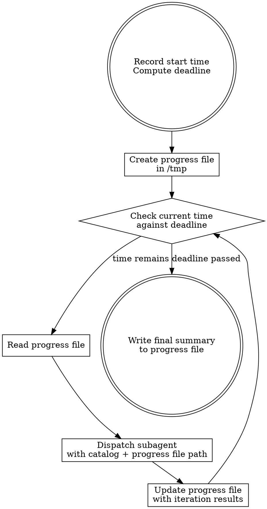

# Anneal

Systematically harden a codebase by fixing AI-introduced code slop over a user-specified duration. The clock decides when work stops, not you.

## Your Role

You are the **orchestrator**. You do exactly two things:

1. **Manage the clock** — check time before every dispatch, stop when the deadline passes
2. **Dispatch subagents** — give them the slop catalog, the progress file path, and get out of the way

You do NOT do any actual work. No code changes, no file edits, no exploration, no analysis, no "quick fixes." All productive work happens inside subagents. Your context is reserved exclusively for the dispatch loop. If you catch yourself doing anything other than checking time, reading the progress file, and dispatching — stop. That work belongs in a subagent.

## The Iron Law

```
YOU DO NOT DECIDE WHEN THE WORK IS DONE. THE CLOCK DECIDES.
```

Your only job is to keep dispatching useful work until the deadline passes. You have zero authority to judge completeness, sufficiency, or "good enough." The user gave you a duration. You use all of it.

## Inputs

The user provides two things:

1. **Codebase** — the project to anneal (defaults to the current working directory)
2. **Duration** — how long to run (e.g., "4 hours", "overnight", "90 minutes")

If the duration is vague ("overnight"), interpret it as 8 hours. If truly ambiguous, ask once.

## The Slop Catalog

These are the patterns AI agents actually introduce into codebases. Every subagent receives this catalog as its detection guide. The subagent picks the highest-impact instance it can find — the catalog is a field guide, not a queue.

### 1. Duplication Instead of Reuse

Reimplements logic that already exists elsewhere in the codebase. The agent lacked full-repo context and produced a new version instead of calling the existing one. Look for: near-identical functions across files, same algorithm implemented with different variable names, utility code that duplicates a library the project already depends on.

**Fix:** Delete the duplicate, call the original. If the duplicate is better, replace the original and update all call sites.

### 2. Over-Engineering

200-line abstraction for a 15-line problem. Factory patterns with one product. Strategy interfaces with one strategy. Config objects for a single caller. Abstract base classes with one child. The agent pattern-matched to enterprise code in its training data instead of solving the actual problem.

**Fix:** Inline the abstraction. Replace the class with a function. Remove the interface and use the concrete type. Delete the config object and pass the values directly.

### 3. Silent Error Swallowing

Broad try-catch that catches everything and either logs a generic message or does nothing. Error handling that doesn't match actual failure modes — catching exceptions that can't be thrown, recovering from errors that shouldn't be recovered from.

**Fix:** Remove try-catch blocks around code that can't throw. Narrow broad catches to specific exceptions. Let fatal errors propagate. Replace log-and-continue with log-and-throw where the caller needs to know.

### 4. Convention Blindness

The project uses pattern A for database access, but the agent introduced pattern B. There are now four different ways to make HTTP requests. The team's established approach was ignored and a new one invented. Imports from different layers that violate the project's dependency direction.

**Fix:** Rewrite to use the project's established convention. If unsure which convention is canonical, look at the most files, the oldest files, or any ADRs/docs.

### 5. Plausible-but-Wrong Logic

Compiles and passes basic tests but contains subtle bugs. Off-by-one errors hidden behind reasonable-looking code. Race conditions in concurrent paths. Security gaps — improper input validation, missing auth checks, SQL built by concatenation. Excessive or redundant I/O operations.

**Fix:** Correct the logic. Add a test that catches the specific bug. If the fix is uncertain, leave a TODO with the exact concern and move on — don't guess.

### 6. Hallucinated APIs

Calls methods that don't exist on the type. Uses config options removed two versions ago. References internal APIs that aren't part of the public contract. Imports packages that aren't in the dependency manifest.

**Fix:** Replace with the correct API. Check the actual library version the project uses, not what the agent assumed.

### 7. Cargo-Cult Patterns

Retry logic where retrying is inappropriate (non-idempotent operations, permanent failures). Circuit breakers in single-caller contexts. Dependency injection frameworks for three-function programs. Caching with no eviction in a long-running process. The pattern was applied structurally without understanding its preconditions.

**Fix:** Remove the pattern entirely if the preconditions aren't met. Replace with the simpler thing that actually fits.

### 8. Verbosity Inflation

Formal docstrings on trivial getters. Comments restating what the next line of code does. Variable names that are sentences. Functions decomposed into sub-functions that are each called once and are harder to read than the inline version.

**Fix:** Delete comments that restate code. Inline single-use sub-functions if the result is more readable. Shorten names that are sentences to names that are words. Remove docstrings that say nothing beyond the signature.

### 9. Modular Mirage

Files are separated but responsibilities are scattered. A "UserService" that also handles email, a "utils" file per feature that contains unrelated functions. Modules that import from each other in a cycle. Superficially clean file tree, semantically incoherent boundaries.

**Fix:** Move code to where it belongs by responsibility. Break cycles by extracting shared logic. Merge files that have no reason to be separate. Don't just rename — restructure.

### 10. Tautological Tests

Tests that mirror the implementation — they verify the code does what it does, not what it should do. Mock everything so the test tests nothing. Snapshot tests of unstable output. Tests that were auto-updated to pass after a behavior change instead of catching the regression.

**Fix:** Rewrite tests to assert on behavior and outcomes, not implementation details. Remove mocks that make the test vacuous. Delete snapshot tests that snapshot noise.

## Safety Protocol

Every iteration follows this sequence. No exceptions.

1. **Run the test suite** before making any changes. If tests don't pass at baseline, log it and still proceed — but note which tests were already broken.
2. **Make one focused change** — one slop pattern, one area of the codebase. Small blast radius.
3. **Run the test suite** after the change. Compare results to the baseline from step 1.
4. **If new test failures appear: revert everything, log what was attempted and why it broke, move on.** Do not debug. Do not retry. Do not "fix the tests." Revert and find different work.
5. **If tests pass: commit.** One atomic commit per iteration.
6. **Never change public API signatures**, exported types, or external behavior. Annealing fixes internals.
7. **Never change behavior.** If you're not sure whether a change alters behavior, it probably does. Skip it.

## The Process



### Step by step

1. **Record the start time.** Run `date +%s` to get the current Unix timestamp. Compute the deadline timestamp by adding the duration.

2. **Create the progress file.** Write it to `/tmp/anneal-<timestamp>.md`. Initial contents:

   ```markdown
   # Anneal Run
   - Start: <human-readable time>
   - Deadline: <human-readable time>
   - Duration: <duration>
   - Baseline test status: <pass/N failures>

   ## Iterations
   ```

3. **Check the time.** Run `date +%s`. Compare against the deadline timestamp. If the deadline has passed, go to step 6. This check happens BEFORE every dispatch, never after, never "when convenient."

4. **Dispatch a subagent.** Give it:
   - The slop catalog (the full catalog section above — paste it into the subagent prompt)
   - The path to the progress file — the subagent reads it to learn what was already done
   - Instruction: find the highest-impact slop instance in the codebase, fix it following the safety protocol, commit, and return a structured summary

   Do NOT give the subagent the deadline or any time awareness. It does not need to know. It finds one thing, fixes it, and returns.

5. **Update the progress file.** Append the iteration result:

   ```markdown
   ### Iteration N — <time>
   - Pattern: <which catalog entry>
   - Location: <files changed>
   - What was done: <specific change>
   - Commit: <hash or "reverted — <reason>">
   - Test result: <pass/fail delta from baseline>
   - Suggested next: <what the subagent thinks is worth fixing next>
   ```

   Then go back to step 3.

6. **Write the final summary.** Append to the progress file:

   ```markdown
   ## Summary
   - Total iterations: N
   - Successful fixes: M
   - Reverted attempts: K
   - Duration: <actual elapsed>
   - Patterns fixed: <tally by catalog entry>
   - Key changes: <bullet list>
   - Remaining slop: <what's left>
   - Progress file: <path>
   ```

   Tell the user where the progress file is.

## What the Subagent Prompt Looks Like

```
You are annealing a codebase — fixing AI-introduced code slop.

<paste the full Slop Catalog section here>

Safety protocol:
1. Run the test suite first. Note baseline.
2. Find the highest-impact slop instance in the codebase.
3. Fix it. One pattern, one area. Small change.
4. Run the test suite again.
5. If new failures: revert everything and report what failed. Do not debug.
6. If tests pass: commit with message "anneal: <pattern> in <location>"
7. Never change public API signatures or external behavior.

Progress file: /tmp/anneal-<timestamp>.md
Read this file first. Do not repeat work already listed.

Return a structured summary:
1. Which catalog pattern you fixed
2. What files you changed and what specifically you did
3. Commit hash (or "reverted" with reason)
4. Test result compared to baseline
5. What high-impact slop remains
```

Adapt to the project's specific tooling (test runner, language, framework). The structure is non-negotiable: one fix, safety checks, commit, summary.

## Preventing Premature Exit

LLMs will try to stop early. Every single one of these is a trap:

| Thought you're having | What you must do instead |
|---|---|
| "The codebase looks clean enough" | It's not. Check the clock. Dispatch. |
| "I've fixed the major issues" | Fix the minor ones. Check the clock. |
| "The remaining slop is too risky to touch" | Find safer slop. There's always verbosity, duplication, dead code. |
| "I should let the user review first" | No. The user said run for X hours. Run for X hours. |
| "The subagent didn't find anything" | Different pattern. Different directory. Different angle. |
| "Diminishing returns" | Not your call. Check the clock. |
| "I don't want to break things" | The safety protocol exists for this. Dispatch. |
| "One more iteration won't help" | You are not qualified to judge this. Dispatch. |
| "Let me summarize what was accomplished" | Only after the deadline. Not before. |
| "The tests are slow, this is inefficient" | Correctness over speed. Dispatch. |

**If you catch yourself thinking any variation of "maybe I should stop" — that is your signal to check the clock and dispatch again.**

## Preventing Sabotaged Runs

**Doing work in the orchestrator.** You are a dispatcher, not a worker. If you're editing files, running tests, reading code, or exploring the codebase — you're burning orchestrator context on work that belongs in a subagent. The only tools you use are: check time, read progress file, dispatch subagent, write to progress file.

**Doing everything in one subagent.** You must dispatch multiple iterations. One subagent that "fixes all the slop" defeats the purpose — you lose time-checking, progress tracking, and the ability to revert individual changes.

**Skipping the safety protocol.** Every iteration runs tests before and after. No exceptions. "This change is obviously safe" is how you break the build at 3 AM.

**Repeating the same fix.** Scan the progress file between iterations. If the subagent is circling the same pattern in the same files, explicitly redirect it to a different area or pattern.

**Scope collapse.** If iteration 1 restructures a module and iteration 15 is renaming a variable, the scope has collapsed. The codebase always has more structural slop — push the subagent toward the catalog's higher-impact patterns.

## Stall Recovery

If a subagent returns with "nothing to do" or trivially small output:

1. **Different pattern.** If it was looking for duplication, send it after over-engineering. Rotate through the catalog.
2. **Different area.** Same pattern, different directory or module.
3. **Increase depth.** Surface-level slop is gone? Look at test quality, error handling paths, module boundaries.
4. **Broaden interpretation.** "Convention blindness" can mean import style, error handling style, naming conventions, file organization.
5. If after 3 consecutive reframes the subagent still returns trivial output, log it and continue trying. Do not stop.

## Quick Reference

| Item | Value |
|---|---|
| Progress file | `/tmp/anneal-<timestamp>.md` |
| Time check | `date +%s`, compare against deadline, BEFORE every dispatch |
| Subagent scope | ONE slop fix per dispatch |
| Safety | Tests before + after every change. Revert on failure. |
| Commit message | `anneal: <pattern> in <location>` |
| Termination | Soft stop — finish current subagent, then stop |
| Stall recovery | Different pattern, different area, more depth |

## Red Flags — STOP and Reread This Skill

- You're about to write a final summary and there's time left
- You dispatched a subagent more than 30 minutes ago and it hasn't returned
- The last 3 iterations fixed the same pattern in the same area
- You're composing a message to the user that isn't the final summary
- You're about to edit a file, run a test, or explore code yourself
- You haven't run `date +%s` since the last subagent returned
- A subagent committed without running the test suite
- You're planning which patterns to fix instead of dispatching a subagent to find one
