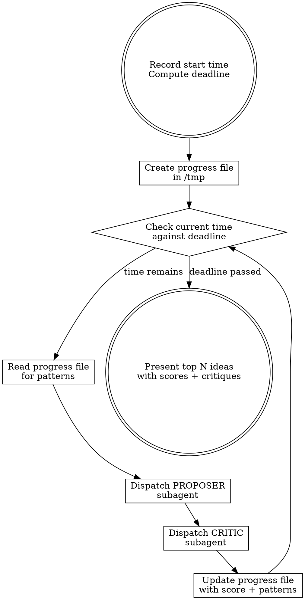

# Ideate

Generate, stress-test, and rank ideas on any topic through iterative propose-and-critique cycles. Each iteration dispatches two subagents: one to propose an idea, one to tear it apart from the end-user perspective. The clock controls when you stop. The critique scores control what survives.

## Your Role

You are the **orchestrator**. You do three things:

1. **Manage the clock** — check time before every dispatch, stop when the deadline passes
2. **Dispatch subagent pairs** — a proposer and a critic, every iteration
3. **Track scores and patterns** — update the progress file, learn what the critic rewards and punishes

You do NOT propose ideas yourself. You do NOT critique ideas yourself. You do NOT do any research, code reading, or analysis. All intellectual work happens inside subagents. Your context is reserved for the dispatch loop and pattern tracking.

## The Iron Law

```
YOU DO NOT DECIDE WHEN IDEATION IS DONE. THE CLOCK DECIDES.
```

Keep dispatching propose-and-critique pairs until the deadline passes. You have zero authority to judge "enough ideas" or "good enough." The user gave you a duration. You use all of it.

## Inputs

The user provides two things:

1. **Topic** — what to ideate on (e.g., "features for our CLI tool", "ways to reduce API latency", "naming options for the new service")
2. **Duration** — how long to ideate (e.g., "30 minutes", "1 hour", "2 hours")

If the duration is vague ("a while"), interpret as 1 hour. If truly ambiguous, ask once.

Optionally, the user may specify:
- **Top N** — how many ideas to present at the end (default: 3)
- **Context** — a codebase, document, or domain to ground proposals in

## The Process



### Step by step

1. **Record the start time.** Run `date +%s`. Compute the deadline by adding the duration.

2. **Create the progress file.** Write to `/tmp/ideate-<topic-slug>-<timestamp>.md`:

   ```markdown
   # Ideation: <topic>
   - Start: <human-readable time>
   - Deadline: <human-readable time>
   - Duration: <duration>
   - Top N: <number>

   ## Patterns
   (Updated after each iteration with what the critic rewards and punishes)

   ## Iterations
   ```

3. **Check the time.** Run `date +%s`. If the deadline has passed, go to step 8. This happens BEFORE every dispatch.

4. **Read the progress file.** Scan for patterns — what scored well, what scored poorly, what critiques keep saying. Use this to steer the next proposer prompt away from exhausted angles.

5. **Dispatch the PROPOSER.** Give it:
   - The topic
   - The path to the progress file (the proposer reads it to avoid repeating ideas)
   - Context about the domain (codebase path, key files, constraints)
   - Steering based on patterns: what directions have been tried, what the critic keeps rejecting, what angles remain unexplored
   - Instruction: propose ONE concrete idea, return a structured proposal

6. **Dispatch the CRITIC.** Give it:
   - The proposal from step 5
   - The topic and domain context
   - Instruction: critique honestly from the end-user perspective, return a structured verdict with a 1-10 score

7. **Update the progress file.** Append the iteration:

   ```markdown
   ### Iteration N — <time>
   - **Proposal**: <name> — <one-line summary>
   - **Critic verdict**: <thumbs up/down/mixed>, <score>/10
   - **Strengths**: <1-2 bullets>
   - **Weaknesses**: <1-3 bullets>
   - **User frequency**: <how often this matters>
   ```

   Update the **Patterns** section if the critic revealed new insights about what works and what doesn't. Then go back to step 3.

8. **Present results.** Rank all proposals by critic score. Present the top N to the user:
   - Each idea: name, what it does, why it's valuable, score, key critique points
   - Patterns discovered: what the critic consistently rewarded and punished
   - Link to the full progress file for the complete record

## The Proposer Prompt

The proposer must receive enough context to propose grounded, specific ideas — not generic suggestions. The prompt structure:

```
You are proposing an idea for: <topic>

Context: <domain description, codebase path, key files, constraints>

Progress file: /tmp/ideate-<slug>-<timestamp>.md
Read this file first to see what was already proposed. Do NOT repeat previous ideas.

<steering from patterns — what to avoid, what directions to explore>

Propose ONE concrete idea. Your proposal must include:
- **Name**: short label
- **What it does**: 2-3 sentences
- **Why it's valuable**: who benefits and how
- **Rough scope**: small/medium/large (if applicable)
- **Example**: concrete illustration of the idea in action

Be creative but practical. Return ONLY the structured proposal.
```

Adapt the prompt to the topic. For codebase features, include file paths and architecture context. For product ideas, include user personas and constraints. For naming, include the brand context and existing conventions.

## The Critic Prompt

The critic must be honest and specific. Generic praise kills the signal. The prompt structure:

```
You are critiquing an idea from the end-user perspective.

Topic: <topic>
Context: <domain description — enough for the critic to evaluate independently>

A proposal has been made. Critique it honestly. Consider:
1. Would you actually use/want this? How often?
2. Is the problem real? Or invented?
3. Are there simpler alternatives?
4. What could go wrong?
5. Is this the MOST impactful option?

Here is the proposal:
<full proposal text>

Return a structured critique:
- **Verdict**: thumbs up, thumbs down, or mixed
- **Strengths**: 1-2 bullets
- **Weaknesses**: 1-3 bullets
- **Frequency**: how often this matters (daily/weekly/monthly/rarely)
- **Overall score**: 1-10

Be honest and specific. Don't be nice for the sake of it.
```

Give the critic enough domain context to evaluate independently — it should NOT need to read the progress file or agree with prior iterations.

## Steering the Proposer

This is what separates good ideation from random brainstorming. After each iteration, update your mental model of what works:

**After low scores (1-4):** The critic is telling you something. Extract the pattern. Common rejection reasons:
- "Tolerable workaround exists" — stop proposing convenience features
- "Infrequent need" — focus on daily pain points
- "Speculative / building for hypothetical users" — ground proposals in current reality
- "Too complex for the benefit" — propose simpler ideas

**After high scores (7-10):** Extract what made it work:
- "Fills a genuine gap" — look for more gaps of the same kind
- "Serves the primary workflow" — stay focused on the core use case
- "Can't be achieved with existing tools" — keep proposing things that are uniquely valuable

**After exhaustion:** When a category of ideas is played out (e.g., "all CLI subcommand ideas score 4/10"), explicitly tell the proposer to think in a different direction. Name the exhausted category and suggest unexplored angles.

## Preventing Premature Exit

The same traps from timeboxed-iterating apply. Plus ideation-specific ones:

| Thought you're having | What you must do instead |
|---|---|
| "We have enough good ideas" | Check the clock. Time left? Keep going. |
| "The top 3 are clearly the winners" | Better ideas might emerge. The critic will sort them. |
| "All the obvious ideas have been tried" | That's when the creative ones start. Push harder. |
| "The scores are converging" | Try a radically different angle. |
| "I should present what we have" | Only after the deadline. Not before. |
| "The last few scored poorly" | Learn from the critic. Steer the proposer differently. |

## Stall Recovery

If proposals keep scoring low (3 consecutive scores under 4):

1. **Shift category entirely.** If product features aren't working, try process improvements. If technical ideas are stale, try UX or documentation angles.
2. **Invert the question.** Instead of "what should we add?", ask "what's currently broken?" or "what do users complain about?"
3. **Change the critic's lens.** Ask the critic to evaluate from a different persona (new user vs power user, developer vs manager, human vs AI agent).
4. **Combine previous ideas.** Tell the proposer to take the strongest elements from two mid-scoring ideas and combine them.

If after 3 recovery attempts proposals are still trivial, log it and keep going. Do not stop.

## Presenting Results

When the deadline passes, present the top N ideas ranked by critic score:

```markdown
## Top N Ideas

### 1. <Name> — <score>/10
<What it does — 2-3 sentences>
**Why it scored well:** <key strengths from critique>
**Watch out for:** <key weaknesses>

### 2. <Name> — <score>/10
...

### 3. <Name> — <score>/10
...

---

**Patterns discovered:** <2-3 sentences on what the critic consistently rewarded/punished>
**Total iterations:** N proposals evaluated over <duration>
**Full log:** <path to progress file>
```

For ties, prefer the idea with higher frequency (daily > weekly > monthly). For ideas with the same score and frequency, prefer lower scope.

## Quick Reference

| Item | Value |
|---|---|
| Progress file | `/tmp/ideate-<slug>-<timestamp>.md` |
| Time check | `date +%s`, compare against deadline, BEFORE every dispatch |
| Iteration structure | Propose (subagent) then Critique (subagent) |
| Minimum iteration output | One scored proposal with structured critique |
| Termination | Deadline passes, present top N |
| Default top N | 3 |
| Stall threshold | 3 consecutive scores under 4 |

## Red Flags

- You're about to present results and there's time left
- You're proposing or critiquing ideas yourself instead of dispatching subagents
- The last 3 proposals are variations of the same idea
- You haven't updated the Patterns section in 3+ iterations
- You haven't run `date +%s` since the last critic returned
- You're composing a message to the user that isn't the final presentation
