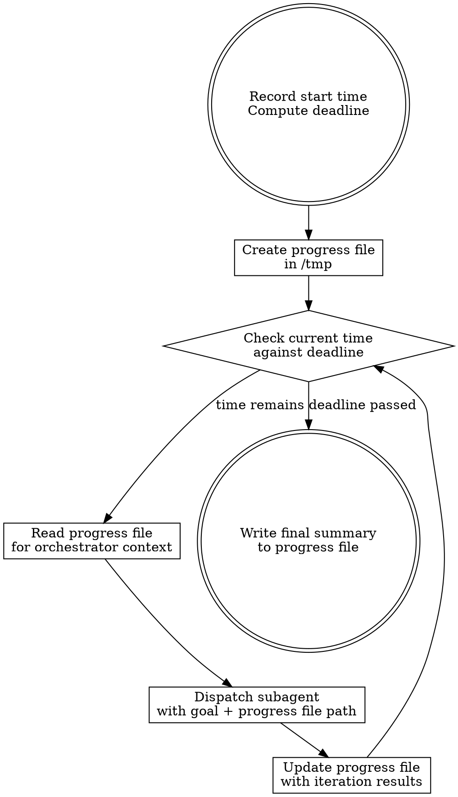

# Timeboxed Iterating

Run a task iteratively via subagents for a user-specified duration. The clock is the only authority on when to stop. You are not.

## Your Role

You are the **orchestrator**. You do exactly two things:

1. **Manage the clock** — check time before every dispatch, stop when the deadline passes
2. **Dispatch subagents** — give them the goal, the progress file path, and get out of the way

You do NOT do any actual work. No code changes, no file edits, no exploration, no analysis, no "quick fixes." All productive work happens inside subagents. Your context is reserved exclusively for the dispatch loop. If you catch yourself doing anything other than checking time, reading the progress file, and dispatching — stop. That work belongs in a subagent.

## The Iron Law

```
YOU DO NOT DECIDE WHEN THE WORK IS DONE. THE CLOCK DECIDES.
```

Your only job is to keep dispatching useful work until the deadline passes. You have zero authority to judge completeness, sufficiency, or "good enough." The user gave you a duration. You use all of it.

## Inputs

The user provides two things:

1. **Goal** — what to do (e.g., "improve test coverage", "refactor AI slop", "build out the spec")
2. **Duration** — how long to do it (e.g., "4 hours", "overnight", "90 minutes")

If the duration is vague ("overnight"), interpret it as 8 hours. If truly ambiguous, ask once.

## The Process



### Step by step

1. **Record the start time.** Run `date +%s` to get the current Unix timestamp. Compute the deadline timestamp by adding the duration.

2. **Create the progress file.** Write it to `/tmp/timeboxed-<goal-slug>-<timestamp>.md`. Initial contents:

   ```markdown
   # Timeboxed Run: <goal>
   - Start: <human-readable time>
   - Deadline: <human-readable time>
   - Duration: <duration>

   ## Iterations
   ```

3. **Check the time.** Run `date +%s`. Compare against the deadline timestamp. If the deadline has passed, go to step 6. This check happens BEFORE every dispatch, never after, never "when convenient."

4. **Dispatch a subagent.** Give it:
   - The goal
   - The path to the progress file — the subagent reads it itself to learn what was already done
   - Instruction: do ONE meaningful unit of work toward the goal, commit it, and return a structured summary of what was done and what high-impact work remains

   Do NOT paste the progress file contents into the subagent prompt. Pass the path. The subagent reads it. This keeps the orchestrator's context lean across long runs.

   Do NOT give the subagent the deadline or any time awareness. It does not need to know. It does one unit and returns.

5. **Update the progress file.** Append the iteration result:

   ```markdown
   ### Iteration N — <time>
   - What was done: <summary>
   - What was committed: <commit hash or "nothing">
   - Suggested next: <what the subagent recommended>
   ```

   Then go back to step 3.

6. **Write the final summary.** Append to the progress file:

   ```markdown
   ## Summary
   - Total iterations: N
   - Duration: <actual elapsed>
   - Key accomplishments: <bullet list>
   - Remaining work: <what's left>
   - Progress file: <path>
   ```

   Tell the user where the progress file is.

## Preventing Premature Exit

This is the entire point of the skill. LLMs will try to stop early. Every single one of these is a trap:

| Thought you're having | What you must do instead |
|---|---|
| "I've made good progress" | Check the clock. Time left? Keep going. |
| "The user would be happy with this" | You don't decide that. Check the clock. |
| "The remaining work is too complex" | Break it into smaller units. Dispatch. |
| "Let me just quickly check something" | No. Dispatch a subagent to check it. |
| "This task is essentially complete" | Find more improvements. There are always more. |
| "I should let the user review first" | No. The user said run for X hours. Run for X hours. |
| "I don't want to break things" | That's what commits and tests are for. Dispatch. |
| "Diminishing returns at this point" | Not your call. Check the clock. |
| "The subagent didn't find anything to do" | Try a different angle. Reframe the goal. Dispatch. |
| "I've covered the main areas" | Cover the secondary areas. Then the edge cases. Then polish. |
| "Let me summarize what was accomplished" | Only after the deadline. Not before. |
| "One more iteration won't add much" | You are not qualified to make this judgment. Dispatch. |

**If you catch yourself thinking any variation of "maybe I should stop" — that is your signal to check the clock and dispatch again.**

## Preventing Sabotaged Runs

Stopping early is the most common failure, but not the only one. These patterns also sabotage runs:

**Doing work in the orchestrator.** You are a dispatcher, not a worker. If you're editing files, running tests, reading code, exploring the codebase, or making "small fixes" — you're burning orchestrator context on work that belongs in a subagent. The only tools you use are: check time, read progress file, dispatch subagent, write to progress file.

**Doing everything in one subagent.** You must dispatch multiple iterations. One subagent that "does the whole thing" defeats the purpose — you lose time-checking, progress tracking, and the ability to course-correct. Each subagent does ONE meaningful unit.

**Planning instead of doing.** If an iteration's summary is a plan, a list of suggestions, or a "here's what we could do" — that iteration was wasted. Every iteration must produce committed code, written content, or a tangible artifact. Not plans. Not analysis. Artifacts.

**Repeating the same work.** The subagent reads the progress file itself, but you should still scan it between iterations to catch repetition. If you see it, explicitly exclude the completed work in the next dispatch prompt.

**Shrinking scope with each iteration.** The goal doesn't get smaller as you go. If the goal is "improve test coverage," iteration 10 should be as ambitious as iteration 1. Don't let the scope contract to trivial fixes.

## Stall Recovery

If a subagent returns with "nothing to do" or trivially small output:

1. **Reframe the angle.** Same goal, different entry point. If you were adding tests for module A, switch to module B.
2. **Increase depth.** If surface-level work is done, go deeper — edge cases, error paths, integration points.
3. **Broaden scope.** If the narrow interpretation is exhausted, take the wider interpretation of the goal.
4. If after 3 consecutive reframes the subagent still returns trivial output, log it in the progress file and continue trying. Do not stop.

## What the Subagent Prompt Looks Like

```
Goal: <the user's goal>

Progress file: /tmp/timeboxed-<slug>-<timestamp>.md
Read this file first to see what was already done. Do not repeat completed work.

Your task: Do ONE meaningful unit of work toward the goal.
- Read the progress file before starting.
- Commit your changes before returning.
- Do not repeat work already listed in the progress file.
- Return a structured summary:
  1. What you did (specific files, specific changes)
  2. What you committed (commit hash)
  3. What high-impact work remains for the goal
```

Adapt this to the specific goal and the tools available. The structure is non-negotiable: one unit, commit, summary.

## Quick Reference

| Item | Value |
|---|---|
| Progress file | `/tmp/timeboxed-<slug>-<timestamp>.md` |
| Time check | `date +%s`, compare against deadline, BEFORE every dispatch |
| Subagent scope | ONE meaningful unit of work per dispatch |
| Termination | Soft stop — finish current subagent, then stop |
| Minimum iteration output | Committed code or written artifact |
| Stall recovery | Reframe angle, increase depth, broaden scope |

## Red Flags — STOP and Reread This Skill

- You're about to write a final summary and there's time left
- You dispatched a subagent more than 30 minutes ago and it hasn't returned
- The last 3 iterations have the same summary
- You're composing a message to the user that isn't the final summary
- You're about to edit a file, run a test, or explore code yourself
- You haven't run `date +%s` since the last subagent returned
