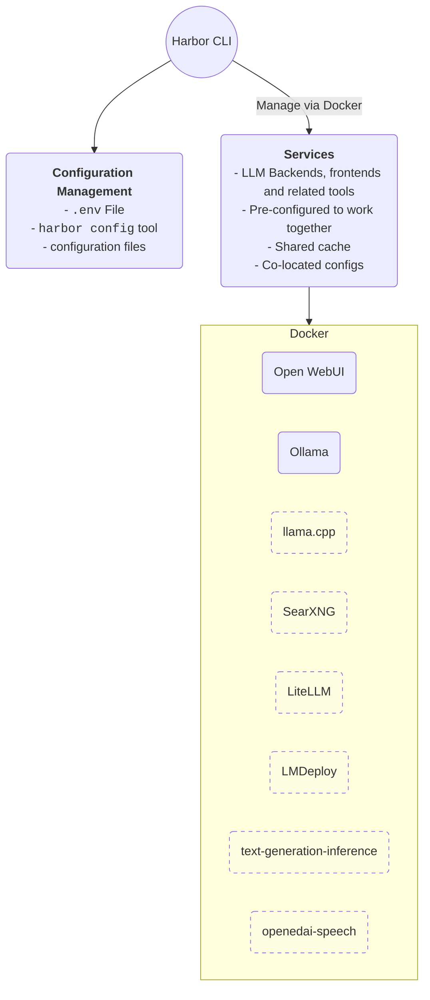

Developer-friendly containerized LLM setup. The main goal is to provide a convenient way ~~for developers~~ to experiment with LLMs.

## Quickstart

```bash
git clone https://github.com/av/harbor.git && cd harbor

# [Optional] make available globally
# Creates a symlink in User's local bin directory
./harbor.sh ln

# Start default services
# Initial download of the docker images might take a while
harbor up

# [Optional] open Webui in the browser
harbor open
```

> [!NOTE]
> First open will require you to create a local admin account. Harbor keeps auth requirement by default because it also supports exposing your local stack to the internet.

## Blitz Tour

```bash
# Run Harbor with additional services
# Running SearXNG automatically enables Web RAG in Open WebUI
harbor up searxng

# Run additional/alternative LLM Inference backends
# Open Webui is automatically connected to them.
harbor up llamacpp tgi lmdeploy litellm mistralrs vllm

# Use custom model for llama.cpp
harbor llamacpp model https://huggingface.co/user/repo/model.gguf

# Convenience tools for docker setup
harbor logs llamacpp
harbor exec llamacpp ./scripts/llama-bench --help

# Access service CLIs without installing them
harbor hf scan-cache
harbor ollama list

# Open services from the CLI
harbor open webui
harbor open llamacpp

# Config management
harbor config list
harbor config set webui.host.port 8080

# Eject from Harbor into a standalone Docker Compose setup
# Will export
harbor eject searxng llamacpp > docker-compose.harbor.yml
```

## Why?

- Convenience factor
- Workflow/setup centralisation

If you're comfortable with Docker and Linux administration - you likely don't need Harbor to manage your LLM setup. However, you're also likely to arrive to a somewhat similar solution eventually.

Harbor is not designed as a deployment solution, but rather as a helper for the local LLM development environment. It's a good starting point for experimenting with LLMs and related services.

You can later eject from Harbor and use the services in your own setup, or continue using Harbor as a base for your own configuration.

## Table of Contents

- [Table of Contents](#table-of-contents)
- [Overview and Features](#overview-and-features)
- [Getting Started](#getting-started)
- [Harbor CLI Reference](#harbor-cli-reference)
  - [`harbor ln`](#harbor-ln)
  - [`harbor up <services>`](#harbor-up-services)
  - [`harbor defaults`](#harbor-defaults)
  - [`harbor down`](#harbor-down)
  - [`harbor ps`](#harbor-ps)
  - [`harbor logs`](#harbor-logs)
  - [`harbor help`](#harbor-help)
  - [`harbor version`](#harbor-version)
  - [`harbor hf`](#harbor-hf)
  - [`harbor ollama <command>`](#harbor-ollama-command)
  - [`harbor eject`](#harbor-eject)
  - [`harbor open <service>`](#harbor-open-service)
  - [`harbor exec <service> <command>`](#harbor-exec-service-command)
  - [`harbor config [get|set|list] <option> [value]`](#harbor-config)
- [Services Overview](#services-overview)
  - [Open WebUI](#open-webui)
  - [Ollama](#ollama)
  - [llama.cpp](#llamacpp)

## Overview and Features



This project is a CLI and a pre-configured Docker Compose setup that connects various LLM-related projects together. It simplifies the initial configuration and can serve as a base for your own customized setup later.

- Manage local LLM stack with a concise CLI
- Convenience utilities for common tasks (model management, configuration, service debug)
- Access service CLIs (`hf`, `ollama`, etc.) via Docker without install
- Services are pre-configured to work together
- Host cache is shared and reused - huggingface, ollama, etc.
- Co-located service configs
- Eject to run without harbor with `harbor eject`

## Harbor CLI Reference

### `harbor ln`

Creates a symlink to the `harbor.sh` script in the `~/bin` directory. This allows you to run the script from any directory.

```bash
# Puts the script in the ~/bin directory
harbor ln
```

### `harbor up <services>`

Starts selected services. See the list of available services here. Run `harbor defaults` to see the default list
of services that will be started. When starting additional services, you might need to `harbor down` first, so that all the services can pick updated configuration. API-only services can be started without stopping the main stack.

```bash
# Start with default services
harbor up

# Start with additional services
# See service descriptions in the Services Overview section
harbor up searxng

# Start with multiple additional services
harbor up webui ollama searxng llamacpp tts tgi lmdeploy litellm
```

You can configure default set of services using the `harbor config` command.

```bash
# `harbor up` will start these services by default from now on
harbor config set services.default 'webui ollama searxng'
```

### `harbor defaults`

Displays the list of default services that will be started when running `harbor up`. Will include one LLM backend and one LLM frontend out of the box.

```bash
harbor defaults
```

### `harbor down`

Stops all currently running services.

```bash
harbor down
```

### `harbor ps`

Proxy to `docker-compose ps` command. Displays the status of all services.

```bash
harbor ps
```

### `harbor logs`

Proxy to `docker-compose logs` command. Starts tailing logs for all or selected services.

```bash
harbor logs

# Show logs for a specific service
harbor logs webui

# Show logs for multiple services
harbor logs webui ollama
```

### `harbor help`

Print basic help information to the console.

```bash
harbor help
harbor --help
```

### `harbor version`

Prints the current version of the Harbor script.

```bash
harbor version
harbor --version
```

### `harbor hf`

Runs HuggingFace CLI in the container against the hosts' HuggingFace cache.

```bash
# All HF commands are available
harbor hf --help

# Show current cache status
harbor hf scan-cache
```

Harbor's `hf` CLI is expanded with some additional commands for convenience.

```bash
# Get repository and file names from the HuggingFace URL
harbor hf parse-url https://huggingface.co/user/repo/blob/main/file.gguf

# > Repository: user/repo
# > File: file.gguf
```

### `harbor ollama <command>`

Runs Ollama CLI in the container against the Harbor configuraiton.

```bash
# All Ollama commands are available
harbor ollama --version

# Show currently cached models
harbor ollama list

# See for more commands
harbor ollama --help
```

### `harbor llamacpp <command>`

Runs CLI tasks specific to managing `llamacpp` service.

```bash
# Show the model currently configured to run
harbor llamacpp model

# Set a new model to run via a HuggingFace URL
# ⚠️ Note, other kinds of URLs are not supported
harbor llamacpp model https://huggingface.co/user/repo/blob/main/file.gguf
# Above command is an equivalent of
harbor config set llamacpp.model https://huggingface.co/user/repo/blob/main/file.gguf
# And will translate to a --hf-repo and --hf-file flags for the llama.cpp CLI runtime
```

You can specify additional flags and arguments that'll be passed to the `llamacpp` CLI.

```bash
```

### `harbor eject`

Renders Harbor's Docker Compose configuration into a standalone config that can be moved and used elsewhere. Accepts the same options as `harbor up`.

```bash
# Eject with default services
harbor eject

# Eject with additional services
harbor eject searxng

# Likely, you want the output to be saved in a file
harbor eject searxng llamacpp > docker-compose.harbor.yml
```

### `harbor open <service>`

Opens the service URL in the default browser. In case of API services, you'll see the response from the service main endpoint.

```bash
# Webui is default service to open
harbor open

# Open a specific service
harbor open ollama
```

### `harbor url <service>`

Prints the URL of the service to the terminal.

```bash
# With default settings, this will print
# http://localhost:33831
harbor url llamacpp
```

### `harbor exec <service> <command>`

Allows executing arbitrary commands in the container running given service. Useful for inspecting service at runtime or performing some custom operations that aren't natively covered by Harbor CLI.

```bash
# This is the same folder as "harbor/open-webui"
harbor exec webui ls /app/backend/data

# Check the processes in searxng container
harbor exec searxng ps aux
```

`exec` offers plenty of flexibility. Some useful examples below.

Launch an interactive shell in the running container with one of the services.

```bash
# Launch "bash" in the ollama service
harbor exec ollama bash

# You are then landed in the interactive
# container shell
$ root@279a3a523a0b:/#
```

Access useful scripts and CLIs from the `llamacpp`.

```bash
# See .sh scripts from the llama.cpp
harbor exec llamacpp ls ./scripts
# Run one of the bundled CLI tools
harbor exec llamacpp ./llama-bench --help
```

### `harbor config`

Allows working with the harbor configuration via the CLI. Mostly useful for the automation and scripting, as the configuration can also be managed via the `.env` file variables.

```bash
# Show the current configuration
harbor config list

# Get a specific configuration value
# All three versions below are equivalent and will return the same value
harbor config get webui.host.port
harbor config get webui_host_port
harbor config get WEBUI_HOST_PORT

# Set a new configuration value
harbor config set webui.host.port 8080
```

Translating CLI config fields to `.env` file variables:

```bash
# All three version are pointing to the same
# environment variable in the .env file
webui.host.port -> HARBOR_WEBUI_HOST_PORT
webui_host_port -> HARBOR_WEBUI_HOST_PORT
WEBUI_HOST_PORT -> HARBOR_WEBUI_HOST_PORT
```

## Services Overview and Configuration

#### Overview

| Service | Handle / Default Local URL | Description |
| --- | --- | --- |
| [Open WebUI](https://docs.openwebui.com/) | `webui` / [http://localhost:33801](http://localhost:33801) | Extensible, self-hosted interface for AI that adapts to your workflow. |
| [Ollama](https://ollama.com/) | `ollama` / [http://localhost:33821](http://localhost:33821) |  Ergonomic wrapper around llama.cpp with plenty of QoL features |
| [llama.cpp](https://github.com/ggerganov/llama.cpp) | `llamacpp` / [http://localhost:33831](http://localhost:33831) | LLM inference in C/C++ |
| [SearXNG](https://github.com/searxng/searxng) | `searxng` / [http://localhost:33811/](http://localhost:33811/) | A free internet metasearch engine which aggregates results from various search services and databases. |
| [openedai-speech](https://github.com/matatonic/openedai-speech) | `tts` | An OpenAI API compatible text to speech server |
| [litellm](https://docs.litellm.ai/docs/) | `litellm`| LLM API Proxy/Gateway |
| [text-generation-inference](https://github.com/huggingface/text-generation-inference) | `tgi` | A Rust, Python and gRPC server for inference from HuggingFace |
| [lmdeploy](https://lmdeploy.readthedocs.io/en/latest/get_started.html) | `lmdeploy` | A toolkit for deploying, and serving LLMs. |

---

### [Open WebUI](https://docs.openwebui.com/)
Extensible, self-hosted interface for AI that adapts to your workflow. Open WebUI provides plenty of features and QoL goodies for working with LLMs. Notably:
- Model management - create model instances with pre-configured settings, chat with multiple models at once
- Prompt library
- Persistent chat history
- Document RAG

You can configure Open WebUI in three ways:
- Via WebUI itself: changes are saved in the `webui/config.json` file
- Via the `webui/config.json` file: changes are applied after restarting the Harbor
- Via [environment variables](https://docs.openwebui.com/getting-started/env-configuration/): changes are applied after restarting the Harbor


---

### [Ollama](https://ollama.com/)
Ergonomic wrapper around llama.cpp with plenty of QoL features.

Ollama is connected directly to the Open WebUI as the main LLM backend.

#### Models

You can manage Ollama models right from the [Open WebUI Admin Settings](http://localhost:33801/admin/settings/). The models are stored in the global ollama cache on your local machine.

Alternatively, you can use `ollama` CLI itself.

```bash
# Show the list of available models
harbor ollama list

# Pull a new model
harbor ollama pull phi3
```

More generally, you can use a full `ollama` CLI, when the corresponding service is running.

```bash
# Ollama service should be running to access the cli
harbor ollama --help
# See the envrionment variables
# supported by ollama service
harbor ollama serve --help

# Access Ollama CLI commands
harbor ollama version
```

#### Configuration

You can specify Ollama's environment variables (run `harbor ollama serve --help` for reference) in the `.env` and `docker-compose.ollama.yml` files.

#### API

Retreive the endpoint for `ollama` service with:
```bash
harbor url ollama
```

Additionally, you can find a small [HTTP playbook](./http-catalog/ollama.http) in the [http-catalog](./http-catalog) folder.

---

### [llama.cpp](https://github.com/ggerganov/llama.cpp)
LLM inference in C/C++. Allows to bypass Ollama release cycle when needed - to get access to the latest models or features.

#### Models

You can find GGUF models to run on Huggingface [here](https://huggingface.co/models?sort=trending&search=gguf). After you find a model you want to run, grab the URL from the browser address bar and pass it to the `harbor config`

```bash
# Set the model to run
# Config accepts a full URL (from Browser address bar)
harbor llamacpp model https://huggingface.co/user/repo/file.gguf

# Alternatively, use `config` command directly
harbor config set llamacpp.model https://huggingface.co/user/repo/file.gguf
```

Downloaded models are stored in the global `llama.cpp` cache on your local machine (same as native version uses). The server can only run one model at a time and must be restarted to switch models.

#### Configuration

You can provide additional arguments to the `llama.cpp` CLI via the `LLAMACPP_EXTRA_ARGS`. It can be set either with Harbor CLI or in the `.env` file.

```bash
# Set the extra arguments
harbor llamacpp args '--max-tokens 1024 -ngl 100'

# Edit the .env file
HARBOR_LLAMACPP_EXTRA_ARGS="--max-tokens 1024 -ngl 100"
```

#### `llama.cpp` CLIs and scripts

`llama.cpp` comes with a lot of helper tools/CLIs, which all can be accessed via the `harbor exec llamacpp` command (once the service is running).

```bash
# Show the list of available llama.cpp CLIs
harbor exec llamacpp ls

# See the help for one of the CLIs
harbor exec llamacpp ./scripts/llama-bench --help
```

---

### [SearXNG](https://github.com/searxng/searxng)

A free internet metasearch engine which aggregates results from various search services and databases.

Spin up with `harbor up searxng`. Once running, Open WebUI will automatically connect to the SearXNG instance for Web RAG feature.

#### Configuration

Can be configured via the files in the `searxng` folder. [Configuration reference](https://docs.searxng.org/user/configured_engines.html).

---

### [openedai-speech](https://github.com/matatonic/openedai-speech)

An OpenAI API compatible text to speech server.

---

### [litellm](https://docs.litellm.ai/docs/)
LLM API Proxy/Gateway.

---

### [text-generation-inference](https://github.com/huggingface/text-generation-inference)

A Rust, Python and gRPC server for inference from HuggingFace.

---

### [lmdeploy](https://lmdeploy.readthedocs.io/en/latest/get_started.html)

A toolkit for deploying, and serving LLMs.