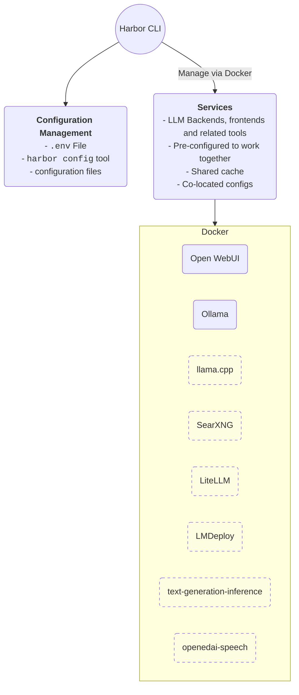

Containerized LLM toolkit. Run LLM backends, APIs, frontends, and additional services via a concise CLI.

## Quickstart

#### Requirements

- Docker
  - _Optional_ [NVIDIA Container Toolkit](https://docs.nvidia.com/datacenter/cloud-native/container-toolkit/latest/install-guide.html#installation)
- git
- bash-compatible shell

#### Unsafe install

- Runs the install script directly from the internet (make sure you trust the source)
- Will clone the Harbor repository to your home directory
- Will write to your shell profile to add bin folder to the path

```bash
curl -sSL https://raw.githubusercontent.com/av/harbor/main/install.sh | bash
```

#### Manual install

Same as above, just done by you.

```bash
git clone https://github.com/av/harbor.git && cd harbor

# [Optional] make Harbor CLI available globally
# Creates a symlink in User's local bin directory
# Adds the bin folder to the path
./harbor.sh ln

# Start default services
# Initial download of the docker images might take a while
# If you have container toolkit installed, GPU will
# be automatically used for supported services.
harbor up

# [Optional] open Webui in the browser
harbor open
```

> [!NOTE]
> First open will require you to create a local admin account. Harbor keeps auth requirement by default because it also supports exposing your local stack to the internet.

## Blitz Tour


```bash
# Run Harbor with additional services
# Running SearXNG automatically enables Web RAG in Open WebUI
harbor up searxng

# Run additional/alternative LLM Inference backends
# Open Webui is automatically connected to them.
harbor up llamacpp tgi litellm vllm tabbyapi aphrodite

# Run different Frontends
harbor up librechat bionicgpt hollama

# Use custom models for supported backends
harbor llamacpp model https://huggingface.co/user/repo/model.gguf

# Shortcut to HF Hub to find the models
harbor hf find gguf gemma-2
# Use HFDownloader and official HF CLI to download models
harbor hf dl -m google/gemma-2-2b-it -c 10 -s ./hf
harbor hf download google/gemma-2-2b-it

# Where possible, cache is shared between the services
harbor tgi model google/gemma-2-2b-it
harbor vllm model google/gemma-2-2b-it
harbor aphrodite model google/gemma-2-2b-it
harbor tabbyapi model google/gemma-2-2b-it-exl2
harbor mistralrs model google/gemma-2-2b-it
harbor opint model google/gemma-2-2b-it

# Convenience tools for docker setup
harbor logs llamacpp
harbor exec llamacpp ./scripts/llama-bench --help
harbor shell tabbyapi

# Tell your shell that you don't like it anymore,
# courtesy of Open Interpreter
harbor opint

# Access service CLIs without installing them
harbor hf scan-cache
harbor ollama list

# Open services from the CLI
harbor open webui
harbor open llamacpp
# Print yourself a QR to quickly open the
# service on your phone
harbor qr
# Feeling adventurous? Expose your harbor
# to the internet
harbor tunnel

# Config management
harbor config list
harbor config set webui.host.port 8080

# Eject from Harbor into a standalone Docker Compose setup
# Will export related services and variables into a standalone file.
harbor eject searxng llamacpp > docker-compose.harbor.yml
```

## Documentation

- [Harbor CLI Reference](https://github.com/av/harbor/wiki/Harbor-CLI-Reference)<br/>
  Read more about Harbor CLI commands and options.
- [Harbor Services](https://github.com/av/harbor/wiki/Services)<br/>
  Read about supported services and the ways to configure them.
- [Harbor Compose Setup](https://github.com/av/harbor/wiki/Harbor-Compose-Setup)<br/>
  Read about the way Harbor uses Docker Compose to manage services.
- [Compatibility](https://github.com/av/harbor/wiki/Compatibility)<br/>
  Known compatibility issues between the services and models as well as possible workarounds.

## Why?

- Convenience factor
- Workflow/setup centralisation

If you're comfortable with Docker and Linux administration - you likely don't need Harbor per se to manage your local LLM environment. However, you're also likely to eventually arrive to a similar solution.

Harbor is not designed as a deployment solution, but rather as a helper for the local LLM development environment. It's a good starting point for experimenting with LLMs and related services.

You can later eject from Harbor and use the services in your own setup, or continue using Harbor as a base for your own configuration.

## Overview and Features



This project is a CLI and a pre-configured Docker Compose setup that connects various LLM-related projects together. It simplifies the initial configuration and can serve as a base for your own customized setup later.

- Manage local LLM stack with a concise CLI
- Convenience utilities for common tasks (model management, configuration, service debug)
- Access service CLIs (`hf`, `ollama`, etc.) via Docker without install
- Services are pre-configured to work together
- Host cache is shared and reused - Hugging Face, ollama, etc.
- Co-located service configs
- Eject to run without harbor with `harbor eject`
