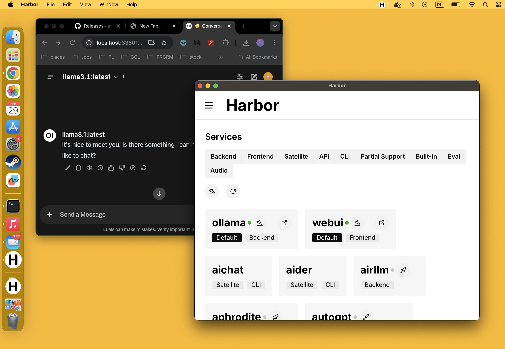

## Installing Harbor

Harbor lets you run local LLMs and 50+ AI services with simple commands. Get Open WebUI + Ollama running in minutes.

> [!NOTE]
> Harbor is in active development (v0.x). Join our [Discord](https://discord.gg/8nDRphrhSF) for support.

### At a Glance

| Path | Time | Prerequisites | Best For |
|------|------|---------------|----------|
| [Quick Start](#quick-start) | 5 min | Docker + Git | Docker users |
| [Agent Install Prompt](#agent-install-prompt) | 5-15 min | Agent CLI | Claude Code, Codex, and similar tools |
| [Complete Install](#complete-installation-guide) | 15-30 min | Just a computer | New to Docker |
| [GPU Setup](#gpu-acceleration-optional) | +10 min | NVIDIA / AMD GPU | Optional boost |

---

## Table of Contents

- [Quick Start](#quick-start)
- [Agent Install Prompt](#agent-install-prompt)
- [Complete Installation Guide](#complete-installation-guide)
  - [Windows](#-windows-installation)
  - [macOS](#-macos-installation)
  - [Linux](#-linux-installation)
- [GPU Acceleration (Optional)](#gpu-acceleration-optional)
- [Harbor CLI Installation Methods](#harbor-cli-installation-methods)
  - [Quick Install Script](#quick-install-script-recommended)
  - [Manual Install](#manual-install)
- [Harbor App (GUI)](#harbor-app-gui)
- [Troubleshooting](#troubleshooting)

---

## Quick Start

**For users who already have Docker and Git installed.**

### Prerequisites Check

- [ ] Docker installed and running (`docker --version`)
- [ ] Docker Compose 2.23.1+ installed (`docker compose version`)
- [ ] Git installed (`git --version`)
- [ ] curl installed (`curl --version`)
- [ ] 10GB+ free disk space

### Install Harbor

Choose your preferred method:

**Quick Install Script (Recommended)**
```bash
curl -fsSL https://raw.githubusercontent.com/av/harbor/refs/heads/main/install.sh | bash
```

### Verify Installation

```bash
harbor --version
harbor doctor  # Check system compatibility
```

### Start Using Harbor

```bash
harbor up    # Start default services (Ollama + Open WebUI)
harbor open  # Open in browser
```

> [!TIP]
> First launch requires creating a local admin account for Open WebUI.

**✓ Done! What's next?**
- [Harbor User Guide](./1.-Harbor-User-Guide.md)
- [Available Services](./2.-Services.md)
- [CLI Reference](./3.-Harbor-CLI-Reference.md)

---

## Agent Install Prompt

Use [`install.md`](https://github.com/av/harbor/blob/main/install.md) when you want an agentic coding tool to install Harbor for you. The prompt tells the agent to orchestrate the install through Harbor's `install.sh` (which installs dependencies by default) and verify with `harbor --version` and `harbor doctor`.

```bash
# With Claude Code
curl -fsSL https://raw.githubusercontent.com/av/harbor/refs/heads/main/install.md | claude

# With Codex
codex "$(curl -fsSL https://raw.githubusercontent.com/av/harbor/refs/heads/main/install.md)"
```

This is the recommended path for Claude Code, Codex, and similar local agents. Use the quick script directly when you are installing Harbor yourself.

---

## Complete Installation Guide

**New to Docker?** No problem. Choose your platform below for step-by-step instructions.

Harbor is a containerized toolkit that runs on top of Docker. This enables Harbor to support so many services and work across platforms. The sections below guide you through setting up Docker and all prerequisites.

<details>
<summary><b>🪟 Windows Installation</b></summary>

### Windows Installation (15-25 minutes)

**What you'll need:**
- Windows 10/11 (64-bit)
- 20GB free disk space
- Administrator access

**Why WSL2?** Harbor uses WSL2 (Windows Subsystem for Linux) to run Docker on Windows. Think of it as a lightweight Linux environment inside Windows.

> [!WARNING]
> **WSL1 is not supported.** Harbor requires WSL2 for Docker compatibility. If you have an existing WSL1 distro, upgrade it: `wsl --set-version <distro> 2`

**Supported WSL2 distros:** Ubuntu, Debian, Fedora, openSUSE, Kali, Arch (auto-detected in this order). If none are found, the installer will set up Ubuntu automatically.

#### Step 1: Install WSL2 (5 minutes)

Open PowerShell as Administrator and run:

```powershell
wsl --install
```

Restart your computer when prompted.

**Verify:**
```bash
wsl --version
```

You should see WSL version information with WSL2 as the default version.

#### Step 2: Install Docker Desktop (10 minutes)

- [ ] Download [Docker Desktop for Windows](https://docs.docker.com/desktop/install/windows-install/)
- [ ] Run the installer
- [ ] During installation, ensure "Use WSL 2 instead of Hyper-V" is checked
- [ ] Restart your computer
- [ ] Launch Docker Desktop
- [ ] In Docker Desktop settings, go to Resources → WSL Integration
- [ ] Enable integration with your default WSL distro

**Verify** (in WSL2 terminal):
```bash
docker --version
docker compose version
docker run hello-world
```

You should see "Hello from Docker!" ✓

#### Step 3: Install Git (2 minutes)

In your WSL2 terminal:
```bash
sudo apt update && sudo apt install git -y
```

**Verify:**
```bash
git --version
```

#### Step 4: Install Harbor (5 minutes)

Follow the [Harbor CLI installation methods](#harbor-cli-installation-methods) below.

**✓ Success! What's next?**
- Run `harbor doctor` to verify everything is working
- Try `harbor up` to start default services
- [Learn more about Harbor](./1.-Harbor-User-Guide.md)

**Common Issues:**
- **Docker Desktop not starting?** Ensure virtualization is enabled in BIOS
- **WSL not installing?** You may need to enable Windows features manually
- **Permission issues?** Ensure Docker integration is enabled for your WSL distro in Docker Desktop settings (Resources > WSL Integration)
- **Slow file operations?** Avoid installing Harbor on Windows-mounted paths (`/mnt/c`, `/mnt/d`). Use the native Linux filesystem (e.g., `~/.harbor`) for best performance
- **WSL1 errors?** Upgrade your distro to WSL2: `wsl --set-version <distro> 2`

</details>

<details>
<summary><b>🍎 macOS Installation</b></summary>

### macOS Installation (15-20 minutes)

**What you'll need:**
- macOS 11 (Big Sur) or newer
- 20GB free disk space
- Administrator access

> [!NOTE]
> **ARM64 Limitation:** Some services don't ship ARM64 images (Apple Silicon). GPU pass-through is not supported on macOS. For Metal-accelerated inference, use host-native backends like [Docker Model Runner](./2.2.22-Backend-Docker-Model-Runner.md) (`harbor up dmr`), [MLX](./2.2.23-Backend-MLX.md) (`harbor up mlx`), or [oMLX](./2.2.24-Backend-oMLX.md) (`harbor up omlx`) — they run on the host and are exposed to Harbor containers via a proxy.

#### Step 1: Install Docker Desktop (10 minutes)

- [ ] Download [Docker Desktop for Mac](https://docs.docker.com/desktop/install/mac-install/)
  - Choose Apple Silicon or Intel based on your Mac
- [ ] Open the `.dmg` file and drag Docker to Applications
- [ ] Launch Docker from Applications
- [ ] Follow the setup wizard
- [ ] Grant the requested permissions

**Verify** (in Terminal):
```bash
docker --version
docker compose version
docker run hello-world
```

You should see "Hello from Docker!" ✓

#### Step 2: Install Git (2 minutes)

Git typically comes pre-installed on macOS. Verify:
```bash
git --version
```

If not installed, macOS will prompt you to install Command Line Tools.

Or install via Homebrew:
```bash
brew install git
```

#### Step 3: Install Harbor (5 minutes)

Follow the [Harbor CLI installation methods](#harbor-cli-installation-methods) below.

**✓ Success! What's next?**
- Run `harbor doctor` to verify everything is working
- Try `harbor up` to start default services
- [Learn more about Harbor](./1.-Harbor-User-Guide.md)

**Common Issues:**
- **Docker Desktop not starting?** Check System Preferences → Privacy & Security
- **Permission errors?** Grant Full Disk Access to Docker in System Preferences
- **ARM64 service not available?** Check [available services](./2.-Services.md) for ARM64 support

</details>

<details>
<summary><b>🐧 Linux Installation</b></summary>

### Linux Installation (15-20 minutes)

**What you'll need:**
- Ubuntu 20.04+, Debian 11+, Fedora 35+, Arch Linux, Alpine, or similar
- 20GB free disk space
- Sudo access (or root)

> [!TIP]
> On minimal or containerized environments where `sudo` is not installed, run the install script as root. The installer detects rootless environments and adapts accordingly.

#### Step 1: Install Docker (10 minutes)

**Ubuntu/Debian:**
```bash
# Add Docker's official GPG key
sudo apt-get update
sudo apt-get install ca-certificates curl
sudo install -m 0755 -d /etc/apt/keyrings
sudo curl -fsSL https://download.docker.com/linux/ubuntu/gpg -o /etc/apt/keyrings/docker.asc
sudo chmod a+r /etc/apt/keyrings/docker.asc

# Add repository
echo \
  "deb [arch=$(dpkg --print-architecture) signed-by=/etc/apt/keyrings/docker.asc] https://download.docker.com/linux/ubuntu \
  $(. /etc/os-release && echo "$VERSION_CODENAME") stable" | \
  sudo tee /etc/apt/sources.list.d/docker.list > /dev/null

# Install Docker
sudo apt-get update
sudo apt-get install docker-ce docker-ce-cli containerd.io docker-buildx-plugin docker-compose-plugin -y
```

**Fedora:**
```bash
sudo dnf -y install dnf-plugins-core
sudo dnf config-manager --add-repo https://download.docker.com/linux/fedora/docker-ce.repo
sudo dnf install docker-ce docker-ce-cli containerd.io docker-buildx-plugin docker-compose-plugin -y
sudo systemctl start docker
sudo systemctl enable docker
```

**Configure Docker to run without sudo:**
```bash
sudo groupadd docker
sudo usermod -aG docker $USER
newgrp docker
```

**Verify:**
```bash
docker --version
docker compose version
docker run hello-world
```

You should see "Hello from Docker!" ✓

#### Step 2: Install Git (2 minutes)

**Ubuntu/Debian:**
```bash
sudo apt-get install git -y
```

**Fedora:**
```bash
sudo dnf install git -y
```

**Verify:**
```bash
git --version
```

#### Step 3: Install Harbor (5 minutes)

Follow the [Harbor CLI installation methods](#harbor-cli-installation-methods) below.

**✓ Success! What's next?**
- Run `harbor doctor` to verify everything is working
- Try `harbor up` to start default services
- [Learn more about Harbor](./1.-Harbor-User-Guide.md)

**Common Issues:**
- **Permission denied?** Ensure you've added your user to the docker group and logged out/in
- **Docker service not starting?** Try `sudo systemctl status docker`
- **Old Docker version?** Ensure Docker Compose 2.23.1+ is installed
- **No `sudo` available?** Run the install script as root, or install `sudo` first

</details>

---

## GPU Acceleration (Optional)

**Should you set this up?**
- ✓ You have an NVIDIA or AMD GPU
- ✓ You want 3-10x faster inference for local LLMs

### NVIDIA Setup

> [!NOTE]
> Official documentation: [NVIDIA Container Toolkit Installation Guide](https://docs.nvidia.com/datacenter/cloud-native/container-toolkit/latest/install-guide.html)

**Ubuntu/Debian:**
```bash
# Add NVIDIA Container Toolkit repository
distribution=$(. /etc/os-release;echo $ID$VERSION_ID)
curl -fsSL https://nvidia.github.io/libnvidia-container/gpgkey | sudo gpg --dearmor -o /usr/share/keyrings/nvidia-container-toolkit-keyring.gpg
curl -s -L https://nvidia.github.io/libnvidia-container/$distribution/libnvidia-container.list | \
  sed 's#deb https://#deb [signed-by=/usr/share/keyrings/nvidia-container-toolkit-keyring.gpg] https://#g' | \
  sudo tee /etc/apt/sources.list.d/nvidia-container-toolkit.list

# Install
sudo apt-get update
sudo apt-get install -y nvidia-container-toolkit
sudo systemctl restart docker
```

**Arch Linux:**
```bash
# Install from official repositories
sudo pacman -S nvidia-container-toolkit

# Configure Docker runtime
sudo nvidia-ctk runtime configure --runtime=docker
sudo systemctl restart docker
```

**Windows (WSL2):**
Follow the Ubuntu/Debian instructions above inside your WSL2 terminal.

**Verify:**
```bash
docker run --rm --gpus all nvidia/cuda:12.0.0-base-ubuntu22.04 nvidia-smi
```

You should see your GPU information ✓

### AMD Setup (ROCm)

> [!NOTE]
> Official documentation: [AMD ROCm Docker Guide](https://rocm.docs.amd.com/projects/install-on-linux/en/latest/how-to/docker.html)

Use this method if you have an AMD Radeon GPU (RX 6000/7000 series or newer recommended).

> [!TIP]
> Ensure your user is in the `render` or `video` group to access GPU devices:
> `sudo usermod -aG render,video $USER`

**Ubuntu (22.04 / 24.04):**
```bash
# 1. Add ROCm GPG key
wget https://repo.radeon.com/rocm/rocm.gpg.key -O - | \
  gpg --dearmor | sudo tee /etc/apt/keyrings/rocm.gpg > /dev/null

# 2. Add repository
source /etc/os-release
echo "deb [signed-by=/etc/apt/keyrings/rocm.gpg] https://repo.radeon.com/amd-container-toolkit/apt/ $VERSION_CODENAME main" \
  | sudo tee /etc/apt/sources.list.d/amd-container-toolkit.list

# 3. Install
sudo apt update && sudo apt install -y amd-container-toolkit

# 4. Configure Docker
sudo amd-ctk runtime configure
sudo systemctl restart docker
```

> [!WARNING]
> **Important:** You must run `amd-ctk runtime configure` to set up Docker's AMD runtime. Without this, GPU-accelerated containers may not have access to your GPU devices.

**Fedora / RHEL:**
```bash
# 1. Add repository and install
sudo dnf config-manager --add-repo https://repo.radeon.com/amd-container-toolkit/el9/main/amd-container-toolkit.repo
sudo dnf install -y amd-container-toolkit

# 2. Configure Docker
sudo amd-ctk runtime configure
sudo systemctl restart docker
```

**Verify:**
> [!NOTE]
> This command may download the Ubuntu image if not present on your system.

```bash
docker run --rm --runtime=amd -e AMD_VISIBLE_DEVICES=all ubuntu ls -l /dev/dri
```
Expected output: `/dev/dri/renderD128` shown in the container.

**✓ GPU Enabled!** Harbor will automatically use GPU for supported services when available.

---

## Harbor CLI Installation Methods

Choose your preferred installation method. All methods work equally well.

### Quick Install Script (Recommended)

This automated script:
- Installs system dependencies (Git, curl, Docker, Docker Compose) by default via `requirements.sh`
- Clones Harbor to `~/.harbor`
- Adds Harbor to your PATH (supports bash, zsh, and fish shells)
- Merges config on upgrade (preserves your existing `.env` and per-service `override.env` files)
- Prevents concurrent installs (lock-based protection)
- Runs `harbor doctor` to verify the installation
- Works on Linux, macOS, and Windows (WSL2)

```bash
curl -fsSL https://raw.githubusercontent.com/av/harbor/refs/heads/main/install.sh | bash
```

If Docker, Git, and Docker Compose are already installed and you want to skip the dependency step:

```bash
curl -fsSL https://raw.githubusercontent.com/av/harbor/refs/heads/main/install.sh | bash -s -- --skip-requirements
```

> [!WARNING]
> Use `| bash`, not `| sh`. The install script requires bash and will error if run under a different shell (e.g., dash or sh).

> [!TIP]
> Want to review the script first? `curl -fsSL https://raw.githubusercontent.com/av/harbor/refs/heads/main/install.sh | less`

> [!TIP]
> Want an agentic tool to run the install for you? Use the [Agent Install Prompt](#agent-install-prompt).

> [!TIP]
> Need a custom install location? See [Manual Install](#manual-install) below.

**On Windows:** Run this inside your WSL2 terminal, not PowerShell.

---

### Manual Install

Same as the quick install script, but manual. You can install Harbor to any location:

```bash
# Default location
git clone https://github.com/av/harbor.git ~/.harbor
cd ~/.harbor

# Or a custom location
git clone https://github.com/av/harbor.git /path/to/harbor
cd /path/to/harbor

# Make Harbor CLI available globally
./harbor.sh ln

# Verify installation
harbor --version
```

The `harbor update` command works the same way regardless of install location.

> [!TIP]
> Use [`harbor home`](./3.-Harbor-CLI-Reference.md#harbor-home) to reference the install path in scripts and commands.

**Troubleshooting:**
- If `harbor` command not found after install, restart your shell
- On some systems, you may need to manually add `~/.local/bin` to PATH

---

### Verify Your Installation

After installing via any method:

```bash
# Check Harbor version
harbor --version

# Check system compatibility
harbor doctor

# View available commands
harbor --help
```

**Expected output from `harbor doctor`:**
- Docker installed, daemon reachable, no sudo required
- Docker Compose 2.23.1 or newer
- Docker storage disk space (warns below 10GB free)
- Docker Hub registry connectivity
- Harbor home directory and default profile
- CLI symlink validity
- GPU detection (NVIDIA Container Toolkit, AMD ROCm) when hardware is present
- WSL version and filesystem diagnostics (when running in WSL)

**✓ Installation Complete!**

**Next steps:**
```bash
# Start default services (Ollama + Open WebUI)
harbor up

# Open in browser
harbor open

# Browse available services
harbor ls
```

> [!TIP]
> First launch requires creating a local admin account for Open WebUI. This is required because Harbor supports [exposing your services to the internet](./3.-Harbor-CLI-Reference.md#harbor-tunnels).

**Learn more:**
- [Harbor User Guide](./1.-Harbor-User-Guide.md) - How to use Harbor
- [Available Services](./2.-Services.md) - Browse 50+ services
- [CLI Reference](./3.-Harbor-CLI-Reference.md) - Complete command reference

---

## Troubleshooting

### harbor doctor

The `harbor doctor` command checks your system for common issues:

```bash
harbor doctor
```

This will verify:
- **Docker:** installation, daemon status (with 10s timeout to avoid hanging), and sudo-free access
- **Docker Compose:** version 2.23.1 or newer
- **Disk space:** warns when Docker storage has less than 10GB free (LLM models are large)
- **Registry connectivity:** tests Docker Hub reachability, reports proxy configuration, diagnoses DNS and network failures
- **Harbor home:** directory existence, default profile, `.env` file
- **CLI symlink:** checks that `harbor` points to a valid target (detects broken symlinks after moves or uninstalls)
- **GPU (when hardware is present):**
  - NVIDIA: GPU detection via `nvidia-smi`, Container Toolkit (`nvidia-ctk` or `nvidia-container-toolkit`)
  - AMD ROCm: checks `/dev/kfd`, `/dev/dri/renderD*` devices, and `amdgpu` kernel module
- **WSL diagnostics (when running in WSL):** WSL version (flags WSL1 as unsupported), Windows-mounted filesystem warnings

For scripting, `harbor doctor --check` prints the same diagnostics but exits non-zero only on critical issues (Docker or Compose unusable, broken installation) — non-critical warnings such as a missing NVIDIA Container Toolkit or registry connectivity problems do not affect the exit code. The installer and the Harbor App use this mode to decide whether the environment is ready.

### Common Issues

**"docker: command not found"**
- Docker is not installed or not in PATH
- On Windows: Make sure you're running commands in WSL2, not PowerShell
- Solution: Follow the [Complete Installation Guide](#complete-installation-guide) for your platform

**"Cannot connect to the Docker daemon" or "Docker daemon is not responding"**
- Docker Desktop is not running, or is still starting up
- Solution: Start Docker Desktop and wait for it to fully initialize
- On Linux: Try `sudo systemctl start docker`
- If doctor reports a timeout, Docker may be starting -- wait a moment and retry

**"docker compose: command not found" or version too old**
- Docker Compose plugin not installed or outdated
- Solution: Install/update Docker Compose plugin (minimum version 2.23.1)
- Check version: `docker compose version`

**"Permission denied" when running docker commands**
- On Linux: User not in docker group
- Solution: `sudo usermod -aG docker $USER` then log out and back in (or `newgrp docker`)
- On Windows/macOS: Docker Desktop permissions issue

**"Low disk space on Docker storage"**
- Docker storage has less than 10GB free -- LLM models can be 4-70GB each
- Solution: Free space with `docker system prune` or move Docker's data directory to a larger volume

**"Docker Hub registry is not reachable"**
- Network connectivity issue, DNS failure, or proxy/firewall blocking Docker Hub
- Doctor reports proxy environment variables when set -- verify they allow access to `registry-1.docker.io`
- Solution: Check your internet connection, VPN, or corporate firewall settings

**"CLI symlink is broken"**
- The `harbor` symlink in `~/.local/bin` points to a missing target (Harbor was moved or deleted)
- Solution: Run `harbor link` from the Harbor install directory, or reinstall

**Services fail to start with GPU errors (NVIDIA or AMD)**
- NVIDIA Container Toolkit not properly installed
- AMD: `/dev/kfd` missing permissions or `amdgpu` kernel module not loaded
- Solution: See [GPU Acceleration](#gpu-acceleration-optional) section. For AMD, ensure your user is in the `render` and `video` groups.

**"harbor: command not found" after installation**
- PATH not updated or shell not restarted
- Solution: Restart your terminal or run `source ~/.bashrc` (or `~/.zshrc`, or open a new fish shell)
- Manual fix: Add `~/.local/bin` to your PATH (Harbor links the CLI there via `harbor.sh ln`)
- Fish shell users: the installer creates `~/.config/fish/conf.d/harbor.fish` automatically

**"WSL1 does not support Docker"**
- Harbor requires WSL2. WSL1 cannot run Docker natively
- Solution: Upgrade your distro: `wsl --set-version <distro> 2`

**Slow operations in WSL**
- Harbor is installed on a Windows-mounted filesystem (`/mnt/c`, `/mnt/d`)
- Solution: Move Harbor to the native Linux filesystem (e.g., `~/.harbor` on ext4) for 5-10x faster performance

**"Another Harbor install is already running"**
- A concurrent install process holds the lock file
- Solution: Wait for the other install to finish, or remove the stale lock file if no other install is running (path is shown in the error message)

**Services download slowly or fail**
- Large Docker images (especially with CUDA)
- Solution: Be patient, first download can take 10-30 minutes depending on your internet
- Retry: `harbor down && harbor up`

**Need more help?**
- Run `harbor doctor` for automated diagnostics
- Join our [Discord community](https://discord.gg/8nDRphrhSF)
- Check [GitHub Issues](https://github.com/av/harbor/issues)
- Read the [CLI Reference](./3.-Harbor-CLI-Reference.md)

---

## Harbor App (GUI)

**Alternative to the command-line interface.**

Harbor App provides a graphical interface for managing Harbor services. It's built on top of the Harbor CLI.

On first launch, the app can install Harbor and host prerequisites for you through a [guided setup flow](./1.1-Harbor-App.md#guided-setup-first-launch). You only need to download and install the Harbor App package first; the CLI install is optional beforehand.

> [!NOTE]
> Harbor App is in beta. The CLI is more stable and feature-complete for advanced workflows. Windows App support is beta and uses WSL2 plus Docker Desktop.

### When to Use Harbor App

**Use Harbor App if you:**
- Prefer graphical interfaces over command-line
- Want visual service management
- Want App-first install on Linux, macOS, or Windows (WSL2)
- Are comfortable with beta software

**Use Harbor CLI if you:**
- Comfortable with terminal commands
- Want the most stable experience
- Need all features and latest updates
- Prefer installing Harbor manually before opening the app

### Prerequisites

**App package only (recommended path)**

- [ ] Harbor App installed from [releases](https://github.com/av/harbor/releases/latest)
- [ ] Linux, macOS, or Windows 10/11 with WSL2 capability (Windows)
- [ ] Administrator or sudo access when the guided installer needs it
- [ ] Network access for Docker images and Harbor install scripts

**Already have Harbor CLI (optional)**

- [ ] `harbor` on PATH (or in WSL for Windows) and `harbor doctor` passing
- [ ] Docker daemon running when you start services

If the CLI is missing, launch the app and use **Install Harbor** on the setup screen. See [Harbor App — Guided setup](./1.1-Harbor-App.md#guided-setup-first-launch) for platform-specific behavior.

### Installation by Platform

<details>
<summary><b>🐧 Linux</b></summary>

Download the package for your distribution from the [latest release](https://github.com/av/harbor/releases/latest):

**Debian/Ubuntu (.deb)**
```bash
# Download the .deb file from releases
sudo dpkg -i Harbor_*.deb

# If dependencies missing:
sudo apt-get install -f
```

**AppImage (Universal)**
```bash
# Download the .AppImage file from releases
chmod +x Harbor_*.AppImage
./Harbor_*.AppImage
```

**✓ Launch Harbor App from your applications menu or run the AppImage.**

</details>

<details>
<summary><b>🍎 macOS</b></summary>

**Important:** Harbor App is not code-signed. You'll need to bypass macOS security.

#### Installation Steps

1. Download `Harbor_aarch64.app.tar.gz` from [releases page](https://github.com/av/harbor/releases/latest)
2. Extract the archive (double-click the `.tar.gz` file)
3. You'll see `Harbor.app` in the same directory
4. Open Terminal in that directory and run:

```bash
sudo xattr -d com.apple.quarantine ./Harbor.app
```

5. Enter your system password when prompted
6. Launch Harbor.app by double-clicking it
7. (Optional) Move to Applications folder for easier access

**✓ Harbor App is now ready to use!**



**Troubleshooting:**
- **"damaged and can't be opened":** Run the `xattr` command above
- **Setup screen or errors after launch:** Complete [guided setup](./1.1-Harbor-App.md#guided-setup-first-launch) or run `harbor doctor` after the CLI is installed
- **Can't find Harbor.app:** Make sure you extracted the .tar.gz file

</details>

<details>
<summary><b>🪟 Windows</b></summary>

Harbor App on Windows is beta. Guided setup installs WSL2 (if needed), a WSL2 distro, Docker Desktop, and the Harbor CLI inside WSL via `install.ps1`.

Supported WSL2 distros (auto-detected in this order): Ubuntu, Debian, Fedora, openSUSE, Kali, Arch. If none are found, Ubuntu is installed automatically.

1. Download `.msi` or `setup.exe` from [releases page](https://github.com/av/harbor/releases/latest)
2. Run the installer
3. Launch from Start Menu
4. On the setup screen, choose **Install Harbor** and complete any WSL or Docker Desktop first-run prompts
5. Enable Docker Desktop **WSL integration** for your WSL distro when prompted, then **Retry** setup if Docker was not reachable yet

**Optional:** set `HARBOR_WSL_DISTRO` to your distro name before launching the app to override auto-detection.

**If setup is blocked or the main UI shows errors:**
- Run `harbor doctor` inside WSL: `wsl.exe -d <YourDistro> -e bash -lic 'harbor doctor'`
- Confirm Docker Desktop is running and integrated with your WSL distro
- Restart Harbor App after WSL or Docker Desktop finishes its first-run setup

**Having issues?** See [Harbor App — Guided setup](./1.1-Harbor-App.md#guided-setup-first-launch) or install Harbor manually in WSL2 with the [Windows installation](#-windows-installation) steps and press **Check** in the app.

</details>

---

### Next Steps with Harbor App

After installing the app package:

1. **Launch the app** — Complete [guided setup](./1.1-Harbor-App.md#guided-setup-first-launch) if prompted, or confirm **Ready** if `harbor` is already installed
2. **Verify the CLI** — Open the CLI screen and confirm `harbor doctor` passes
3. **Browse services** — See all 50+ available services on the Home screen
4. **Start services** — Start the default stack or individual services (for example Open WebUI and a backend)
5. **Monitor status** — View running services and their logs

```bash
# Equivalent CLI steps after setup is ready
harbor doctor
harbor up
harbor open
```

**Learn more:**
- [Harbor App Guide](./1.1-Harbor-App.md)
- [Available Services](./2.-Services.md)

---

## Additional Resources

### System Requirements Summary

**Minimum:**
- 10GB free disk space (more recommended for multiple services)
- 8GB RAM (16GB+ recommended for LLMs)
- Docker 20.10+
- Docker Compose 2.23.1+
- Git and curl
- Bash 3.2+

**Recommended:**
- 50GB+ free disk space
- 16GB+ RAM
- NVIDIA GPU (optional, for faster inference)
- AMD GPU with ROCm (optional, alternative to NVIDIA)
- SSD storage (for better performance)

### Bash Version Check

Harbor requires Bash 3.2 or newer (available by default on most systems):

```bash
bash --version
```

If you encounter Bash-related issues, please [report them](https://github.com/av/harbor/issues).

### Getting Help

- **Discord:** Join our [community server](https://discord.gg/8nDRphrhSF) for live support
- **GitHub Issues:** Report bugs or request features at [github.com/av/harbor/issues](https://github.com/av/harbor/issues)
- **Documentation:** Browse the [Harbor Wiki](https://github.com/av/harbor/wiki)
- **CLI Reference:** See all commands in [Harbor CLI Reference](./3.-Harbor-CLI-Reference.md)

### What's Next?

Now that Harbor is installed:

1. **Learn the basics:** [Harbor User Guide](./1.-Harbor-User-Guide.md)
2. **Explore services:** [Browse 50+ services](./2.-Services.md)
3. **Master the CLI:** [Complete CLI Reference](./3.-Harbor-CLI-Reference.md)
4. **Join the community:** [Discord](https://discord.gg/8nDRphrhSF)

**Popular first services to try:**
- [Open WebUI](./2.1.1-Frontend&colon-Open-WebUI.md) - ChatGPT-like interface
- [Ollama](./2.2.1-Backend&colon-Ollama.md) - Run local LLMs
- [ComfyUI](./2.-Services.md) - Image generation
- [n8n](./2.-Services.md) - Workflow automation

Welcome to Harbor! 🚢
