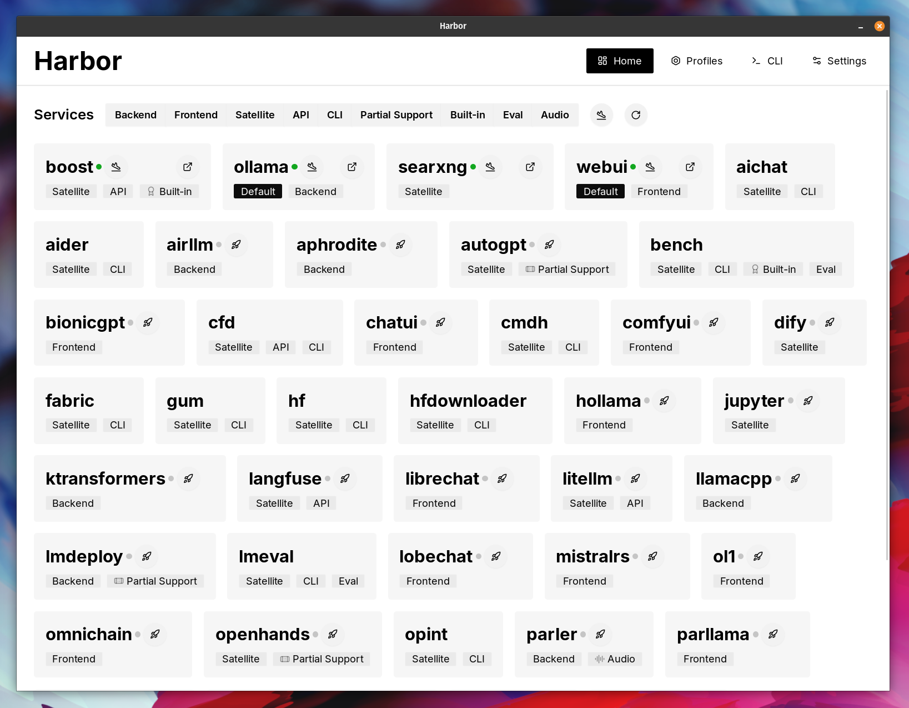
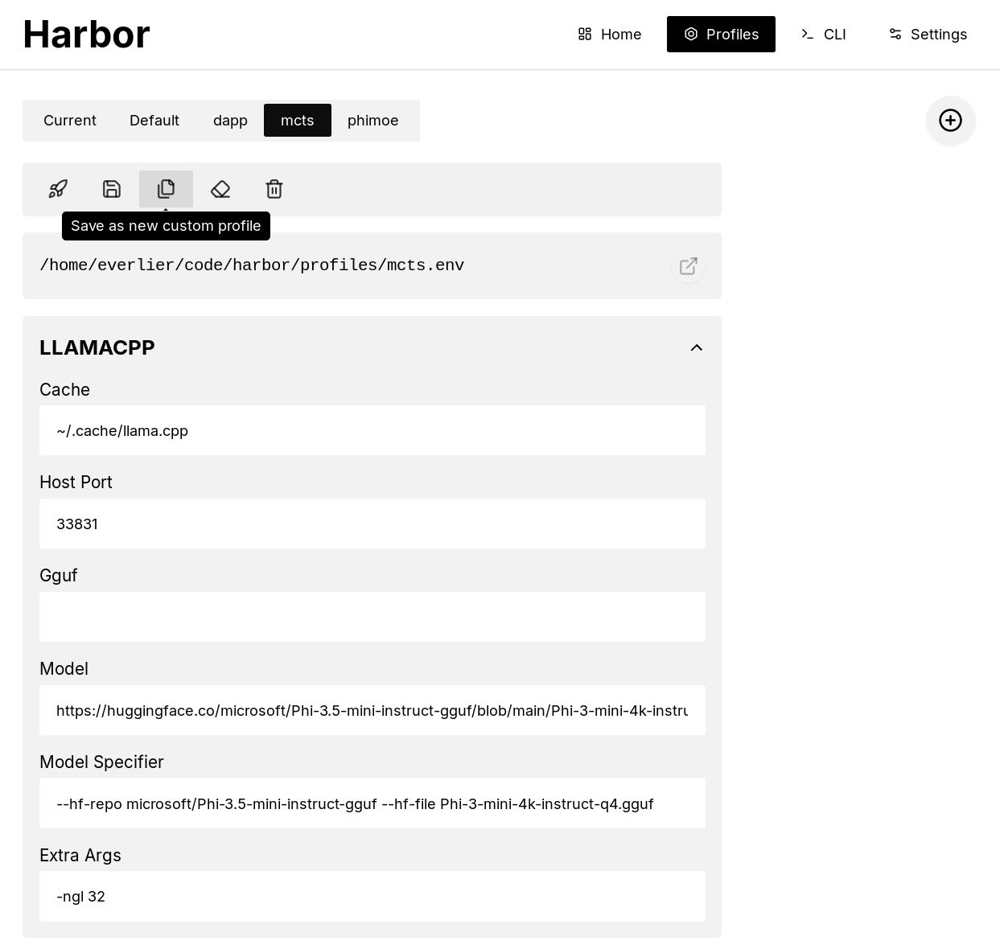
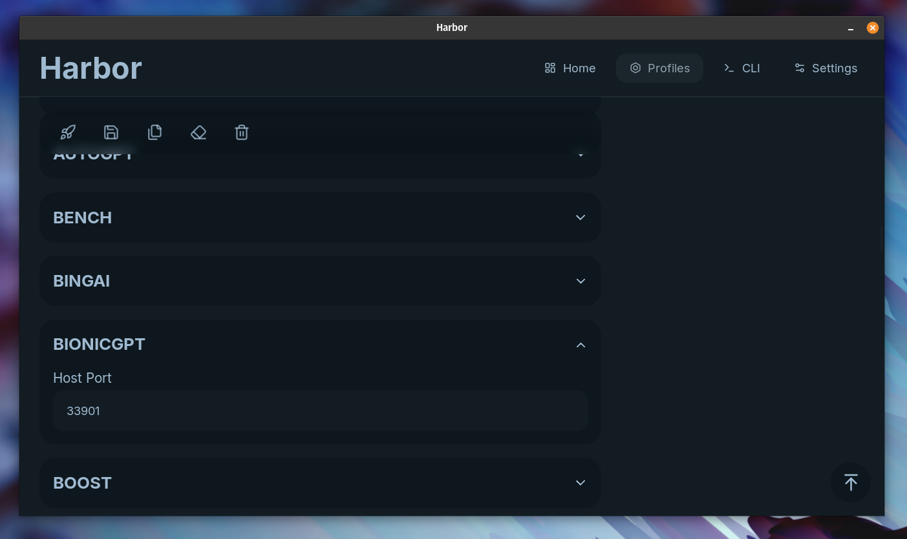
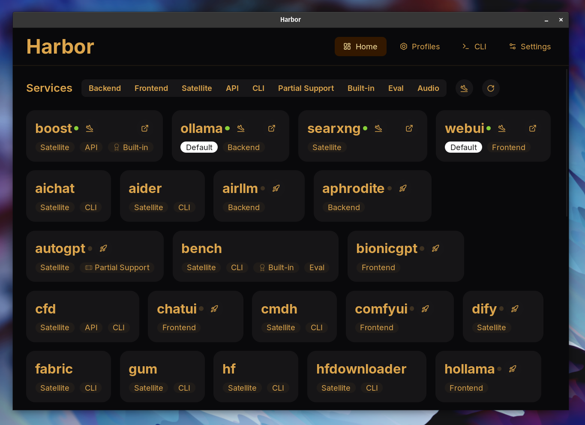
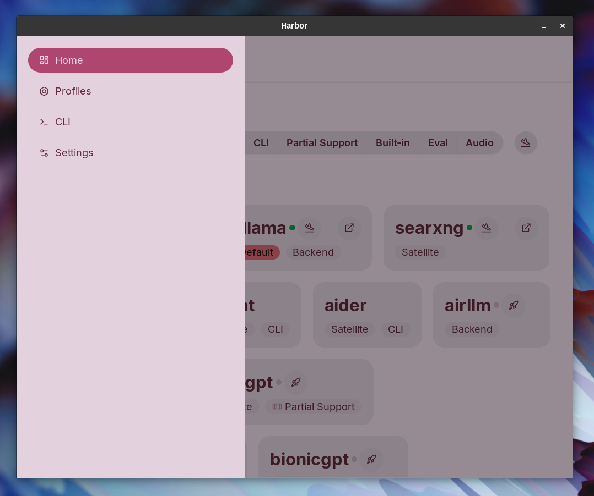

This is an overview and a manual for the Harbor companion application.

## Overview


Harbor App is a companion application for [Harbor](https://github.com/av/harbor) - a toolkit for running AI locally. It's built on top of functionality provided by the `harbor` CLI and is intended to complement it.

The app provides clean and tasteful UI to aid with workflows associated with running a local AI stack.

- 🚀 Manage Harbor stack and individual services
- 🔗 Quickly access UI/API of a running service
- ⚙️ Manage and switch between different configurations
- 🎨 Aestetically pleasing UI with plenty of built-in themes

## Demo


https://github.com/user-attachments/assets/a5cd2ef1-3208-400a-8866-7abd85808503

In the demo, Harbor App is used to launch a default stack with [Ollama](./2.2.1-Backend:-Ollama) and [Open WebUI](./2.1.1-Frontend:-Open-WebUI) services. Later, [SearXNG](./2.3.1-Satellite:-SearXNG) is also started, and WebUI can connect to it for the Web RAG right out of the box. After that, [Harbor Boost](./5.2.-Harbor-Boost) is also started and connected to the WebUI automatically to induce more creative outputs. As a final step, Harbor config is adjusted in the App for the [`klmbr`](./5.2.-Harbor-Boost#klmbr---boost-llm-creativity) module in the [Harbor Boost](./5.2.-Harbor-Boost), which makes the output unparsable for the LLM (yet still undetstandable for humans).


## Features

**Home Screen**

See available services, start and stop Harbor stack or individual services. Find services matching specific tags.

Based on:

```bash
harbor ls
harbor ls -a
harbor defaults
harbor open <service handle>
harbor url <service handle>
```

**Profiles screen**

Create and manage configuration profiles, switch between them. Edit individual configuration entries, access underlying `.env` files and more.

Based on:

```bash
harbor profiles ls
harbor profiles add <name>
harbor profiles use <name>
harbor profiles rm <name>
harbor config update
```

**Settings**

Manage application theme and autostart.

## Installation

Please refer to the [Installation Guide](./1.0.-Installing-Harbor#harbor-app).

## Gallery







