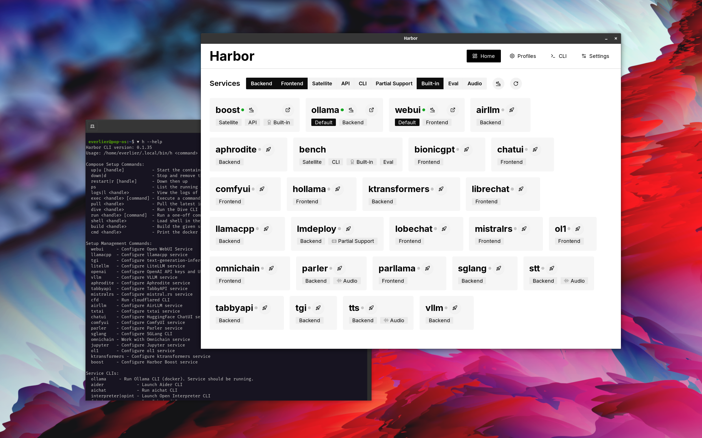
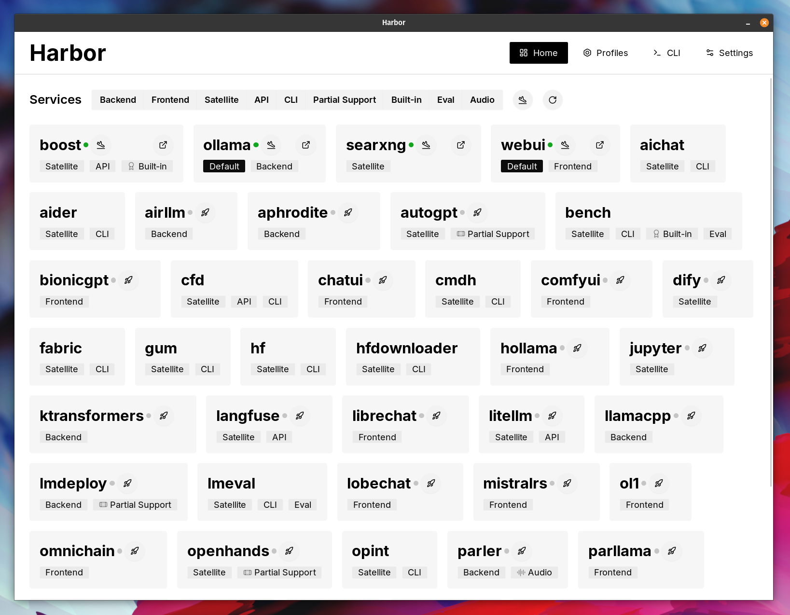
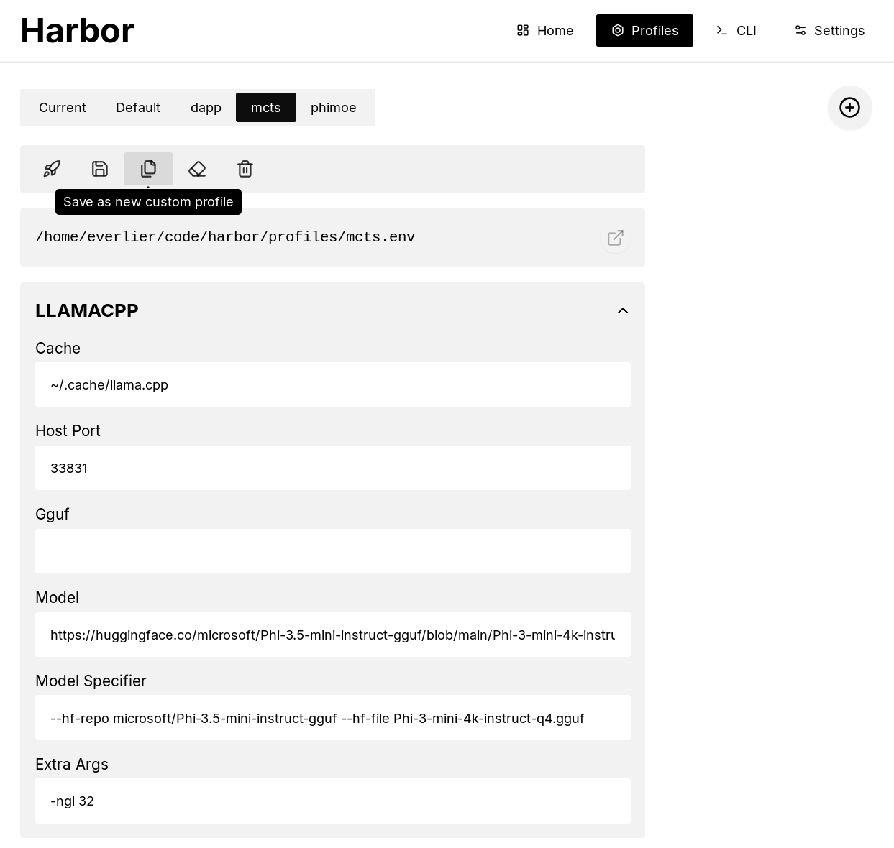
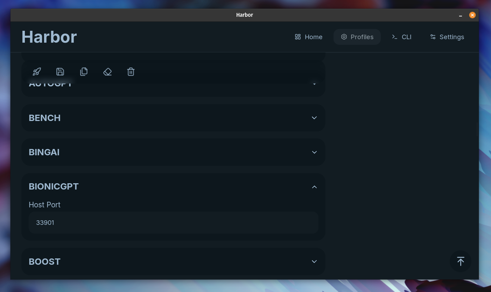
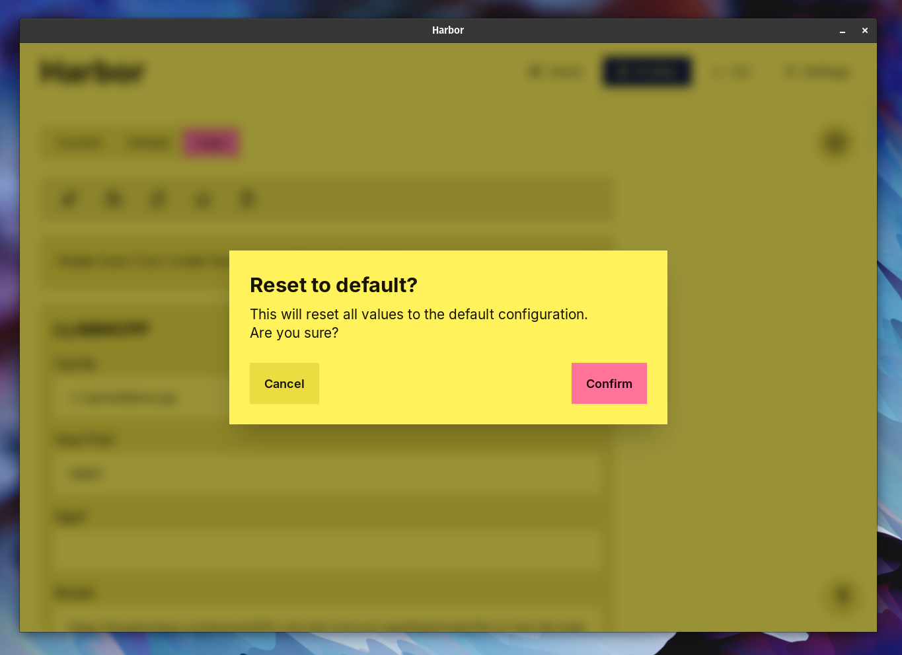
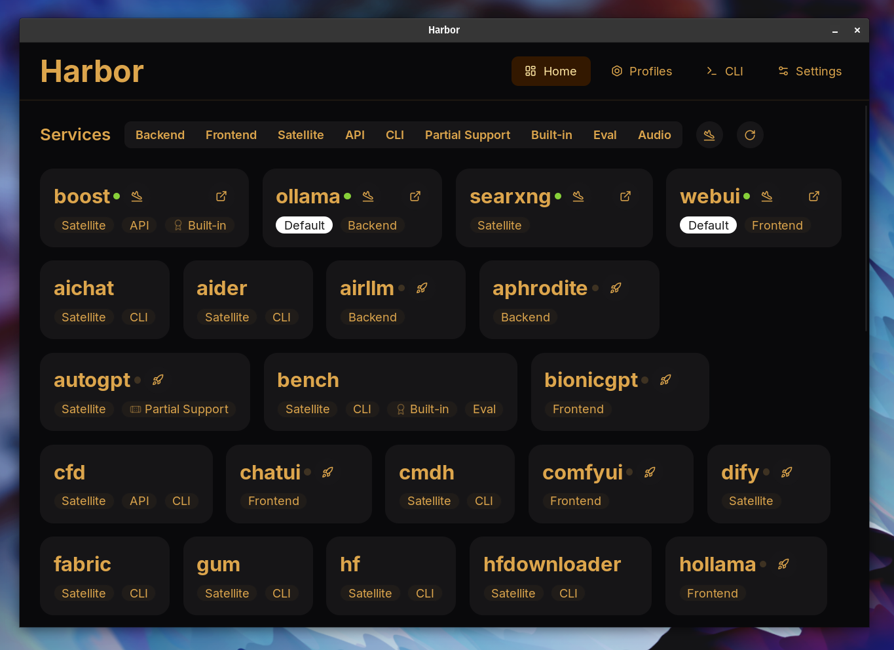
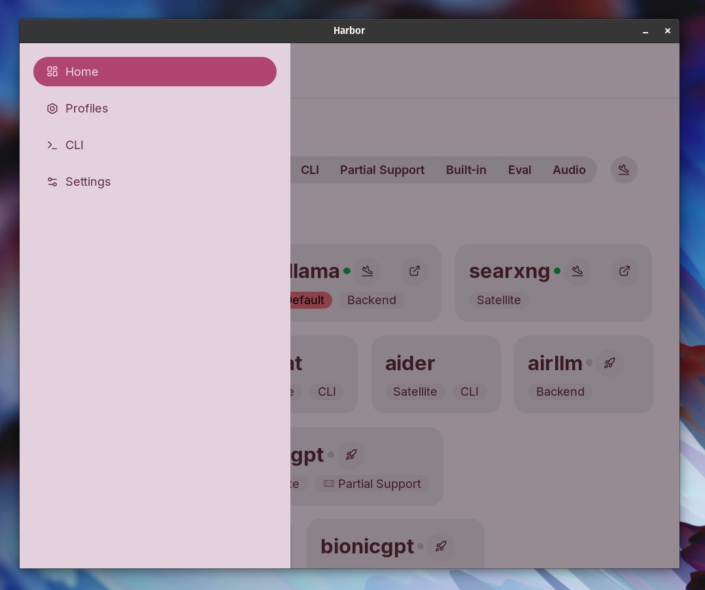

This is an overview and a manual for the Harbor companion application.

## Overview



Harbor App is a companion application for [Harbor](https://github.com/av/harbor) - a toolkit for running AI locally. It's built on top of functionality provided by the `harbor` CLI and is intended to complement it.

The app provides clean and tasteful UI to aid with workflows associated with running a local AI stack.

- 🚀 Manage Harbor stack and individual services
- 🔗 Quickly access UI/API of a running service
- ⚙️ Manage and switch between different configurations
- 🎨 Aestetically pleasing UI with plenty of built-in themes

## Demo


https://github.com/user-attachments/assets/a5cd2ef1-3208-400a-8866-7abd85808503

In the demo, Harbor App is used to launch a default stack with [Ollama](./2.2.1-Backend&colon-Ollama.md) and [Open WebUI](./2.1.1-Frontend&colon-Open-WebUI.md) services. Later, [SearXNG](./2.3.1-Satellite&colon-SearXNG.md) is also started, and WebUI can connect to it for the Web RAG right out of the box. After that, [Harbor Boost](./5.2.-Harbor-Boost.md) is also started and connected to the WebUI automatically to induce more creative outputs. As a final step, Harbor config is adjusted in the App for the [`klmbr`](./5.2.-Harbor-Boost.md#klmbr---boost-llm-creativity) module in the [Harbor Boost](./5.2.-Harbor-Boost.md), which makes the output unparsable for the LLM (yet still undetstandable for humans).


## Features

**Home Screen**

See available services, start and stop Harbor stack or individual services. Find services matching specific tags.

Based on:

```bash
harbor ls
harbor ls -a
harbor defaults
harbor open <service handle>
harbor url <service handle>
```

**Profiles screen**

Create and manage configuration profiles, switch between them. Edit individual configuration entries, access underlying `.env` files and more.

Based on:

```bash
harbor profiles ls
harbor profiles add <name>
harbor profiles use <name>
harbor profiles rm <name>
harbor config update
```

**Settings**

Manage application theme and autostart.

**CLI screen**

Shows the detected Harbor CLI version, runs `harbor doctor`, and offers **Reinstall** to rerun the guided setup installer.

## Guided setup (first launch)

Harbor App blocks the main UI until the Harbor CLI is installed and reachable. On first launch (or when `harbor` is missing), you see a setup screen with live installer output, a **Redetect** action to re-run detection, and **Install Harbor** (or **Retry** after a failure or cancel).

The app does not reimplement Harbor's installers. It runs the same official entrypoints as the CLI install guide:

| Platform | Installer invoked by the app |
|----------|----------------------------|
| Linux, macOS | [`install.sh`](https://raw.githubusercontent.com/av/harbor/refs/heads/main/install.sh) |
| Windows | [`install.ps1`](https://raw.githubusercontent.com/av/harbor/refs/heads/main/install.ps1) (WSL2 + Docker Desktop, then `install.sh` inside the selected WSL2 distro) |

### What gets installed

**Linux and macOS**

1. **Prerequisites** — `requirements.sh` installs or verifies Git, curl, Docker Engine, and Docker Compose v2 (2.23.1+). On macOS it may install Homebrew and start Docker Desktop when needed. On Linux it uses your distro package manager (apt, dnf, pacman, or apk).
2. **Harbor CLI** — clones or updates Harbor under `~/.harbor`, runs `./harbor.sh ln`, and links `harbor` into `~/.local/bin`.
3. **Verification** — runs `harbor --version` and `harbor doctor --check` (fails only on critical issues).

**Windows**

1. **WSL2** — ensures WSL is available; may run `wsl --install` or `wsl --install -d Ubuntu` when no suitable distro exists. Supported distros (auto-detected in preference order): Ubuntu, Debian, Fedora, openSUSE, Kali, Arch. WSL1 distros are rejected with guidance to upgrade.
2. **Docker Desktop** — installs (winget or official installer) and starts Docker Desktop when missing; waits until `docker` works inside the selected WSL2 distro with WSL integration enabled. When Docker Desktop is already providing Docker to WSL, the installer skips installing Docker packages to avoid conflicts.
3. **Harbor CLI in WSL** — runs `install.sh` inside that distro (same prerequisites and CLI steps as Linux).
4. **Verification** — runs `harbor --version` and `harbor doctor --check` inside WSL (fails only on critical issues).

The app picks a WSL2 distro automatically (preferring a running instance, checking supported distros in order) and remembers it under `%LOCALAPPDATA%\Harbor\setup\wsl-distro`. Override with the `HARBOR_WSL_DISTRO` environment variable before launching the app if you use a non-default distro name.

### Setup stages

Install scripts emit `HARBOR_SETUP_STAGE=...` lines; the app maps them to status labels in the setup UI. Typical progression:

| Stage | Meaning |
|-------|---------|
| `checking` | App is detecting platform, whether `harbor` is reachable, and whether `harbor doctor --check` passes |
| `not-installed` | Harbor CLI not found; **Install Harbor** is available |
| `checking-platform` / `installing-prerequisites` / `checking-prerequisites` | `requirements.sh` or Windows host steps (WSL, Docker Desktop) |
| `installing-cli` | Cloning or updating Harbor and linking the CLI |
| `verifying-cli` | `harbor --version` and `harbor doctor --check` |
| `ready` | CLI verified and essential checks pass; main app UI loads |
| `refresh-required` | CLI is installed but essential checks failed (run `harbor doctor` in a terminal), the app cannot see `harbor` yet (restart the app), or a platform step needs a reboot / WSL first-run / Docker Desktop first-run before retrying |
| `blocked` | Unsupported OS, missing Linux package manager, WSL/Docker not usable, or `harbor doctor` reports Docker unreachable |
| `failed` / `cancelled` | Install error or user cancel; use **Retry** |

After setup reaches **Ready**, start services from the Home screen (for example `harbor up` / `harbor defaults` from the UI). The guided installer does not automatically start Open WebUI or download models; use the app or CLI for your stack once the CLI is ready.

### Interactive prompts, cancel, and recovery

- **Installer input** — While setup is running, type passwords or other prompts into the **installer input** field and press **Send**. The app attaches a PTY so `sudo`, package managers, and similar prompts work like a terminal.
- **Cancel** — Stops the running install process. Partial installs may remain on disk; use **Retry** after fixing the blocker.
- **PATH not updated** — If Harbor was just linked but the app still cannot find `harbor`, quit and relaunch Harbor App (status **Environment issue**).
- **Docker not running** — Start Docker Desktop or the Docker daemon, then **Retry** setup or run `harbor doctor` from the CLI screen after the app loads.
- **Manual install** — You can still install Harbor outside the app ([Installation Guide](./1.0.-Installing-Harbor.md)), then press **Redetect** on the setup screen.

Equivalent CLI-only install:

```bash
# Linux / macOS / WSL
curl -fsSL https://raw.githubusercontent.com/av/harbor/refs/heads/main/install.sh | bash
harbor doctor
```

```powershell
# Windows host (installs into WSL)
iwr -UseBasicParsing https://raw.githubusercontent.com/av/harbor/refs/heads/main/install.ps1 | iex
```

## Installation

Please refer to the [Installation Guide](./1.0.-Installing-Harbor.md#harbor-app).

## Gallery







