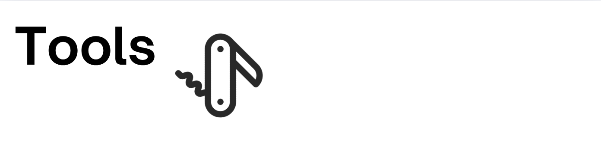
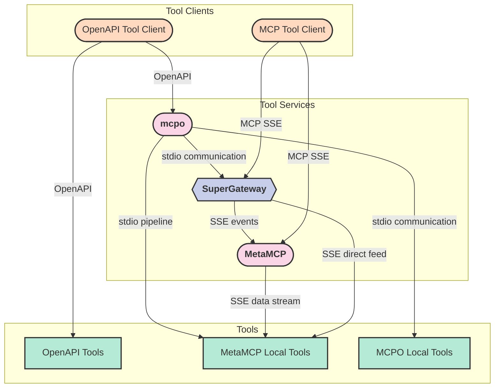

This is a high-level guide on expanding your local LLM stack with external tools from the community and ecosystem. In this guide you'll learn about Harbor's definition of a tool, service that provide tools and related functionality and how it all ties together.

## What is a tool?

Harbor operates with tools that are available over HTTP, such as: SSE/Websocket MCP servers, OpenAPI endpoints. It comes out of containerized nature of Harbor's services - they typically do not run on the same "host" and can't communicate between one another directly, but rather over a local network provided by Docker.

If tool relies on a stdio transport - it means that it'll require an adapter to be connected with Harbor's services. Harbor includes services providing the functionality to bridge stdio and http tools together as well as convert between different tool protocols.

## How things are connected?



Harbor supports two main tool protocols: MCP and OpenAPI, in addition to that MCP tools can come in SSE or STDIO flavors. For all STIO tools - Harbor provides a way to convert them to SSE.

Below is a table explaining services and their role in the system:

| Service | Description |
| ------- | ----------- |
| MCP Tool Client | Connects to MCP tools and provides a way to interact with them. When supports SSE - will use underlying tools directly, when only supports STDIO - Harbor will add supergateway to service container to run SSE-based tools |
| OpenAPI Tool Client | Connects to OpenAPI tools and provides a way to interact with them. Can interact with MCP-based tools via `mcpo` |
| `mcpo` | Runs STDIO-based MCP tools and serves them in OpenAPI format. Can use SSE-based MCP tools via SuperGateway |
| `supergateway` | Allows to translate between SSE and STDIO based MCP tools. |
| `metamcp` | Allows to manage MCP tools via a nice Web UI |

- `MCP SSE` <- `MCP STDIO`: SuperGateway
- `MCP STDIO` <- `MCP SSE`: SuperGateway
- `OpenAPI` <- `MCP STDIO`: mcpo

## Cookbook

### Use MCP In Open WebUI

```bash
# 1. Start MetaMCP
harbor up metamcp

# 2. Open MetaMCP App, install servera
harbor open metamcp

# 3. Restart MetaMCP with mcpo to connect to Open WebUI
harbor up metamcp mcpo

# 3.5. Verify tools are available in mcpo
open $(harbor url mcpo)/metamcp/docs

# 4. Open Open WebUI
# 5. Toggle the "MetaMCP" tool before starting the chat
harbor open webui
```

### TBD

Request more examples in [GitHub](https://github.com/av/harbor/issues) or our [Discord](https://discord.gg/8nDRphrhSF).

## Tools Image

Most of the services in Harbor that are using Tools/MCP are based on the [av/tools](https://github.com/av/tools) docker image which is also a convenient way to run MCP tools in a containerized environment.

```bash
docker run -p 8000:8000 -v cache:/app/cache ghcr.io/av/tools uvx mcpo -- uvx mcp-server-time --local-timezone=America/New_York
```