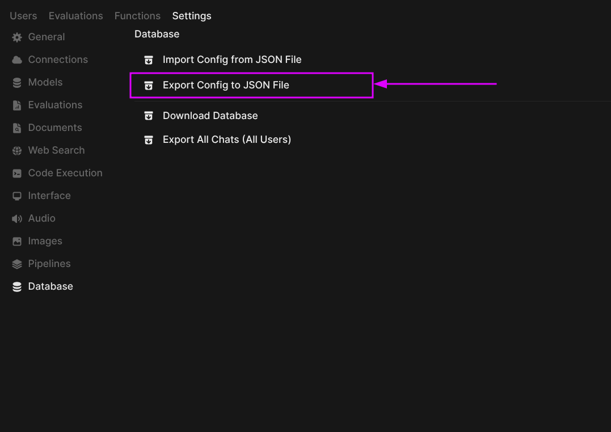

### [Open WebUI](https://github.com/open-webui/open-webui)

> Handle: `webui`<br/>
> URL: [http://localhost:33801](http://localhost:33801)


[](https://discord.gg/5rJgQTnV4s)
[](https://github.com/sponsors/tjbck)

Extensible, self-hosted interface for AI that adapts to your workflow. Open WebUI provides plenty of features and QoL goodies for working with LLMs. Notably:
- Model management - create model instances with pre-configured settings, chat with multiple models at once
- Prompt library
- Persistent chat history
- Document RAG
- Web RAG
- Tools, Functions, Filters

#### Starting

`webui` is one of the default services in Harbor, so you don't need to specify anything special to start it.

```bash
# [Optional] Pre-pull the image
harbor pull webui

# Open WebUI is one of the default services,
# so you don't need to specify the handle explicitly
harbor up

# However, you can also start it explicitly
harbor up webui
```

See [`harbor defaults`](./3.-Harbor-CLI-Reference.md#harbor-defaults) on managing default services.

See [troubleshooting guide](./1.-Harbor-User-Guide.md#troubleshooting) if you encounter any issues.

#### Integrations

`webui` (Open WebUI on port 8080) is a default frontend in Harbor. It is automatically included when you run bare `harbor up`. The service wires dozens of backends and tools into itself using the cross-compose mechanism: files named `compose.x.webui.<name>.yml` (and a few reverse like `compose.x.ollama.webui.yml`) mount JSON snippets into the container. On startup the entrypoint script `start_webui.sh` invokes the shared `json_config_merger.py` which renders any `${HARBOR_*}` variables and merges everything into `/app/backend/data/config.json` (persisted in the data volume). The result appears instantly in the UI.

**Inference backends that auto-configure for webui**

- `ollama`, `llamacpp`, `vllm`, `litellm`, `boost`, `sglang`, `mistralrs`, `aphrodite`, `ktransformers`, `tabbyapi`, `nexa`, `airllm`, `omnichain`, `kobold`, `lemonade`, `modularmax`, `ikllamacpp`, `dify` and many more — each contributes a `config.<backend>.json` (plus an `OLLAMA_BASE_URL` env injection for Ollama).
- Aggregator/router layers: `bifrost`, `llamaswap`, `optillm`.

**Tools, RAG, media and orchestration extensions**

- `pipelines` — first-class support for Open WebUI Pipelines / Functions / Filters.
- `comfyui` — image generation backend.
- `searxng` (and the `searxng.ollama` variant) — web search for RAG; injects `SEARXNG_QUERY_URL`.
- `cognee` — knowledge-graph tool server (exposed as MCP).
- `dbhub`, `mcpo.metamcp`, `agent`, `npcsh`, `openterminal`, `needle` — database, MCP, agent and terminal tools.
- Audio stack: `speaches`, `stt`, `tts`, `parler`.
- Niche / experimental: `unsloth-studio` (special case: a bootstrap sidecar mints an API key at runtime; the webui start script reads the file from a ro mount before the merger runs so the first `harbor up` succeeds without a second pass).

See the full catalogue under `$(harbor home)/services/webui/configs`.

**Reverse proxy / external access**

- When `traefik` is also running, `compose.x.traefik.webui.yml` adds the labels that make the UI reachable at `https://webui.${HARBOR_TRAEFIK_DOMAIN}`.

**Host / volume interactions**

- **Primary data & persistence volume**: `./services/webui:/app/backend/data` — this single bind mount is where Open WebUI keeps its entire state: SQLite `webui.db`, user uploads/, the Chroma `vector_db/`, generated `config.json`, embedding/image/audio caches under `cache/`, etc. Your chats, documents, settings and custom models all live on the host here and survive container restarts or image upgrades.
- The `configs/` subdirectory (visible on the host) is the source of truth for Harbor-provided integration fragments; `config.override.json` is applied last and is the recommended place for permanent customizations.
- Supporting scripts are overlaid: `start_webui.sh` (custom entrypoint) and `json_config_merger.py` from the shared tree.
- A few integrations add extra volume mounts (e.g. the unsloth auth key dir) or `depends_on` health checks so dependent services are ready before the merger runs.

Everything above is driven by the declarative cross-compose files and the runtime merger — no manual `config.json` editing is normally required. After any `harbor config set` that affects backend URLs or keys, simply restart the affected containers (`harbor restart webui <backend>`) and the merged configuration is rebuilt automatically.

#### Configuration

You can configure Open WebUI in three ways:
- Via WebUI itself: changes are saved in the `webui/config.json` file, Harbor may override them on restart
  - Copy config changes to the `webui/configs/config.override.json` in order to persist them over Harbor's default config
- Via [environment variables](https://docs.openwebui.com/getting-started/env-configuration/): changes are applied after restarting the Harbor

Harbor CLI allows configuring following options:

```bash
# Override the WebUI image version
harbor webui version dev-cuda

# Override WebUI default name
harbor webui name "Jarvis"

# Specify custom secret for JWT tokens
harbor webui secret sk-203948

# Set to DEBUG for more visibility
harbor webui log DEBUG
```

Following options can be set via [`harbor config`](./3.-Harbor-CLI-Reference.md#harbor-config):

```bash
# The port on the host where WebUI will be available
HARBOR_WEBUI_HOST_PORT         33801

# Custom secret for JWT tokens
HARBOR_WEBUI_SECRET            h@rb0r

# Name of the WebUI instance
HARBOR_WEBUI_NAME              Harbor

# Log level for WebUI
HARBOR_WEBUI_LOG_LEVEL         DEBUG

# WebUI image version
HARBOR_WEBUI_VERSION           main

# Docker image to use for the service
# You can switch to a custom build if needed
HARBOR_WEBUI_IMAGE             ghcr.io/open-webui/open-webui
```

Additionally, all [environment variables](https://docs.openwebui.com/getting-started/env-configuration/) from the official example can be set according to Harbor's [environment configuration guide](./1.-Harbor-User-Guide.md#environment-variables).

```bash
# Example: set ENABLE_REALTIME_CHAT_SAVE env variable value
harbor env webui ENABLE_REALTIME_CHAT_SAVE false

# Example: get ENABLE_REALTIME_CHAT_SAVE env variable value
harbor env webui ENABLE_REALTIME_CHAT_SAVE
```

#### Override Harbor Config

Harbor will assemble a custom configuration from many pieces that matches the set of services you're running with Open WebUI.

```bash
# This location contains individual configuration parts matching
# the services that might integrate with Open WebUI
open $(harbor home)/services/webui/configs
```

See docs on [Config Merging](./6.-Harbor-Compose-Setup.md#config-merging) to learn more about this process.

When you need to override a `webui` configuration set by Harbor, there's a special file that is applied after all Harbor's built-in configs, so its contents will always take precedence.

```bash
open $(harbor home)/services/webui/configs/config.override.json
```

You can obtain the sample JSON config with your settings from your Open WebUI instance:


