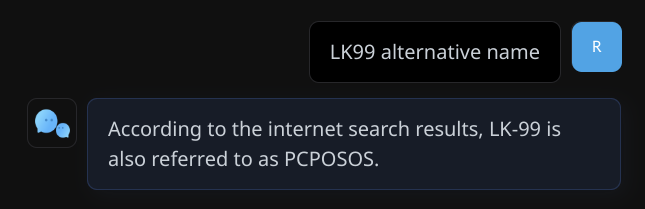

### [Chat Nio](https://github.com/zmh-program/chatnio)

> Handle: `chatnio`<br/>
> URL: [http://localhost:34219](http://localhost:34219)

<div align="center">


**Next Generation AIGC One-Stop Business Solution**

*"Chat Nio > [Next Web](https://github.com/ChatGPTNextWeb/ChatGPT-Next-Web) + [One API](https://github.com/songquanpeng/one-api)"*

English · [简体中文](https://github.com/zmh-program/chatnio/blob/main/README_zh-CN.md) · [Docs](https://chatnio.com) · [Discord](https://discord.gg/rpzNSmqaF2) · [Deployment Guide](https://chatnio.com/docs/deploy)


</div>

#### Starting

```bash
# [Optional] Pre-build the image
# Harbor uses a custom image for the main
# service for the config merging functionality
harbor build chatnio

# [Optional] Pre-pull sub-service images
harbor pull chatnio

# Start the service
harbor up chatnio

# [Optional] Open the UI
harbor open chatnio
```

#### Configuration

By default, Harbor will pre-connect `chatnio` to:
- `ollama` - Unfortunately, Chat Nio requires specifying every downstream model manually. Harbor pre-configures `llama3.1:8b` by default, but you'll need to add any other models you want to use manually.
- `searxng` - Harbor enables DuckDuckGo and Wikipedia search engines by default



Following options are available via [`harbor config`](./3.-Harbor-CLI-Reference.md#harbor-config):

```bash
# The port on the host where Chat Nio will be available
HARBOR_CHATNIO_HOST_PORT       34219

# Docker image and version for the main service
HARBOR_CHATNIO_IMAGE           programzmh/chatnio
HARBOR_CHATNIO_VERSION         latest

# MySQL sub-service configuration
HARBOR_CHATNIO_MYSQL_IMAGE     mysql
HARBOR_CHATNIO_MYSQL_VERSION   latest
HARBOR_CHATNIO_MYSQL_HOST_PORT 34212

# Redis sub-service configuration
HARBOR_CHATNIO_REDIS_IMAGE     redis
HARBOR_CHATNIO_REDIS_VERSION   latest
HARBOR_CHATNIO_REDIS_HOST_PORT 34213

# Workspace folder for config, logs, storage and database
# Path is relative to $(harbor home)
HARBOR_CHATNIO_WORKPSACE       ./services/chatnio
```

Please refer to the official documentation for more information.
