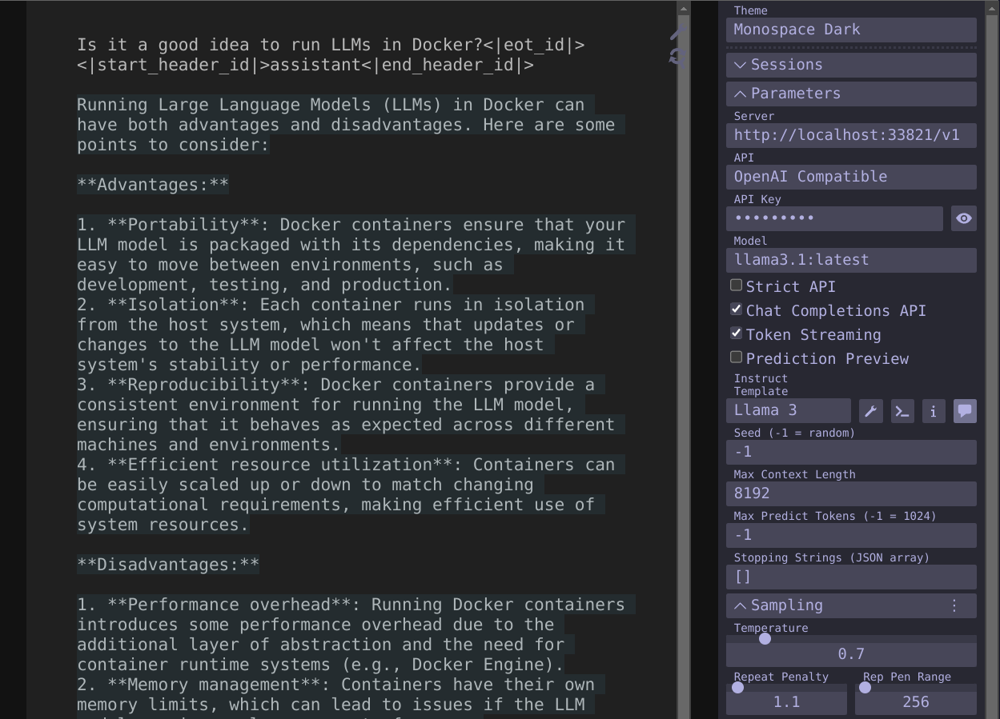

### [mikupad](https://github.com/lmg-anon/mikupad)

> Handle: `mikupad`<br/>
> URL: [http://localhost:34361](http://localhost:34361)



`mikupad` is a user-friendly, browser-based interface for interacting with language models. It's built with ReactJS and supports various text generation backends, all within a single HTML file.

### Starting

```bash
# Will start mikupad alongside
harbor up mikupad
```

### Configuration

`mikupad` does not support external configuration, so all changes must be done in the running UI and are local to the specific browser instance.

You can set host port where Harbor will serve `mikupad`:

```bash
# Get current port
harbor config get mikupad.host_port

# Set new port
harbor config set mikupad.host_port 34361
```