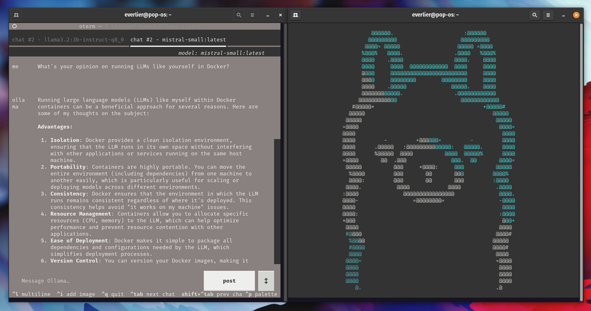

### [oterm](https://github.com/ggozad/oterm)

> Handle: `oterm`
> URL: -



### Starting

```bash
# Ollama must be up and running before
# launching oterm
harbor up ollama

# 1. Shortcut
harbor oterm

# 2. Via harbor run - the underlying command is different
harbor run oterm

# 3. Via interactive service shell
harbor shell oterm
$ oterm
```

- If you have a lot of models in Ollama (a few dozens) - TUI will take a few seconds to start
- Press `Ctrl+N` to start a new chat

### Configuration

You can configure where local files for `oterm` are persisted on the host:

```bash
# Get current oterm workspace path
harbor config get oterm.workspace

# Path must be either relative to $(harbor home) or
# absolute on the host
harbor config set oterm.workspace /path/to/your/workspace
```

