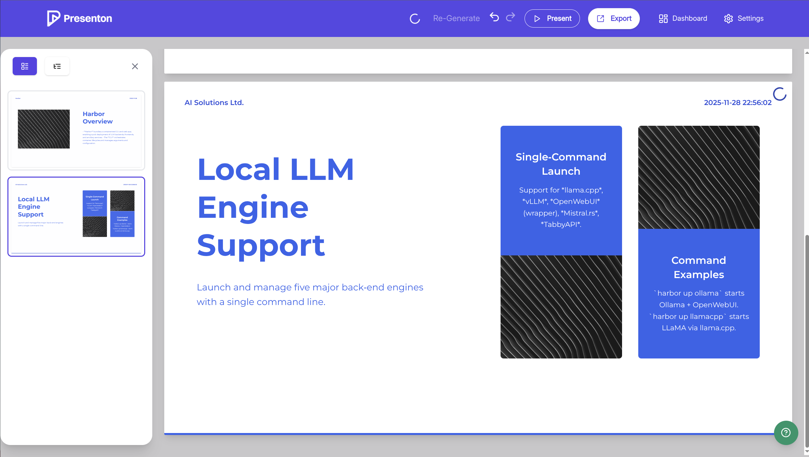

### [Presenton](https://github.com/presenton/presenton)

> Handle: `presenton`<br/>
> URL: [http://localhost:34531](http://localhost:34531)




Presenton is an open-source AI presentation generator that creates professional presentations from text prompts or documents. It's a self-hosted alternative to Gamma.ai, Beautiful.ai, and Decktopus.

**Key Features:**
- 🎨 **Custom Templates & Themes** - Create unlimited presentation designs with HTML and Tailwind CSS
- 🤖 **AI Template Generation** - Generate templates from existing PowerPoint documents
- 📝 **Flexible Generation** - Build presentations from prompts or uploaded documents
- 💾 **Export Ready** - Save as PowerPoint (PPTX) and PDF with professional formatting
- 🔌 **Built-In MCP Server** - Generate presentations over Model Context Protocol
- 🔑 **Bring Your Own Key** - Use your own API keys for OpenAI, Google Gemini, Anthropic Claude, or any compatible provider
- 🦙 **Ollama Integration** - Run open-source models locally with full privacy
- 🔗 **OpenAI API Compatible** - Connect to any OpenAI-compatible endpoint
- 🎨 **Multi-Provider Support** - Mix and match text and image generation providers
- 🖼️ **Versatile Image Generation** - Choose from DALL-E 3, Gemini Flash, Pexels, or Pixabay
- 🌐 **Runs Locally** - All processing happens on your device, no cloud dependencies

## Starting

```bash
# [Optional] Pre-pull the image
# might take a while as it bundles Ollama + GPU support
harbor pull presenton

# Start the service with web UI
harbor up presenton --open

# Or start with Ollama for local inference
harbor up presenton ollama --open
```

## Usage

- By default, Harbor will connect Presenton to included Ollama instance
- When connecting to other included backends - you may use `custom` LLM option
  - Since Presenton runs from within Browser - ensure to use public URLs for the services, e.g. `harbor url ollama`, `harbor url llamacpp`, etc.
- Harbor shares Ollama/LlamaCPP/HuggingFace Cache with Presenton

## Configuration

### Environment Variables

Following options can be set via [`harbor config`](./3.-Harbor-CLI-Reference.md#harbor-config):

```bash
# The port on the host where Presenton will be available
HARBOR_PRESENTON_HOST_PORT=34531

# Docker image and version
HARBOR_PRESENTON_IMAGE="ghcr.io/presenton/presenton"
HARBOR_PRESENTON_VERSION="latest"

# Allow users to change API keys in the UI
HARBOR_PRESENTON_CAN_CHANGE_KEYS="true"

# LLM Provider Configuration
# Options: "openai", "google", "anthropic", "ollama", "custom"
HARBOR_PRESENTON_LLM=""

# OpenAI Configuration
HARBOR_PRESENTON_OPENAI_API_KEY=""
HARBOR_PRESENTON_OPENAI_MODEL=""

# Google Gemini Configuration
HARBOR_PRESENTON_GOOGLE_API_KEY=""
HARBOR_PRESENTON_GOOGLE_MODEL=""

# Anthropic Claude Configuration
HARBOR_PRESENTON_ANTHROPIC_API_KEY=""
HARBOR_PRESENTON_ANTHROPIC_MODEL=""

# Ollama Configuration (auto-configured when running with Ollama)
HARBOR_PRESENTON_OLLAMA_URL=""
HARBOR_PRESENTON_OLLAMA_MODEL=""

# Custom OpenAI-compatible API
HARBOR_PRESENTON_CUSTOM_LLM_URL=""
HARBOR_PRESENTON_CUSTOM_LLM_API_KEY=""
HARBOR_PRESENTON_CUSTOM_MODEL=""

# Image Provider Configuration
# Options: "pexels", "pixabay", "dalle", "gemini"
HARBOR_PRESENTON_IMAGE_PROVIDER="pexels"
HARBOR_PRESENTON_PEXELS_API_KEY=""

# Feature Flags
HARBOR_PRESENTON_EXTENDED_REASONING="false"
HARBOR_PRESENTON_WEB_GROUNDING="false"
HARBOR_PRESENTON_TOOL_CALLS="false"
HARBOR_PRESENTON_DISABLE_THINKING="false"

# Database URL (optional, for external database)
HARBOR_PRESENTON_DATABASE_URL=""

# Privacy
HARBOR_PRESENTON_DISABLE_ANONYMOUS_TRACKING="true"
```

### Using with OpenAI

```bash
# Configure OpenAI
harbor config set presenton.llm openai
harbor config set presenton.openai_api_key sk-your-key
harbor config set presenton.openai_model gpt-4

# Start Presenton
harbor up presenton --open
```

### Using with Ollama (Local Models)

When running Presenton with Ollama, Harbor automatically configures the connection:

```bash
# Start both services together
harbor up presenton ollama --open

# Ollama URL and default model are automatically configured
# You can change the model in the UI or via config:
harbor config set presenton.ollama_model llama3.1:8b
```

### Using with Google Gemini

```bash
# Configure Google Gemini
harbor config set presenton.llm google
harbor config set presenton.google_api_key your-api-key
harbor config set presenton.google_model gemini-pro

harbor up presenton --open
```

### Using with Anthropic Claude

```bash
# Configure Anthropic
harbor config set presenton.llm anthropic
harbor config set presenton.anthropic_api_key sk-ant-your-key
harbor config set presenton.anthropic_model claude-3-sonnet-20240229

harbor up presenton --open
```

### Using with Custom OpenAI-Compatible APIs

```bash
# Configure custom endpoint (e.g., vLLM, TabbyAPI, etc.)
harbor config set presenton.llm custom
harbor config set presenton.custom_llm_url http://your-api:8000/v1
harbor config set presenton.custom_llm_api_key your-key
harbor config set presenton.custom_model your-model-name

harbor up presenton --open
```

### Image Generation

Presenton can use various image providers:

```bash
# Using Pexels (free, no API key required for basic use)
harbor config set presenton.image_provider pexels
harbor config set presenton.pexels_api_key your-pexels-key

# Using DALL-E (requires OpenAI API key)
harbor config set presenton.image_provider dalle

# Using Gemini Flash (requires Google API key)
harbor config set presenton.image_provider gemini

# Using Pixabay
harbor config set presenton.image_provider pixabay
```

## Troubleshooting

### Service won't start
- Check if port 34531 is available: `lsof -i :34531`
- Check logs: `harbor logs presenton`
- Ensure you have an LLM provider configured

### No LLM provider configured
- Configure at least one LLM provider (OpenAI, Gemini, Anthropic, Ollama, or custom)
- Or start with Ollama: `harbor up presenton ollama`

### Images not generating
- Ensure you have an image provider configured
- For Pexels, get a free API key at https://www.pexels.com/api/
- Or disable image generation in the UI

### Presentations not persisting
- Check that `./presenton/app_data` directory exists and is writable
- Verify volume mount in `harbor logs presenton`

## See Also

- [Official Presenton Documentation](https://docs.presenton.ai)
- [Ollama Backend](./2.2.1-Backend:-Ollama.md)
- [Harbor Config Reference](./3.-Harbor-CLI-Reference.md#harbor-config)
