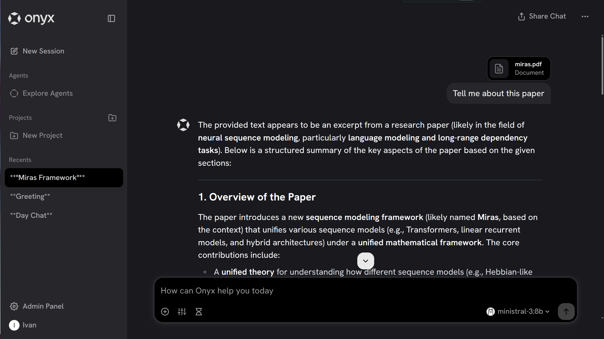

### [Onyx](https://github.com/onyx-dot-app/onyx)

> Handle: `onyx`<br/>
> URL: [http://localhost:34601](http://localhost:34601)



Onyx (formerly Danswer) is an open-source AI platform that combines a Chat UI with powerful RAG capabilities. It's a self-hostable alternative to enterprise knowledge management and AI assistant platforms.

**Key Features:**
- **40+ connectors**: Slack, Google Drive, Notion, Confluence, GitHub, and more
- **Chat UI**: Full-featured chat interface with conversation history
- **RAG**: Retrieval-augmented generation with Vespa search engine
- **MCP support**: Model Context Protocol for tool integration
- **Multi-user**: Authentication and user management
- **OpenAI-compatible**: Works with any OpenAI API-compatible backend

## Starting

```bash
# Pull the images
harbor pull onyx

# Start Onyx with Ollama
harbor up ollama onyx --open
```

- First startup takes several minutes while Vespa initializes its search indices
- Onyx comes pre-configured to use Harbor's Ollama as the LLM backend
- Monitor Vespa initialization with `harbor logs onyx-index`

## Configuration

### Environment Variables

Following options can be set via [`harbor config`](./3.-Harbor-CLI-Reference.md#harbor-config):

```bash
# Main UI port (nginx reverse proxy)
HARBOR_ONYX_HOST_PORT              34601

# Persistent data directory
HARBOR_ONYX_WORKSPACE              ./onyx/data

# Image versions
HARBOR_ONYX_VERSION                latest
HARBOR_ONYX_VESPA_VERSION          8.277.17
HARBOR_ONYX_MINIO_VERSION          latest

# Authentication (disabled, basic, google_oauth, oidc)
HARBOR_ONYX_AUTH_TYPE              disabled

# Database configuration
HARBOR_ONYX_DB_USER                postgres
HARBOR_ONYX_DB_PASSWORD            harbor_onyx_db_password
HARBOR_ONYX_DB_NAME                onyx

# MinIO storage
HARBOR_ONYX_MINIO_USER             minioadmin
HARBOR_ONYX_MINIO_PASSWORD         harbor_onyx_minio_password

# LLM configuration (seeded on first start)
HARBOR_ONYX_DEFAULT_MODEL          llama3.2:3b
HARBOR_ONYX_FAST_MODEL             llama3.2:3b
```

### Volumes

Onyx persists data in the following directories:
- `onyx/data/db/` - PostgreSQL database
- `onyx/data/vespa/` - Vespa search indices
- `onyx/data/minio/` - MinIO object storage

## Integration with Harbor

Onyx comes **pre-configured to use Harbor's Ollama** as the default LLM backend:

```bash
# Start both services - ready to chat immediately
harbor up ollama onyx
```

To change the default model:

```bash
# Set a different default model
harbor config set onyx.default_model qwen2.5:7b

# Pull the model in Ollama
harbor ollama pull qwen2.5:7b

# Restart with fresh database to apply seed config
harbor down onyx && rm -rf onyx/data/db && harbor up onyx
```

> **Note:** Seed configuration is only applied on fresh database initialization. After initial setup, configure models via the Onyx Admin UI under **Configuration → LLM**.

## Troubleshooting

### Check Logs

```bash
# All services
harbor logs onyx

# Specific service
harbor logs onyx-api
harbor logs onyx-background
harbor logs onyx-index
```

### Database Issues

If migrations fail or database is corrupted:

```bash
# Stop services
harbor down onyx

# Remove database (WARNING: destroys all data)
rm -rf onyx/data/db

# Restart
harbor up onyx
```

### Memory Issues

Vespa search engine requires significant memory. Recommended minimum **8GB RAM** for the host system. If containers crash due to OOM, check available memory.

## Links

- [Official Documentation](https://docs.onyx.app/)
- [GitHub Repository](https://github.com/onyx-dot-app/onyx)
- [Connector List](https://docs.onyx.app/connectors/overview)
