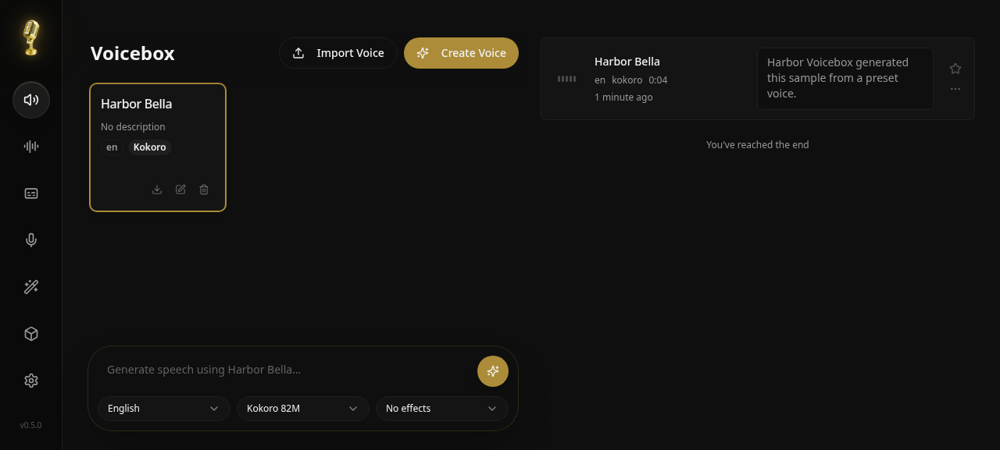

### [Voicebox](https://github.com/jamiepine/voicebox)

> Handle: `voicebox`<br/>
> URL: [http://localhost:34910](http://localhost:34910)

Voicebox is a local-first AI voice studio with a web UI and REST/MCP APIs. It can create cloned or preset voice profiles, generate speech from text, transcribe audio with Whisper, apply audio effects, manage generation history, and let agent clients call Voicebox to speak through a selected profile.



#### Starting

```bash
# Build from the upstream Dockerfile
harbor build voicebox

# Start Voicebox and open the web studio
harbor up voicebox --open
```

The first build compiles the web UI and installs Python voice model dependencies, so it can take several minutes. The first generation also downloads the selected model into the Harbor-managed Hugging Face cache.

Harbor defaults the browser generation form to Qwen TTS 0.6B instead of the upstream Qwen TTS 1.7B default. For the lightest first run, create a preset voice profile in the UI with the Kokoro engine, then generate a short text sample. Kokoro is the smallest preset engine and is suitable for CPU-only testing.

#### Configuration

##### Environment Variables

Following options can be set via [`harbor config`](./3.-Harbor-CLI-Reference.md#harbor-config):

```bash
# Web UI and API port on the host
HARBOR_VOICEBOX_HOST_PORT          34910

# Upstream source used for the Docker build
HARBOR_VOICEBOX_GIT_REF            https://github.com/jamiepine/voicebox.git#main

# Persistent data root
HARBOR_VOICEBOX_WORKSPACE          ./services/voicebox

# Voicebox logging verbosity: debug, info, warning, error
HARBOR_VOICEBOX_LOG_LEVEL          info

# Container path for Hugging Face model downloads
HARBOR_VOICEBOX_MODELS_DIR         /app/models/huggingface

# Additional comma-separated browser/API origins
HARBOR_VOICEBOX_CORS_ORIGINS

# Browser generation form default for Qwen TTS
HARBOR_VOICEBOX_DEFAULT_MODEL_SIZE 0.6B

# UID/GID of the upstream voicebox user inside the image
HARBOR_VOICEBOX_UID                999
HARBOR_VOICEBOX_GID                999

# Docker resource limits
HARBOR_VOICEBOX_CPUS               4
HARBOR_VOICEBOX_MEMORY             8G
HARBOR_VOICEBOX_SHM_SIZE           1g
```

Voicebox also receives `HARBOR_HF_TOKEN` as `HF_TOKEN`, so private or gated Hugging Face model access can reuse Harbor's existing Hugging Face token setting.

##### Volumes

Voicebox persists data under `services/voicebox/`:

- `data/` - SQLite database, voice profiles, captures, app cache, and other Voicebox state
- `generations/` - generated audio files, mounted separately for easy host access
- `huggingface/` - Hugging Face model cache, mounted at `/app/models/huggingface` so models are not re-downloaded after rebuilds

The compose file runs a small init sidecar before Voicebox starts to make those directories writable by the upstream non-root `voicebox` user inside the container.

#### API and Agent Use

Voicebox serves the web UI and API from the same port. Useful endpoints include:

```bash
# Health and backend details
curl http://localhost:34910/health

# List voice profiles
curl http://localhost:34910/profiles

# MCP endpoint for compatible agent clients
http://localhost:34910/mcp
```

The Voicebox API has no built-in authentication. Keep it on trusted networks, or place an authenticated reverse proxy in front of it before exposing it beyond your machine.

#### Troubleshooting

##### Build Takes a Long Time

```bash
harbor build voicebox
```

The upstream Docker image is built from source until prebuilt images are published. Docker layer caching makes later builds and starts faster.

##### Out of Memory During Generation

Voice model inference is memory intensive. Keep the first run to Kokoro or smaller models, or raise the memory limit:

```bash
harbor config set HARBOR_VOICEBOX_MEMORY 16G
harbor config update
```

The upstream web UI defaults to Qwen TTS 1.7B, which can exceed the default 8G CPU memory limit while downloading or loading. Harbor patches that browser default at container startup through `HARBOR_VOICEBOX_DEFAULT_MODEL_SIZE=0.6B`; set it to `1.7B` only when the machine has enough RAM or GPU memory.

##### GPU Acceleration

Start Voicebox with Harbor's GPU profile for your machine:

```bash
# NVIDIA Docker runtime
harbor up voicebox nvidia

# CDI GPU runtime
harbor up voicebox cdi

# AMD ROCm device passthrough
harbor up voicebox rocm
```

The default Voicebox service runs on CPU. GPU profiles only add device access; model support still depends on the upstream Voicebox backend and your installed container runtime.

##### Check Logs

```bash
harbor logs voicebox
```

#### Links

- [Official Documentation](https://docs.voicebox.sh/)
- [Docker Deployment Guide](https://docs.voicebox.sh/overview/docker)
- [GitHub Repository](https://github.com/jamiepine/voicebox)
