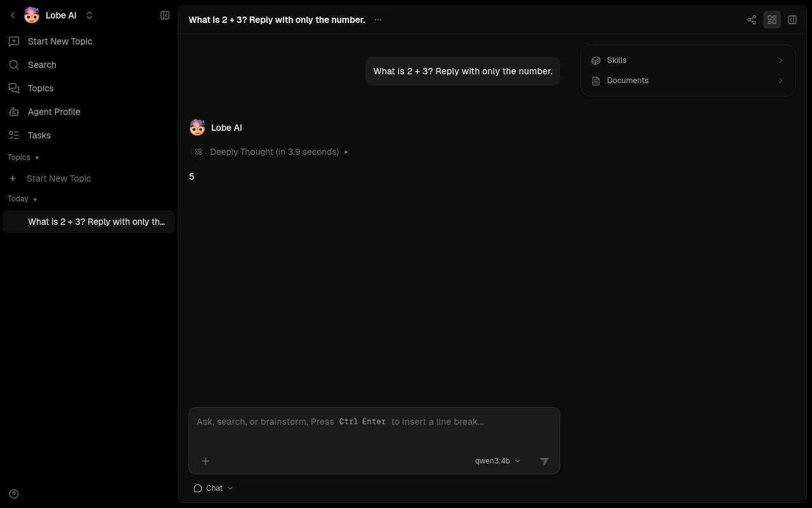

### [LobeHub (Server Database)](https://github.com/lobehub/lobehub)

> Handle: `lobehub`<br/>
> URL: [http://localhost:34960](http://localhost:34960)

LobeHub is the server-database successor to LobeChat. This separate Harbor service stores chats and accounts in PostgreSQL and uploaded knowledge files in S3-compatible storage. The existing `lobechat` handle remains the browser-storage variant; starting this service does not migrate its data.



#### Starting

Set five unique secrets before first start. The preflight container rejects missing or short values rather than booting a database with a public default password. Keep the resulting `.env` private and back it up alongside the data volumes. `harbor config set` normally echoes the new value, so redirect its output when setting secrets.

```bash
harbor pull lobehub
harbor config set lobehub.auth_secret "$(openssl rand -hex 32)" >/dev/null 2>&1
harbor config set lobehub.key_vaults_secret "$(openssl rand -base64 32)" >/dev/null 2>&1
harbor config set lobehub.db_password "$(openssl rand -hex 32)" >/dev/null 2>&1
harbor config set lobehub.s3_secret_key "$(openssl rand -hex 32)" >/dev/null 2>&1
jwks=$(docker run --rm --entrypoint /bin/node lobehub/lobehub:latest -e 'const c=require("crypto");const k=c.generateKeyPairSync("rsa",{modulusLength:2048}).privateKey.export({format:"jwk"});process.stdout.write(Buffer.from(JSON.stringify({keys:[{...k,alg:"RS256",kid:c.randomBytes(8).toString("hex"),use:"sig"}]})).toString("base64"))')
harbor config set lobehub.jwks_key_b64 "$jwks" >/dev/null 2>&1
unset jwks

harbor up lobehub --open
```

Create an email/password account in the UI. To restrict registration to chosen addresses, set `lobehub.allowed_emails` to a comma-separated list before starting. LobeHub does not inherit chats or accounts from the old `lobechat` service.

For local Ollama chat and knowledge-file indexing, start both handles so Harbor applies the Ollama integration and pulls the configured chat and embedding models:

```bash
harbor up lobehub ollama --open
```

The LobeHub image also supports cloud-provider keys through `services/lobehub/override.env`. That file uses `KEY=value` lines; keep credentials out of committed files.

#### Configuration

The defaults live in `services/lobehub/default.env` and can be changed with `harbor config set`:

| Setting | Default | Purpose |
| --- | --- | --- |
| `lobehub.host_port` | `34960` | Web UI host port |
| `lobehub.s3_host_port` | `34961` | Browser-accessible object storage port |
| `lobehub.bind_host` | `127.0.0.1` | Address used by both published ports |
| `lobehub.public_host` | `localhost` | Hostname in browser-facing app and S3 URLs |
| `lobehub.image`, `lobehub.version` | `lobehub/lobehub:latest` | LobeHub image |
| `lobehub.db_image`, `lobehub.db_version` | `paradedb/paradedb:latest-pg17` | PostgreSQL/pg_search image |
| `lobehub.redis_image`, `lobehub.redis_version` | `redis:7-alpine` | Redis image |
| `lobehub.s3_image`, `lobehub.s3_version` | `rustfs/rustfs:latest` | Object-storage image |
| `lobehub.s3_init_image`, `lobehub.s3_init_version` | `rustfs/rc:latest` | Bucket-setup image |
| `lobehub.auth_secret` | Empty | Authentication signing secret; required |
| `lobehub.key_vaults_secret` | Empty | Vault encryption key; required; preserve for restore |
| `lobehub.jwks_key_b64` | Empty | Base64-encoded private RSA JWKS for file parsing/indexing; required |
| `lobehub.db_password` | Empty | Alphanumeric database password; required |
| `lobehub.s3_access_key` | `lobehub` | Object-storage access key name |
| `lobehub.s3_secret_key` | Empty | Object-storage secret; required |
| `lobehub.allowed_emails` | Empty | Optional comma-separated sign-in allowlist |
| `lobehub.chat_model` | `qwen3:4b` | Ollama chat model pulled by the integration |
| `lobehub.embedding_model` | `mxbai-embed-large:latest` | Ollama file-indexing model; its 1024 dimensions match LobeHub's database schema |

Both published ports bind only to loopback by default. For a trusted LAN browser, set **both** `lobehub.bind_host` (for example `0.0.0.0`) and `lobehub.public_host` (the LAN hostname or IP used by the browser) before restarting. The browser must reach ports `34960` and `34961`. Put authentication and TLS in front of any internet-facing deployment; do not expose RustFS or LobeHub directly to the public internet.

LobeHub uses named Docker volumes `lobehub-db-data`, `lobehub-redis-data`, and `lobehub-s3-data`. They persist through `harbor down lobehub`. Back up all three volumes and the five secrets together before changing or replacing the installation. The one-shot `lobehub-s3-init` container creates the `lobe` bucket with read access and browser CORS rules on each start; it does not delete existing objects.

#### Troubleshooting

- If preflight reports an unset secret, run the corresponding `harbor config set` command above. Do not put secrets in `services/lobehub/default.env`.
- If the UI loads but file upload fails, check that the browser can reach `lobehub.s3_host_port` and that `lobehub.public_host` is not `localhost` when using another device.
- If file indexing fails, start `harbor up lobehub ollama` and check that `lobehub.jwks_key_b64` is set and the embedding model produces 1024-dimensional vectors. Models with other dimensions cannot be written to the current schema.
- If the database is unhealthy, inspect `docker logs harbor.lobehub-db`; the image requires its bundled `pg_search`, `pg_cron`, and `pg_stat_statements` preload list.
- After editing distributed defaults in a Git checkout, run `harbor config update` before starting.

See the [upstream deployment files](https://github.com/lobehub/lobehub/tree/canary/docker-compose/deploy) for additional LobeHub capabilities. Harbor's service keeps the core server-database, Redis, and object-storage path focused; it does not enable the optional agent gateway or Elasticsearch deployment.
