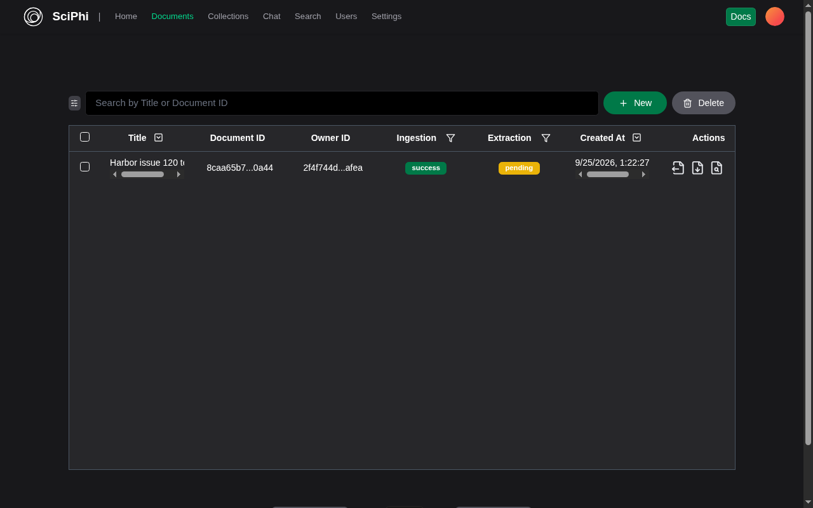

### [R2R](https://github.com/SciPhi-AI/R2R)

> Handle: `r2r`<br/>
> Dashboard: [http://localhost:34273](http://localhost:34273)<br/>
> API: [http://localhost:34272](http://localhost:34272)

R2R provides document ingestion, semantic search, and retrieval-augmented answers. Harbor uses upstream's lighter deployment: R2R API and dashboard, a persistent pgvector database, and the graph-clustering service. It does not include the full deployment's Hatchet, Unstructured, or object-storage stack, so advanced extraction and orchestration features may require that upstream deployment instead.



#### Starting

Set three unique secrets. The preflight container rejects empty, short, or non-alphanumeric secrets. `harbor config set` normally prints values, so redirect its output when setting secrets. Save the three values securely along with database backups; changing them can break access to existing accounts or data.

```bash
harbor config set r2r.db_password "$(openssl rand -hex 32)" >/dev/null 2>&1
harbor config set r2r.secret_key "$(openssl rand -hex 32)" >/dev/null 2>&1
harbor config set r2r.admin_password "$(openssl rand -hex 32)" >/dev/null 2>&1
harbor up r2r ollama --open
```

Sign in to the dashboard as `admin@harbor.local` using the generated `r2r.admin_password`. The dashboard's deployment URL should show `http://localhost:34272`. Starting with `ollama` selects Harbor's local-model profile, pulls the configured chat and embedding models, and points R2R at Harbor Ollama. To ingest a local text document, use the dashboard's Documents page or the API with `ingestion_mode=fast`; then use Search or Chat. The default chat model is `qwen2.5:3b`, and the embedding model is `mxbai-embed-large` (1,024 dimensions). The local profile disables automatic extraction. Image/audio parsing, advanced extraction, and graph workflows are not covered by this local path and may need additional providers or the upstream full deployment.

Starting `harbor up r2r` without `ollama` still loads the dashboard and existing data, but ingestion, semantic search, and RAG need `ollama` running. Harbor keeps the same 1,024-dimensional embedding schema in both startup modes so switching between them does not invalidate the database. Other provider configurations require a custom R2R config and are not part of this service's default setup. Never commit provider keys to the repository.

#### Configuration and persistence

| Setting | Default | Purpose |
| --- | --- | --- |
| `r2r.dashboard_port` | `34273` | Browser dashboard port |
| `r2r.api_port` | `34272` | Browser and SDK API port |
| `r2r.bind_host` | `127.0.0.1` | Host address for both published ports |
| `r2r.public_host` | `localhost` | API hostname advertised to the dashboard |
| `r2r.db_password` | Empty | Required database password |
| `r2r.secret_key` | Empty | Required application cryptographic secret |
| `r2r.admin_password` | Empty | Required bootstrap admin password |
| `r2r.chat_model` | `qwen2.5:3b` | Ollama chat model for RAG responses |
| `r2r.embedding_model` | `mxbai-embed-large` | Ollama embedding model; must output 1,024 dimensions |

Both ports are loopback-only by default. For a trusted LAN browser, set both `r2r.bind_host` (for example `0.0.0.0`) and `r2r.public_host` to the address used by the browser, then restart. Do not expose the API or dashboard to the public internet without a trusted TLS/authentication proxy. The `r2r-db-data` Docker volume persists documents, embeddings, and accounts through `harbor down r2r`; `services/r2r/user_tools/` is a host workspace for optional custom tools. Back up the volume, this directory if used, and the three secrets together.

#### Troubleshooting

- `curl http://localhost:34272/v3/health` should return `{"results":{"message":"ok"}}`. If the dashboard cannot connect, check its deployment URL and reachability of the API port from the browser.
- For local text ingestion, start both `r2r` and `ollama`. Use fast ingestion to avoid extraction services not included in this deployment.
- If RAG returns an empty answer with a reasoning model, switch `r2r.chat_model` to a non-reasoning model such as the default `qwen2.5:3b`, then restart.
- After changing a distributed default in a Git checkout, run `harbor config update` to propagate it to the local `.env`.

See the [upstream Docker deployment](https://github.com/SciPhi-AI/R2R/tree/main/docker) for full-stack options.
