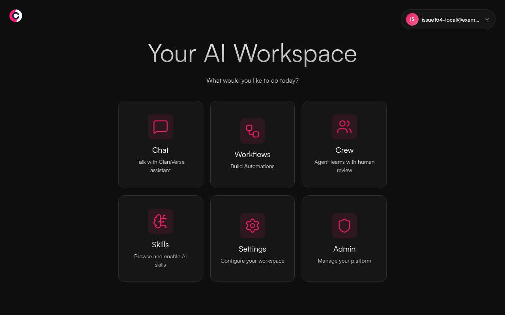

### [ClaraVerse](https://github.com/claraverse-space/ClaraVerse)

> Handle: `claraverse`<br/>
> URL: [http://localhost:34970](http://localhost:34970)

ClaraVerse is a private AI workspace for chat, agent teams, and visual workflows. Harbor runs its official app image with persistent MySQL, MongoDB, and Redis services.



## Starting

```bash
harbor pull --no-defaults claraverse
harbor up --no-defaults claraverse ollama --open
```

Register through the web UI; the first account becomes the administrator. When Harbor Ollama is started with ClaraVerse, its models are discovered through the internal Compose network. ClaraVerse also supports externally configured model providers in its UI.

This is the core app stack, not upstream's full production stack. Device-local chat works; Knowledge bases and the `search_knowledge` tool need Qdrant and the embeddings sidecar, which are not supplied here. Built-in web search also requires a SearXNG instance. Use the upstream production Compose deployment if you need those capabilities. The current upstream image also logs missing MySQL-table warnings for synced conversations and model tiers; those features are not verified here.

## Configuration

Set these keys with [`harbor config set`](./3.-Harbor-CLI-Reference.md#harbor-config):

| Key | Default | Purpose |
| --- | --- | --- |
| `claraverse.image` | `ghcr.io/claraverse-space/claraverse` | Official image repository |
| `claraverse.version` | `latest` | Image tag |
| `claraverse.mysql.image` | `mysql` | MySQL image repository |
| `claraverse.mysql.version` | `8.0` | MySQL image tag |
| `claraverse.mongodb.image` | `mongo` | MongoDB image repository |
| `claraverse.mongodb.version` | `7` | MongoDB image tag |
| `claraverse.redis.image` | `redis` | Redis image repository |
| `claraverse.redis.version` | `7-alpine` | Redis image tag |
| `claraverse.bind.host` | `127.0.0.1` | Host interface for the web UI |
| `claraverse.host.port` | `34970` | Host web UI port |
| `claraverse.workspace` | `./services/claraverse` | Persistent data and upload root |
| `claraverse.allowed.origins` | localhost and 127.0.0.1 on port 34970 | Browser origins accepted by the API |

If you change the port, update `claraverse.allowed.origins` to include the new browser origin. The service mounts `data/` to `/app/data` and `uploads/` to `/app/uploads`; both survive `harbor down claraverse`. A short init container makes these directories writable by the upstream non-root app user and generates private MySQL passwords on first launch. Keep `services/claraverse/data/` with the MySQL volume when moving an installation; losing the password files makes the existing database inaccessible. MySQL, MongoDB, and Redis use separate persistent Docker volumes and expose no host ports.

## Troubleshooting

If no local models appear, confirm that Ollama is healthy with `harbor ps`, then restart ClaraVerse with `harbor up claraverse ollama`. The `ollama` integration sets `OLLAMA_BASE_URL` to Harbor's internal Ollama URL. For startup errors, inspect the finite container log with `docker logs harbor.claraverse` (or your configured container prefix).

## Links

- [Official Docker setup](https://github.com/claraverse-space/ClaraVerse#docker-compose)
- [GitHub repository](https://github.com/claraverse-space/ClaraVerse)
