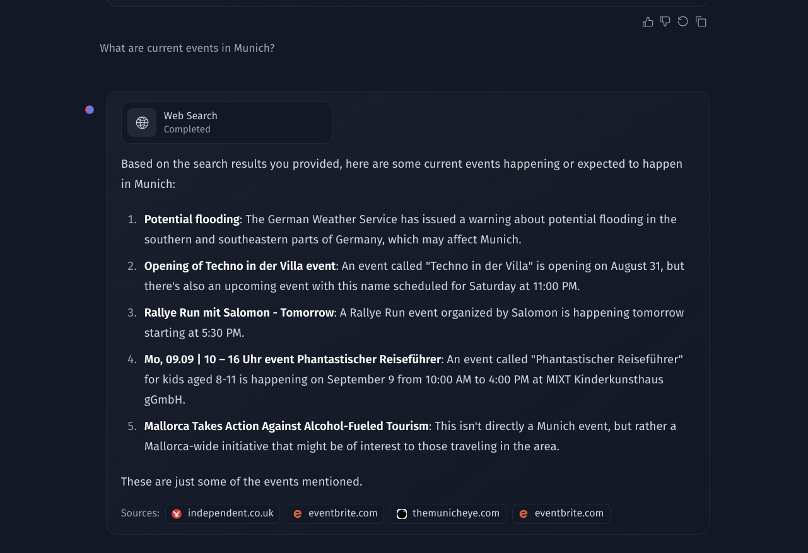

### [HuggingFace ChatUI](https://github.com/huggingface/chat-ui)

> Handle: `chatui`
> URL: [http://localhost:34021](http://localhost:34021)

**Find the docs at [hf.co/docs/chat-ui](https://huggingface.co/docs/chat-ui/index).**


A chat interface using open source models, eg OpenAssistant or Llama. It is a SvelteKit app and it powers the [HuggingChat app on hf.co/chat](https://huggingface.co/chat).

#### Starting

```bash
# [Optional] pre-pull the images
# (otherwise will be pulled on start)
harbor pull chatui

# Start the service
harbor up chatui
```

Harbor will automatically use SearxNG for Web Search feature in ChatUI if started together



```bash
harbor up searxng chatui
```

If you want to make HuggingFace ChatUI your default UI, please see the information below:

```bash
# Replace the default webui with ChatUI
# afterwards, you can just run `harbor up`
harbor defaults rm webui
harbor defaults add chatui

# You'll also want to set ChatUI as a main UI
harbor config set ui.main chatui

# That'll allow you to open the ChatUI
# directly with
harbor open
harbor qr
harbor tunnel
```


#### Configuration

ChatUI is automatically configured to run with backends supporting OpenAI-compatible APIs: Ollama, llama.cpp, TabbyAPI, etc. Note that ChatUI requires models that support system role.

When running with a backend that supports running multiple models at the same time (Ollama, LiteLLM, etc.), you'll need to specify the exact model to be used.

```bash
harbor config set chatui.ollama.model llama3.1
# Ollama model has an alias
harbor chatui model llama3.1

harbor config set chatui.litellm.model tgi
```

It's possible to adjust the image ChatUI will use:

```bash
# See current version, "latest" by default
harbor chatui version

# Set the version to use
harbor chatui version sha-55645e4
# Same as above
# Also can be set in the .env file
harbor config set chatui.version sha-55645e4
```

You can specify additional _configuration environment variables_ in the `chatui/configs/chatui.config.yml` file. [Official configuration docs](https://huggingface.co/docs/chat-ui/configuration/overview).