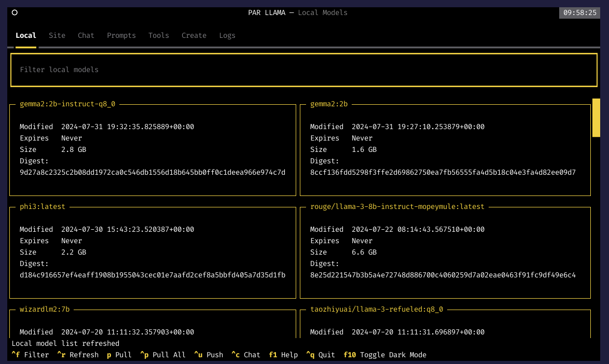

### [PAR LLAMA](https://github.com/paulrobello/parllama)

> Handle: `parllama`
> URL: -



TUI for Ollama.

PAR LLAMA is an amazing terminal UI for interacting with Ollama. Everything you'd expect from a modern chat interface, but in the terminal.

#### Starting

```bash
# Ollama should be one of the
# running services in order to be reachable by parllama
harbor up ollama

# 1. Shortcut
harbor parllama

# 2. Via harbor run - the underlying command is different
harbor run parllama

# 3. Via interactive service shell
harbor shell parllama
$ parllama
```

#### Configuration

`parllama` service will store its global cache on the host.

```bash
# ~/.parllama
harbor config get parllama.cache

# Adjust if needed, note that this
# won't move previously stored cache
harbor config set parllama.cache /path/to/cache
```