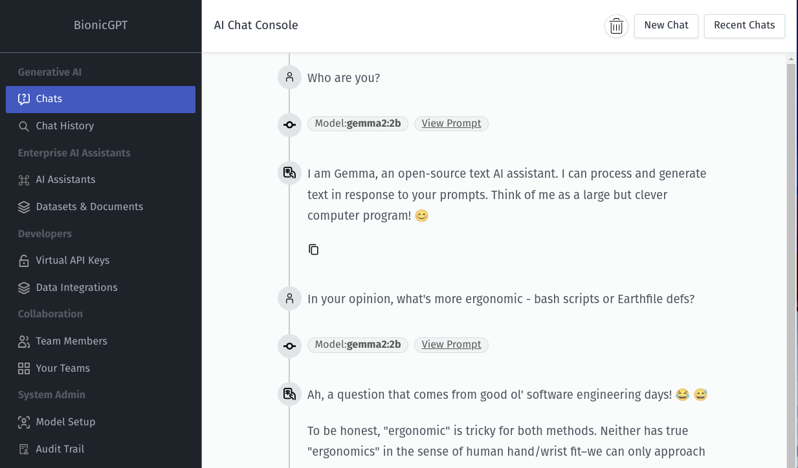

### [BionicGPT](https://github.com/bionic-gpt/bionic-gpt)

> Handle: `bionicgpt`
> URL: [http://localhost:33901](http://localhost:33901)



#### Starting

```bash
# [Optional] BionicGPT requires quite a
# few services. You might want to pull them
# ahead of starting the service
harbor pull bionicgpt

# Will start bionicgpt alongside
# the default webui
harbor up bionicgpt
```

Harbor can't configure BionicGPT ahead of time as connectivity configuration is stored in Postgres and can be adjusted via the UI after service starts.

BionicGPT supports `ollama` and Open-AI compatible backends out of the box.
