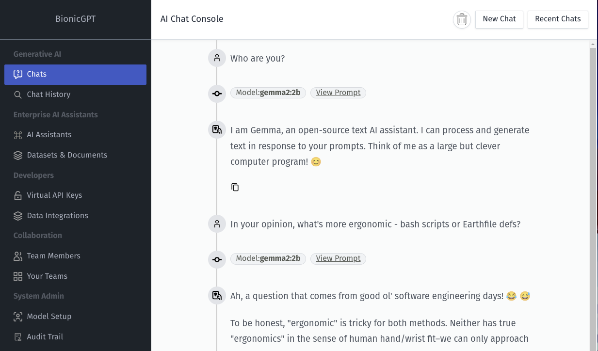

### [BionicGPT](https://github.com/bionic-gpt/bionic-gpt)

> Handle: `bionicgpt`<br/>
> URL: [http://localhost:33901](http://localhost:33901)



#### Starting

```bash
# [Optional] BionicGPT requires quite a
# few services. You might want to pull them
# ahead of starting the service
harbor pull bionicgpt

# Will start bionicgpt alongside
# the default webui
harbor up bionicgpt
```

Harbor can't configure BionicGPT ahead of time as connectivity configuration is stored in Postgres and can be adjusted via the UI after service starts.

BionicGPT supports `ollama` and OpenAI-compatible backends out of the box.

#### Ollama

When configuring Ollama in BionicGPT, use Harbor's internal Ollama URL because BionicGPT runs inside the Harbor Docker network. Start Ollama with BionicGPT, then get the internal URL:

```bash
harbor up bionicgpt ollama
harbor url -i ollama
```

Use that value with `/v1` appended as the OpenAI-compatible base URL. On current Harbor, it resolves through Docker Compose service DNS as:

```text
http://ollama:11434/v1
```

BionicGPT also expects a non-empty API key for OpenAI-compatible providers; use a placeholder such as `sk-ollama`. For the model name, choose a model already available in Ollama:

```bash
harbor ollama list
harbor ollama ls
```

If the model is missing, pull it first:

```bash
harbor ollama pull llama3.2:3b
```
