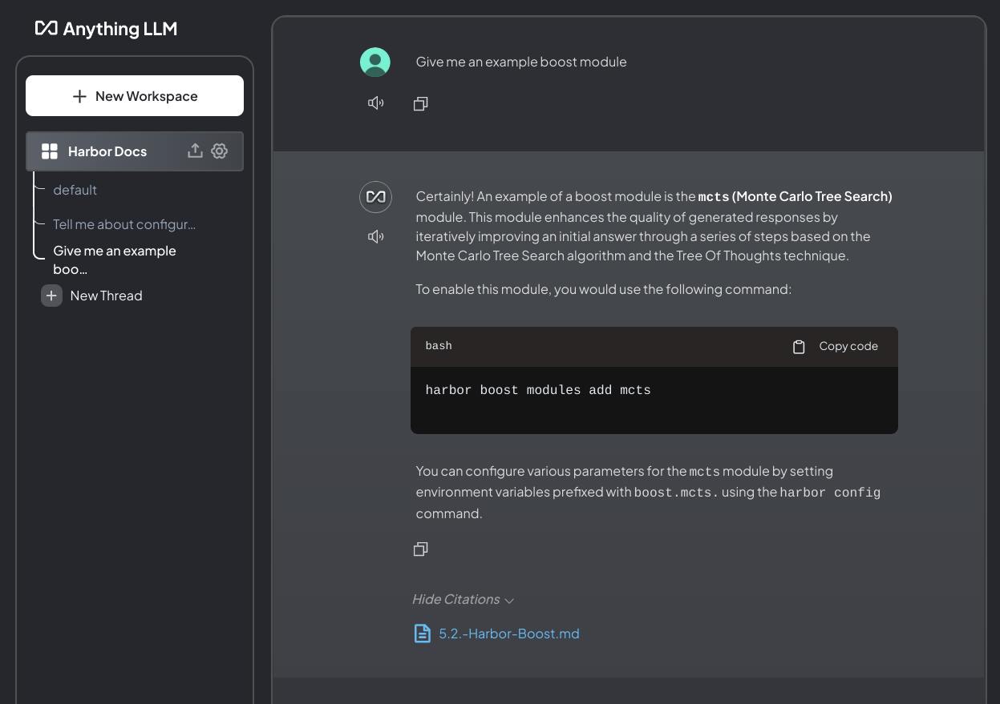

### [AnythingLLM](https://github.com/Mintplex-Labs/anything-llm)

> Handle: `anythingllm`
> URL: [http://localhost:34171](http://localhost:34171)


A full-stack application that enables you to turn any document, resource, or piece of content into context that any LLM can use as references during chatting. This application allows you to pick and choose which LLM or Vector Database you want to use as well as supporting multi-user management and permissions.


AnythingLLM divides your documents into objects called `workspaces`. A Workspace functions a lot like a thread, but with the addition of containerization of your documents. Workspaces can share documents, but they do not talk to each other so you can keep your context for each workspace clean.

#### Starting

```bash
# [Optional] Pre-pull an image
harbor pull anythingllm

# Start the service
harbor up anythingllm

# [Optional] Open the UI
harbor open anythingllm

# [Optional] Inspect service logs
harbor logs anythingllm
```

> [!NOTE]
> If you're seeing any kind of file system permission errors you'll need to ensure that files written from within a container are [accessible to your user](./1.-Harbor-User-Guide#file-system-permissions).

#### Configuration

Local data is stored in Harbor's workspace, you can find a path to it with the following command:

```bash
echo $(harbor home)/anythingllm/storage
```

Out of the box, Harbor pre-connects AnythingLLM to:
- [Ollama](./2.2.1-Backend:-Ollama) - You'll still need to select specific models for LLM and embeddings
- [llama.cpp](./2.2.2-Backend:-llama.cpp) - Embeddings are not pre-configured
- [SearXNG](2.3.1-Satellite:-SearXNG) for Web RAG, but still needs to be enabled in the UI

Other than that, you can adjust following settings via [`harbor config`](./3.-Harbor-CLI-Reference#harbor-config):

```bash
# Port to allocate on your host for the
# AnythingLLM web app
anythingllm.host_port=34171
# Docker image to use, below is the official one
anythingllm.image="mintplexlabs/anythingllm"
# Docker tag/version to use, you might want to pin this
# in case latest doesn't work as expected
anythingllm.version="latest"
# Secret to use for JWT tokens, you can change this
# to a more secure value if exposing AnythingLLM over the network
anythingllm.jwt_secret="sk-anythingllm-jwt"
```

An example of AnythingLLM with Harbor documentation imported into workspace:


