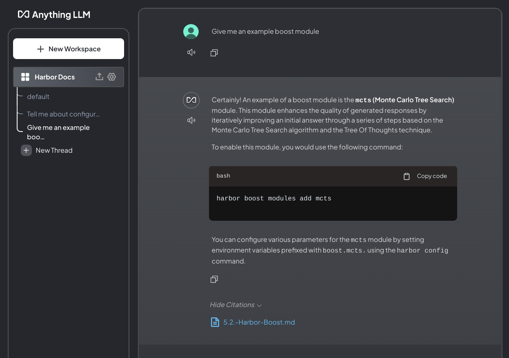

### [AnythingLLM](https://github.com/Mintplex-Labs/anything-llm)

> Handle: `anythingllm`<br/>
> URL: [http://localhost:34171](http://localhost:34171)


A full-stack application that enables you to turn any document, resource, or piece of content into context that any LLM can use as references during chatting. This application allows you to pick and choose which LLM or Vector Database you want to use as well as supporting multi-user management and permissions.


AnythingLLM divides your documents into objects called `workspaces`. A Workspace functions a lot like a thread, but with the addition of containerization of your documents. Workspaces can share documents, but they do not talk to each other so you can keep your context for each workspace clean.

#### Starting

```bash
# [Optional] Pre-pull an image
harbor pull anythingllm

# Start the service
harbor up anythingllm

# [Optional] Open the UI
harbor open anythingllm

# [Optional] Inspect service logs
harbor logs anythingllm
```

> [!NOTE]
> If you're seeing any kind of file system permission errors you'll need to ensure that files written from within a container are [accessible to your user](./1.-Harbor-User-Guide.md#file-system-permissions).

#### Integrations

`anythingllm` (RAG and document-chat platform on internal port 3001) is automatically connected to LLM backends and search providers via Harbor cross-compose files (`services/compose.x.anythingllm.ollama.yml`, `services/compose.x.anythingllm.llamacpp.yml`, `services/compose.x.anythingllm.searxng.yml` and the Traefik overlay).

When `harbor up` includes both `anythingllm` and one of the supported peers, the environment variables that tell AnythingLLM which provider to use are injected automatically.

**Auto-wired providers**

- `ollama` — `LLM_PROVIDER=ollama`, `OLLAMA_BASE_PATH` (and the parallel settings for the embedding engine) point at the Ollama container using the Harbor-internal URL. Model selection for chat and embeddings still happens inside the AnythingLLM UI.
- `llamacpp` — `LLM_PROVIDER=generic-openai` with `GENERIC_OPEN_AI_BASE_PATH=http://llamacpp:8080/v1` and `GENERIC_OPEN_AI_API_KEY=sk-llamacpp`. Embeddings are not pre-configured for the llamacpp path.
- `searxng` — `AGENT_SEARXNG_API_URL` is set for AnythingLLM agents and web-search RAG. The corresponding toggle must be enabled in the AnythingLLM workspace settings.

**External access**

- `traefik` — adds Traefik router labels; the service becomes available at `https://anythingllm.${HARBOR_TRAEFIK_DOMAIN}`.

**Host / volume / container interactions**

- **Data persistence**: the directory `$(harbor home)/services/anythingllm/storage` on the host is mounted at `/app/server/storage` inside the container. Everything—workspaces, uploaded files, LanceDB vectors, settings—lives here. (See the file-system permissions guidance under Starting.)
- **Networking**: the container joins `harbor-network` (container DNS resolution to `ollama`, `llamacpp`, `searxng`, etc.) and `traefik-public` when Traefik is present.
- **Capabilities**: `SYS_ADMIN` is added (AnythingLLM requires it for some of its internal operations).

The integrations are entirely declarative through the compose overlays. Restart the `anythingllm` service after you change the set of co-running services so the injected variables are refreshed.

#### Configuration

Local data is stored in Harbor's workspace, you can find a path to it with the following command:

```bash
echo $(harbor home)/services/anythingllm/storage
```

See the Integrations section above for details on the automatic backend connections to Ollama, llama.cpp, and SearXNG.

Other than that, you can adjust following settings via [`harbor config`](./3.-Harbor-CLI-Reference.md#harbor-config):

```bash
# Port to allocate on your host for the
# AnythingLLM web app
HARBOR_ANYTHINGLLM_HOST_PORT   34171

# Docker image to use, below is the official one
HARBOR_ANYTHINGLLM_IMAGE       mintplexlabs/anythingllm

# Docker tag/version to use, you might want to pin this
# in case latest doesn't work as expected
HARBOR_ANYTHINGLLM_VERSION     latest

# Secret to use for JWT tokens, you can change this
# to a more secure value if exposing AnythingLLM over the network
HARBOR_ANYTHINGLLM_JWT_SECRET  sk-anythingllm-jwt
```

An example of AnythingLLM with Harbor documentation imported into workspace:


