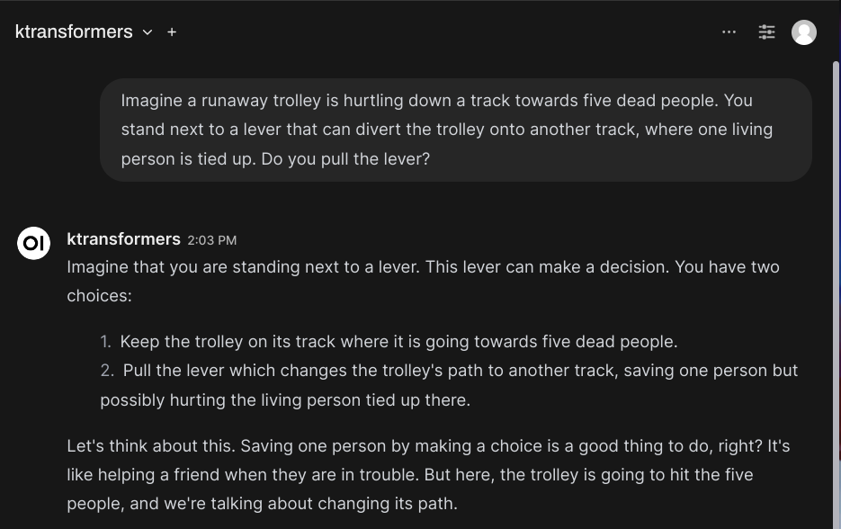

### [KTransformers](https://github.com/kvcache-ai/ktransformers)

> Handle: `ktransformers`
> URL: [http://localhost:34121](http://localhost:34121)

<picture>
    
</picture>

</p>
  <h4>A Flexible Framework for Experiencing Cutting-edge LLM Inference Optimizations</h4>
  <strong><a href="#show-cases">🔥 Show Cases</a> | <a href="#quick-start">🚀 Quick Start</a> | <a href="#tutorial">📃 Tutorial</a> | <a href="https://github.com/kvcache-ai/ktransformers/discussions">💬  Discussion </a> </strong>
</div>

KTransformers, pronounced as Quick Transformers, is designed to enhance your 🤗 <a href="https://github.com/huggingface/transformers">Transformers</a> experience with advanced kernel optimizations and placement/parallelism strategies.

---

#### Starting

```bash
# [Optional] Pre-build the image
# This is very large, as it's based on pytorch+cuda
# go grab a coffee!
harbor build ktransformers

# Start the service
harbor up ktransformers
```

Harbor's version was monkey-patched to be compatible with Open WebUI and will appears as `ktransformers` in the model selector upon successful start.



#### Models

> [!WARN]
> This project is **very** picky about the configuration, you should pay close attention to the parameter values and the contents of the folders on your host as per the guide below

##### GGUF

You can use one of the suggested options from the [README](https://github.com/kvcache-ai/ktransformers?tab=readme-ov-file#-suggested-model)

```bash
# 1. Download with HF CLI
harbor hf download <user/repo> <file.gguf>
harbor hf download mzwing/DeepSeek-V2-Lite-Chat-GGUF DeepSeek-V2-Lite-Chat.Q4_K_M.gguf

# 2. ⚠️ Verify that Q4_K_M is the only file in the folder
harbor find DeepSeek-V2-Lite-Chat.Q4_K_M.gguf
ls <folder where GGUF is located>
# 2.1 Delete any other files, if present
# 2.2 Note down the folder path

# 3. To configure, you must specify:
# 3.1 the name of source source model on Hugging Face - <user/repo>, for KTransformers to download the model config
harbor ktransformers model deepseek-ai/DeepSeek-V2-Lite-Chat
# 3.2 the path to a _folder_ containing a single GGUF file in a supported quant
harbor ktransformers gguf /root/.cache/huggingface/hub/models--mzwing--DeepSeek-V2-Lite-Chat-GGUF/snapshots/b04b913ceb7e910feeb20aa4e3cea9bde33b178a
```

#### Configuration

KTransformers can be configured in the same way as the other Harbor services:
- via Harbor CLI (aliases, config, or profiles)
- via the common `.env` file
- via the `ktransformers/override.env` file

```bash
# [Optional] See supported CLI args
harbor run ktransformers --help

# Get/set extra args for "ktransformers" CLI
harbor ktransformers args

# Get/set model to serve, --model_path
harbor ktransformers model <model>

# Get/set GGUF Folder to lookup model weights, --gguf_path
harbor ktransformers gguf <folder>

# Get/set git release to build the image from
# should be in the format without "v", due to artifact naming
harbor ktransformers version <version>
harbor ktransformers version 1.4.0

# Get/set the image to be used as a base for building the service
# Can help if your host has different CUDA compatibility
harbor ktransformers image <image>
harbor ktransformers image pytorch/pytorch:2.3.1-cuda12.1-cudnn8-devel
```

- [Official configuration examples](https://github.com/kvcache-ai/ktransformers?tab=readme-ov-file#run-example)