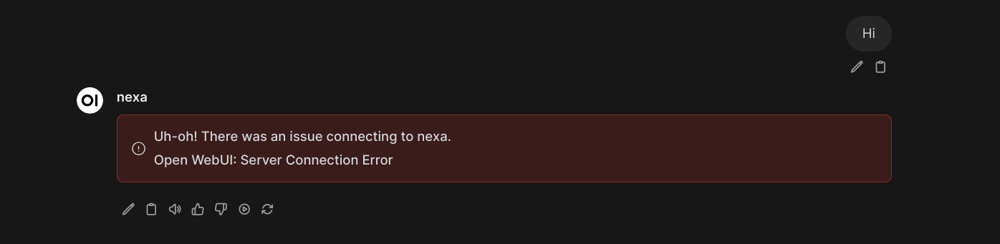
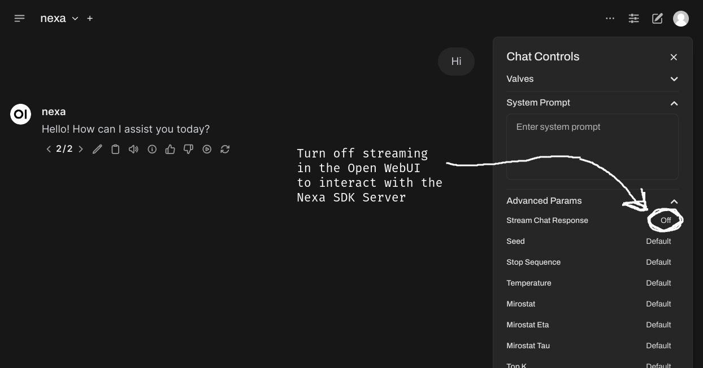

### [Nexa SDK](https://github.com/NexaAI/nexa-sdk)

> Handle: `nexa`
> URL: [http://localhost:34181](http://localhost:34181)


[![MacOS][MacOS-image]][release-url] [![Linux][Linux-image]][release-url] [![Windows][Windows-image]][release-url]

[](https://github.com/NexaAI/nexa-sdk/releases/latest) [](https://github.com/NexaAI/nexa-sdk/actions/workflows/ci.yaml?query=branch%3Amain) 

<!--   -->

[](https://discord.gg/thRu2HaK4D)

[On-device Model Hub](https://model-hub.nexa4ai.com/) / [Nexa SDK Documentation](https://docs.nexaai.com/)

[release-url]: https://github.com/NexaAI/nexa-sdk/releases
[Windows-image]: https://img.shields.io/badge/windows-0078D4?logo=windows
[MacOS-image]: https://img.shields.io/badge/-MacOS-black?logo=apple
[Linux-image]: https://img.shields.io/badge/-Linux-333?logo=ubuntu


Nexa SDK is a comprehensive toolkit for supporting ONNX and GGML models. It supports text generation, image generation, vision-language models (VLM), and text-to-speech (TTS) capabilities. Additionally, it offers an OpenAI-compatible API server with JSON schema mode for function calling and streaming support, and a user-friendly Streamlit UI. Users can run Nexa SDK in any device with Python environment, and GPU acceleration is supported.

---

#### Starting

```bash
# [Optional] pre-build the image
harbor build nexa

# [Optional] Check Nexa CLI is working
harbor nexa --help

# Start the Nexa SDK
harbor up nexa
```

> [!WARN]
> At the time of writing these docs, (Oct 3rd, 2024) Nexa SDK server doesn't support streaming mode. Unfortunately that can't be fixed on Harbor's side. There's a chance that since then the SDK was updated with a fix, so your installation might already be fixed out of the box. [GitHub issue to track](https://github.com/NexaAI/nexa-sdk/issues/141).



So, if streaming doesn't work, try turning it off as a workaround (hopefully temporary)



#### Usage

Harbor supports running Nexa as a command or as a service. This will result in slightly different configuration being appled.

When running as a CLI, just the `nexa` CLI is executed, without any extra arguments.

```bash
harbor nexa
```

When running as a service, the `nexa` CLI is executed with the `server` argument. It's bound to port pre-configured by Harbor (so it'll be avialble on your host machine with [`harbor url`](./3.-Harbor-CLI-Reference#harbor-url-service)). However, you can configure a model that will be used by the service.

```bash
# Start the service
harbor up nexa
```

#### Configuration

You can configure which model the SDK will run in the service mode.

```bash
# See currently configured model
harbor nexa model

# Set a new model
# Must be one of the identifiers from the official list
harbor nexa model llama3.2
```

#### Harbor-specific enhancements

Harbor runs a custom version of Nexa image, that is enhanced in two ways:
- GPU support in Docker
  - Harbor builds a custom version of Nexa SDK image, that ensures that CUDA-enabled version is installed in Docker
- **Partial** compatibility with Open WebUI (except the streaming issue)
  - Harbor runs Nexa SDK server behind a proxy that adds `/v1/models` endpoint for compatibility with Open WebUI
  - [GitHub issue to track](https://github.com/NexaAI/nexa-sdk/issues/140)

#### Vision/Audio Models

Harbor wasn't tested with vision or audio models in Nexa SDK - a contribution is welcome!