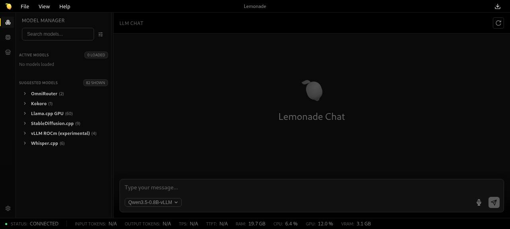

### [Lemonade](https://github.com/lemonade-sdk/lemonade)

> Handle: `lemonade`<br/>
> URL: [http://localhost:34860](http://localhost:34860)



Lemonade is a local AI server that serves optimized LLMs, speech-to-text (Whisper), text-to-speech (Kokoro), image generation (Stable Diffusion), embeddings, and reranking. It comes with a built-in web UI and exposes OpenAI-compatible, Ollama-compatible, and Anthropic-compatible APIs on a single port. Optimized for AMD hardware (ROCm, Vulkan, NPU) but also runs on CPU.

#### Starting

```bash
# Pull the image
harbor pull lemonade

# Start Lemonade
harbor up lemonade --open
```

On first start, the web UI is available immediately. Models are downloaded on demand from Hugging Face when you select and load them through the UI or API.

#### Configuration

##### Environment Variables

Following options can be set via [`harbor config`](./3.-Harbor-CLI-Reference.md#harbor-config):

```bash
# Main API + web UI port
HARBOR_LEMONADE_HOST_PORT          34860

# Docker image
HARBOR_LEMONADE_IMAGE              ghcr.io/lemonade-sdk/lemonade-server
HARBOR_LEMONADE_VERSION            latest

# Persistent data directory
HARBOR_LEMONADE_WORKSPACE          ./lemonade

# llama.cpp backend: cpu, rocm, vulkan
HARBOR_LEMONADE_LLAMACPP           cpu
```

The `HARBOR_LEMONADE_LLAMACPP` variable controls the inference backend:
- `cpu` — runs on any x86_64 CPU (default)
- `rocm` — AMD GPU acceleration (requires ROCm-compatible hardware)
- `vulkan` — AMD iGPU/dGPU via Vulkan

##### Volumes

Lemonade persists data in the following directories:
- Shared Hugging Face cache (`HARBOR_HF_CACHE`) — downloaded model files
- `lemonade/llama/` — llama.cpp backend binaries
- `lemonade/cache/` — Lemonade config, recipe options, and other backend binaries

##### AMD GPU (ROCm)

To enable AMD GPU acceleration:

```bash
harbor config set HARBOR_LEMONADE_LLAMACPP rocm
harbor up lemonade
```

This is handled by a cross-service compose file that passes through `/dev/kfd` and `/dev/dri` devices. Requires an AMD GPU with ROCm support (RDNA3/RDNA4 or Strix Halo).

#### API

Lemonade exposes multiple API surfaces on the same port:

| API | Base URL | Use Case |
|---|---|---|
| OpenAI-compatible | `http://localhost:34860/v1` | Chat completions, embeddings, audio, images |
| Ollama-compatible | `http://localhost:34860/api` | Drop-in Ollama replacement |
| Anthropic-compatible | `http://localhost:34860/v1/messages` | Claude-style messages API |

Key endpoints:
- `POST /v1/chat/completions` — chat (streaming supported)
- `POST /v1/audio/transcriptions` — speech-to-text
- `POST /v1/audio/speech` — text-to-speech
- `POST /v1/images/generations` — image generation
- `POST /v1/embeddings` — embeddings
- `GET /v1/models` — list available models
- `GET /live` — health check

API key is required but can be any string (e.g., `sk-lemonade`).

#### Open WebUI Integration

When running alongside Open WebUI, Lemonade is automatically configured as an OpenAI-compatible backend:

```bash
harbor up lemonade webui
```

#### Troubleshooting

```bash
harbor logs lemonade
```

##### No models available

Models auto-download from Hugging Face on first load. Use the built-in Model Manager in the web UI or the API to pull models:

```bash
curl http://localhost:34860/v1/pull \
  -H "Content-Type: application/json" \
  -d '{"checkpoint": "Qwen/Qwen3-0.6B"}'
```

##### GPU not detected

Ensure `HARBOR_LEMONADE_LLAMACPP` is set to `rocm` and your system has ROCm drivers installed. Check that `/dev/kfd` and `/dev/dri` exist on the host.

#### Links

- [Official Documentation](https://github.com/lemonade-sdk/lemonade/tree/main/docs)
- [GitHub Repository](https://github.com/lemonade-sdk/lemonade)
- [Supported Models](https://github.com/lemonade-sdk/lemonade/blob/main/docs/models.md)
