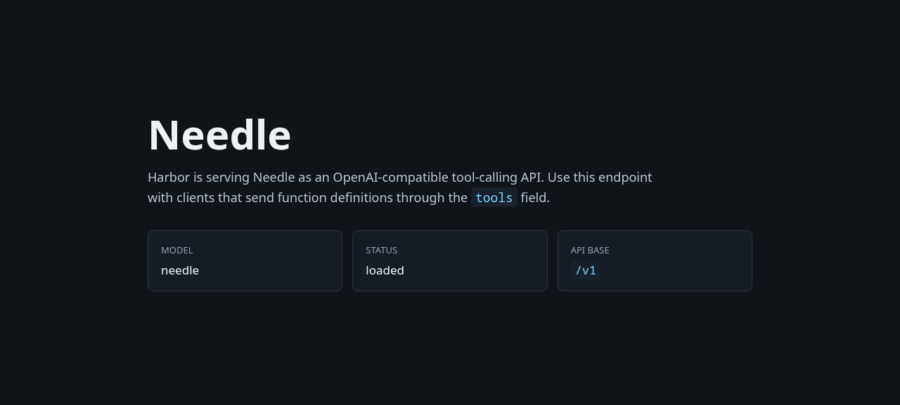

### [Needle](https://github.com/cactus-compute/needle)

> Handle: `needle`<br/>
> URL: [http://localhost:34890](http://localhost:34890)



Needle is a small JAX function-calling model from Cactus Compute. Harbor builds it from the upstream source repository, downloads the open `Cactus-Compute/needle` checkpoint from Hugging Face, and serves it through an OpenAI-compatible API focused on tool-call generation.

#### Starting

```bash
# Build the Harbor image
harbor build needle

# Start Needle
harbor up needle --open
```

The first start downloads `needle.pkl` and the tokenizer files from Hugging Face. The model is small, but JAX may still take a moment to initialize before the health check passes.

#### Configuration

##### Environment Variables

Following options can be set via [`harbor config`](./3.-Harbor-CLI-Reference.md#harbor-config):

```bash
# Main API port
HARBOR_NEEDLE_HOST_PORT             34890

# Harbor-built Docker image
HARBOR_NEEDLE_IMAGE                 harbor/needle
HARBOR_NEEDLE_VERSION               latest
HARBOR_NEEDLE_BASE_IMAGE            python
HARBOR_NEEDLE_BASE_VERSION          3.12-slim
HARBOR_NEEDLE_GIT_REF               https://github.com/cactus-compute/needle.git@main

# Persistent data directory
HARBOR_NEEDLE_WORKSPACE             ./services/needle/data

# Model identity and Hugging Face checkpoint
HARBOR_NEEDLE_MODEL                 needle
HARBOR_NEEDLE_MODEL_REPO            Cactus-Compute/needle
HARBOR_NEEDLE_MODEL_FILE            needle.pkl

# Generation settings
HARBOR_NEEDLE_MAX_GEN_LEN           512
HARBOR_NEEDLE_CONSTRAINED           true
HARBOR_NEEDLE_FORCE_DOWNLOAD        false
HARBOR_NEEDLE_JAX_PLATFORM_NAME     cpu
```

##### Volumes

Needle persists data in the following directories:

- Shared Hugging Face cache (`HARBOR_HF_CACHE`) - downloaded model and tokenizer artifacts
- `services/needle/data/` - Needle checkpoints and service data

#### API

Needle exposes an OpenAI-compatible base URL:

```bash
http://localhost:34890/v1
```

Available endpoints:

- `GET /health` - service health and loaded checkpoint
- `GET /v1/models` - OpenAI-compatible model list
- `POST /v1/chat/completions` - tool-call generation

Needle is specialized for function calling. Send OpenAI `tools` definitions and a user message; Harbor converts those tool definitions into Needle's schema and returns OpenAI `tool_calls`.

```bash
curl http://localhost:34890/v1/chat/completions \
  -H "Content-Type: application/json" \
  -H "Authorization: Bearer sk-needle" \
  -d '{
    "model": "needle",
    "messages": [
      {"role": "user", "content": "What is the weather in San Francisco?"}
    ],
    "tools": [
      {
        "type": "function",
        "function": {
          "name": "get_weather",
          "description": "Get current weather for a city",
          "parameters": {
            "type": "object",
            "properties": {
              "location": {"type": "string"}
            },
            "required": ["location"]
          }
        }
      }
    ]
  }'
```

Streaming requests are accepted with `"stream": true`. Needle generation itself is not token-incremental; Harbor returns Server-Sent Event chunks once the tool-call result is ready.

#### Open WebUI Integration

When running alongside Open WebUI, Needle is automatically registered as an OpenAI-compatible backend:

```bash
harbor up needle webui
```

Use this for workflows that send tool definitions. Plain chat prompts may return raw model text or no useful tool call because Needle is not a general-purpose chat model.

#### Troubleshooting

```bash
harbor logs needle
```

##### First start is slow

The first start downloads the checkpoint and tokenizer from Hugging Face and initializes JAX. Check the logs until the health check passes.

##### Hugging Face download fails

If the Hugging Face Hub rate-limits or blocks anonymous access, configure a token:

```bash
harbor config set HARBOR_HF_TOKEN <token>
harbor up needle
```

##### Tool calls are empty or malformed

Needle performs best when `tools` contains concise function names, descriptions, and JSON schemas. The adapter accepts standard OpenAI tool objects but Needle returns only function-call predictions; it does not execute tools or synthesize final natural-language answers.

#### Links

- [GitHub Repository](https://github.com/cactus-compute/needle)
- [Hugging Face Model](https://huggingface.co/Cactus-Compute/needle)
