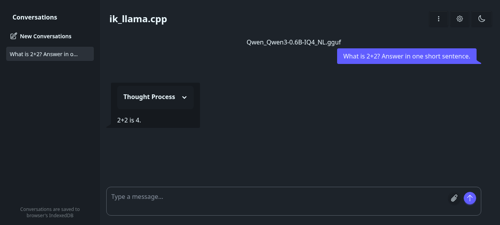

### [ik_llama.cpp](https://github.com/ikawrakow/ik_llama.cpp)

> Handle: `ikllamacpp`<br/>
> URL: [http://localhost:33832](http://localhost:33832)

ik_llama.cpp is a llama.cpp fork focused on local inference performance, additional quantization formats, Bitnet support, and CPU/CUDA execution paths.



#### Starting

The pre-built images are published by the upstream project. CPU and CUDA image variants are available; Harbor selects the NVIDIA image automatically when NVIDIA capabilities are enabled.

```bash
# Pull the selected image
harbor pull ikllamacpp

# Start the ik_llama.cpp server
harbor up ikllamacpp

# Open the built-in server UI
harbor open ikllamacpp
```

`ikllamacpp` runs in router mode by default, matching Harbor's `llamacpp` service. With no fixed model specifier, the server can discover models from the mounted Hugging Face and llama.cpp caches.

#### Models

You can use the same GGUF model workflow as the `llamacpp` service.

```bash
# Set model via Hugging Face URL
harbor ikllamacpp model https://huggingface.co/user/repo/blob/main/file.gguf

# Or set a local GGUF file path
harbor ikllamacpp gguf /path/to/model.gguf

# Add server flags
harbor ikllamacpp args '--ctx-size 4096 -ngl 99'
```

The configured model is translated into the server model specifier and applied when the container starts. Restart `ikllamacpp` after changing the configured model or arguments.

#### API

The service exposes the llama-server UI and OpenAI-compatible API:

```bash
# List models
curl http://localhost:33832/v1/models

# Chat completion
curl http://localhost:33832/v1/chat/completions \
  -H "Content-Type: application/json" \
  -d '{"model":"your-model","messages":[{"role":"user","content":"Say hello"}]}'
```

When `webui` and `ikllamacpp` run together, Harbor mounts an Open WebUI provider config pointing at `http://ikllamacpp:8080/v1` with API key `sk-ikllamacpp`.

```bash
harbor up webui ikllamacpp --open
```

#### Configuration

Following options are available via [`harbor config`](./3.-Harbor-CLI-Reference.md#harbor-config):

```bash
# The port on the host machine where ik_llama.cpp is available
HARBOR_IKLLAMACPP_HOST_PORT      33832

# Docker images for CPU and NVIDIA capability targets
HARBOR_IKLLAMACPP_IMAGE_CPU      ghcr.io/ikawrakow/ik-llama-cpp:cpu-server
HARBOR_IKLLAMACPP_IMAGE_NVIDIA   ghcr.io/ikawrakow/ik-llama-cpp:cu12-server

# Model selection; managed by harbor ikllamacpp model/gguf
HARBOR_IKLLAMACPP_MODEL
HARBOR_IKLLAMACPP_GGUF
HARBOR_IKLLAMACPP_MODEL_SPECIFIER

# Additional llama-server arguments
HARBOR_IKLLAMACPP_EXTRA_ARGS

# Source build controls
HARBOR_IKLLAMACPP_BUILD_REF
HARBOR_IKLLAMACPP_BUILD_CUDA_ARCH
```

#### Building from Source

Use build mode when you need a specific upstream commit or want to rebuild locally for your CPU/GPU target.

```bash
# Enable build mode
harbor ikllamacpp build on

# Optional: pin a branch, tag, or commit
harbor ikllamacpp build ref main

# Build and start
harbor build ikllamacpp
harbor up ikllamacpp
```

Harbor uses `docker/ik_llama-cpu.Containerfile` for CPU builds and overlays `docker/ik_llama-cuda.Containerfile` for NVIDIA builds.

#### Volumes

- `HARBOR_HF_CACHE` is mounted at `/root/.cache/huggingface`.
- `HARBOR_LLAMACPP_CACHE` is mounted at `/root/.cache/llama.cpp`.
- `./services/ikllamacpp/data` is mounted at `/app/data` for local GGUF files, presets, and other service data.

#### Troubleshooting

```bash
harbor logs ikllamacpp
```

- If the service starts but no models appear, download a GGUF model or set `HARBOR_IKLLAMACPP_MODEL_SPECIFIER` through `harbor ikllamacpp model` or `harbor ikllamacpp gguf`.
- If CUDA is unavailable, confirm Harbor detects NVIDIA capability and that the NVIDIA Container Toolkit is installed on the host.
- Upstream currently documents CPU and CUDA as the fully functional compute backends for ik_llama.cpp; use the CPU image on non-NVIDIA systems.

#### Links

- [GitHub Repository](https://github.com/ikawrakow/ik_llama.cpp)
- [Docker Guide](https://github.com/ikawrakow/ik_llama.cpp/blob/main/docker/README.md)
- [Parameters](https://github.com/ikawrakow/ik_llama.cpp/blob/main/docs/parameters.md)
