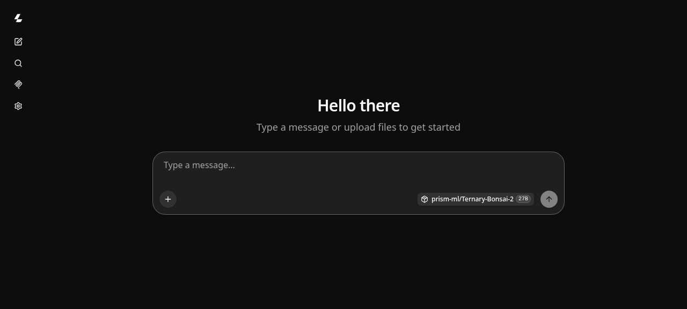

### [PrismML llama.cpp](https://github.com/PrismML-Eng/llama.cpp)

> Handle: `prismml`<br/>
> URL: [http://localhost:35090](http://localhost:35090)

PrismML's fork of llama.cpp is the runtime behind the [Bonsai](https://huggingface.co/collections/prism-ml/bonsai-2) family of ternary models. Ternary Bonsai 2 ships as `PTQ1_0` (1.76 bpw, ~6 GB for 27B) and `PQ2_0` (2.16 bpw, ~7.3 GB) GGUFs that use a rotated weight basis with a runtime Walsh-Hadamard transform. Stock llama.cpp either rejects those tensor types or loads them and emits garbage, so Harbor runs the fork as a separate service that otherwise behaves exactly like `llamacpp`: same caches, same OpenAI-compatible API, same cross-service integrations.



#### Starting

PrismML publishes release tarballs rather than container images. Harbor assembles a small image from the prebuilt binaries for your hardware on first start; no compiler run is involved.

```bash
# Build the image for the active capability (CPU, NVIDIA or ROCm)
harbor build prismml

# Start the server; downloads the default model on first run
harbor up prismml

# Open the built-in server UI
harbor open prismml
```

By default the service serves `prism-ml/Ternary-Bonsai-2-27B-gguf:PTQ1_0` via `-hf`, which downloads the model (and its vision projector) into the shared Hugging Face cache the first time. Expect a 6-7 GB download.

Hardware selection follows Harbor's normal capability detection:

- **NVIDIA** - `nvidia` capability picks a `nvidia/cuda` runtime base and the `linux-cuda-12.8-x64` release asset.
- **ROCm** - `rocm` capability picks a `rocm/dev-ubuntu-24.04` base and the `ubuntu-rocm-7.2-x64` asset, and passes `/dev/kfd` and `/dev/dri`.
- **CPU** - everything else uses `ubuntu:24.04` and the `ubuntu-x64` asset.

Each flavor is tagged separately (`harbor-prismml:<tag>-cpu|cuda|rocm`), so enabling a GPU capability later rebuilds instead of reusing the CPU image.

#### Models

```bash
# Switch to the faster-prefill 2-bit variant
harbor prismml model prism-ml/Ternary-Bonsai-2-27B-gguf:PQ2_0

# Any HF blob URL also works
harbor prismml model https://huggingface.co/prism-ml/Ternary-Bonsai-8B-gguf/blob/main/Ternary-Bonsai-8B-PQ2_0.gguf

# Or a local file; ./services/prismml/data is mounted at /app/data
harbor prismml gguf /app/data/model.gguf

# Clear the model to run in router mode (auto-discovers GGUFs in the HF cache)
harbor prismml model ""

# Pre-download a Bonsai GGUF through the fork instead of stock llama.cpp
harbor models pull --source prismml prism-ml/Ternary-Bonsai-2-27B-gguf:PQ2_0
```

Restart `prismml` after changing the model or arguments.

Default server arguments enable flash attention, cap the context at 32K (the model advertises 262K, which would not fit alongside the weights on a 16 GB GPU) and apply PrismML's suggested sampling:

```bash
harbor prismml args
# -fa on -c 32768 --temp 1.0 --top-p 0.95 --top-k 20
```

The default Bonsai 2 model is a thinking model. Give chat requests a generous `max_tokens` or the reasoning budget eats the whole reply, and prefer `temp 1.0 / top-p 0.95 / top-k 20` as above; other samplers make it loop more.

#### API

```bash
# List served models
harbor prismml models

# Chat completion
curl http://localhost:35090/v1/chat/completions \
  -H "Content-Type: application/json" \
  -d '{"messages":[{"role":"user","content":"Say hello"}],"max_tokens":512}'
```

#### Integrations

`prismml` has the same cross-service files as `llamacpp`. Start it next to any Harbor frontend or satellite and it is wired in automatically, for example:

```bash
harbor up prismml webui --open
harbor up prismml boost litellm
harbor launch opencode --backend prismml
```

Satellites that need a fixed model id read it from `HARBOR_<SERVICE>_PRISMML_MODEL` (for example `HARBOR_HERMES_PRISMML_MODEL`, `HARBOR_LIGHTRAG_PRISMML_MODEL`), all defaulting to the Bonsai 2 27B spec.

#### Configuration

Following options are available via [`harbor config`](./3.-Harbor-CLI-Reference.md#harbor-config):

```bash
# The port on the host machine where the server is available
HARBOR_PRISMML_HOST_PORT          35090

# PrismML release tag to run; see https://github.com/PrismML-Eng/llama.cpp/releases
# (managed by harbor prismml version)
HARBOR_PRISMML_VERSION            prism-b10685-7dffb15

# Runtime base image and release asset flavor per capability
HARBOR_PRISMML_BASE_IMAGE_CPU     ubuntu:24.04
HARBOR_PRISMML_ASSET_CPU          ubuntu-x64
HARBOR_PRISMML_BASE_IMAGE_NVIDIA  nvidia/cuda:12.8.1-runtime-ubuntu24.04
HARBOR_PRISMML_ASSET_NVIDIA       linux-cuda-12.8-x64
HARBOR_PRISMML_BASE_IMAGE_ROCM    rocm/dev-ubuntu-24.04:7.2
HARBOR_PRISMML_ASSET_ROCM         ubuntu-rocm-7.2-x64
# ROCm runtime libs installed on top of the base image; the release binary
# links against them and the rocm/dev-ubuntu image ships without them
HARBOR_PRISMML_ROCM_PACKAGES      hipblas rocblas

# Model selection; managed by harbor prismml model/gguf
HARBOR_PRISMML_MODEL              prism-ml/Ternary-Bonsai-2-27B-gguf:PTQ1_0
HARBOR_PRISMML_GGUF
HARBOR_PRISMML_MODEL_SPECIFIER    -hf prism-ml/Ternary-Bonsai-2-27B-gguf:PTQ1_0

# Additional llama-server arguments
HARBOR_PRISMML_EXTRA_ARGS         -fa on -c 32768 --temp 1.0 --top-p 0.95 --top-k 20

# Source build controls (build capability)
HARBOR_PRISMML_BUILD_REF          prism
HARBOR_PRISMML_BUILD_CUDA_ARCH    default
HARBOR_PRISMML_BUILD_ROCM_ARCH    gfx908;gfx90a;gfx942;gfx1030;gfx1100;gfx1101;gfx1102;gfx1151;gfx1150;gfx1200;gfx1201
```

Older NVIDIA drivers that cannot run CUDA 12.8 can switch to the 12.4 asset:

```bash
harbor config set prismml.base.image.nvidia nvidia/cuda:12.4.1-runtime-ubuntu22.04
harbor config set prismml.asset.nvidia linux-cuda-12.4-x64
harbor build prismml
```

#### Building from Source

The release binaries cover the common GPU targets. If yours is missing, or you need an unreleased commit, build the fork itself with its own Dockerfiles. This is a full llama.cpp compile and takes a while, especially for CUDA and ROCm.

```bash
harbor prismml build on
harbor prismml build ref prism      # branch, tag or commit
harbor config set prismml.build.rocm.arch gfx1151   # optional: trim ROCm targets
harbor build prismml
harbor up prismml
harbor prismml build off            # back to release binaries
```

#### Volumes

- `HARBOR_HF_CACHE` is mounted at `/root/.cache/huggingface`; models pulled via `-hf` land here and are shared with `llamacpp`, `ollama`, and the rest of Harbor.
- `HARBOR_LLAMACPP_CACHE` is mounted at `/root/.cache/llama.cpp`.
- The Hugging Face cache is additionally mounted read-only at the same absolute path as on the host, so GGUFs in the llama.cpp cache that are symlinks to host HF-cache blobs resolve inside the container.
- `./services/prismml/data` is mounted at `/app/data` for local GGUF files.

#### Troubleshooting

```bash
harbor logs prismml
```

- **Garbage output or `unknown tensor type`** - you are running a Bonsai GGUF on stock llama.cpp. Only `prismml` understands `PTQ1_0`/`PQ2_0`; point your frontend at port 35090, not at `llamacpp`.
- **Build fails downloading the tarball** - the pinned `HARBOR_PRISMML_VERSION` may have been published without Linux assets (the newest tag sometimes only carries Windows files for a while). Pick an earlier tag with `harbor prismml version <tag>`.
- **Out of memory on load** - lower the context: `harbor prismml args '-fa on -c 8192 --temp 1.0 --top-p 0.95 --top-k 20'`.
- **Slow generation on ROCm (single-digit tokens/s)** - the HIP backend failed to load, usually because `libhipblas`/`librocblas` are missing from the image. Check with `harbor exec prismml ldd /app/libggml-hip.so | grep 'not found'` and make sure `HARBOR_PRISMML_ROCM_PACKAGES` matches your ROCm base image, then `harbor build prismml`. On a Strix Halo (gfx1151) the 27B PTQ1_0 model generates around 19 tokens/s once the GPU is in use.
- **GPU not used on ROCm** - the release binary targets the gfx list above. For other chips enable the source build and set `HARBOR_PRISMML_BUILD_ROCM_ARCH`. Strix Halo (gfx1151) hosts may also need `HSA_OVERRIDE_GFX_VERSION=11.5.1` via `harbor env prismml`.
- **Endless reasoning loops** - a known trait of Bonsai 2; keep the default sampler settings and cap `max_tokens` per request.

#### Links

- [PrismML llama.cpp fork](https://github.com/PrismML-Eng/llama.cpp)
- [Bonsai demo and setup scripts](https://github.com/PrismML-Eng/Bonsai-demo)
- [Bonsai 2 27B announcement](https://prismml.com/news/bonsai-2-27b)
- [GGUF formats reference](https://docs.prismml.com/download/formats)
- [Ternary Bonsai 2 27B GGUF](https://huggingface.co/prism-ml/Ternary-Bonsai-2-27B-gguf)
