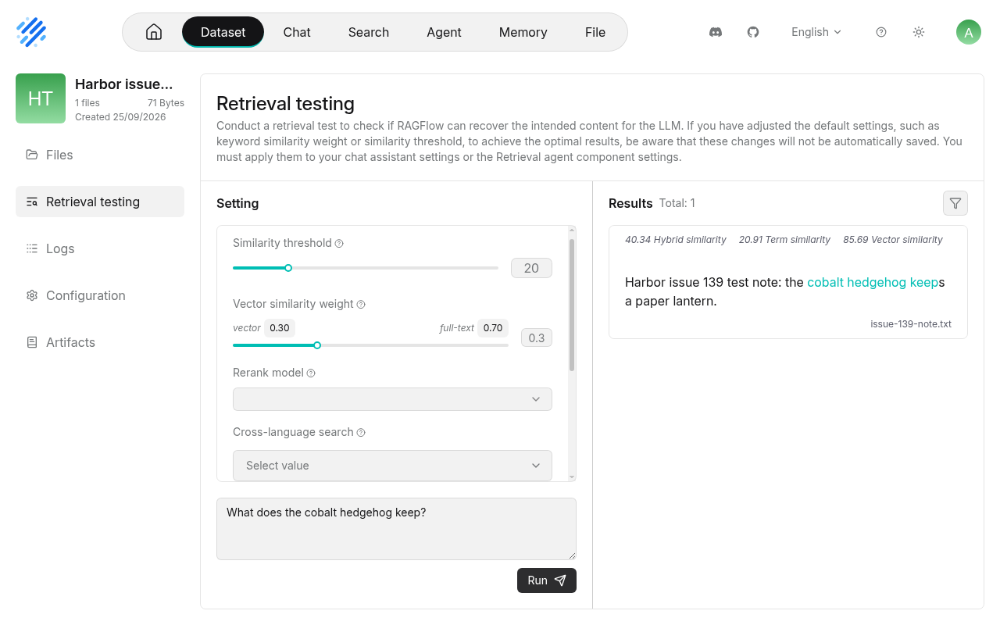

### [RAGFlow](https://github.com/infiniflow/ragflow)

> Handle: `ragflow`<br/>
> URL: [http://localhost:34990](http://localhost:34990)

RAGFlow is a document-focused RAG engine with parsing, datasets, hybrid retrieval, and chat/agent workflows. Harbor packages upstream's CPU deployment with Elasticsearch, MySQL, S3-compatible storage, and Valkey. The five data/log volumes persist when the service is stopped. The image is currently published for `linux/amd64`; ARM64 hosts need an upstream source build.



#### Starting

Set six unique secrets before first start. The preflight container rejects missing, short, or non-alphanumeric values. `harbor config set` normally echoes the new value, so redirect its output when setting secrets. Save the secrets securely with the data-volume backups.

```bash
harbor config set ragflow.mysql_password "$(openssl rand -hex 32)" >/dev/null 2>&1
harbor config set ragflow.es_password "$(openssl rand -hex 32)" >/dev/null 2>&1
harbor config set ragflow.s3_password "$(openssl rand -hex 32)" >/dev/null 2>&1
harbor config set ragflow.redis_password "$(openssl rand -hex 32)" >/dev/null 2>&1
harbor config set ragflow.admin_password "$(openssl rand -hex 32)" >/dev/null 2>&1
harbor config set ragflow.secret_key "$(openssl rand -hex 32)" >/dev/null 2>&1
harbor up ragflow ollama --open
```

First startup downloads several large images and initializes the databases. Sign in as `admin@ragflow.io` with `ragflow.admin_password`, or register another local account. The bootstrap admin password is used on first creation only; changing its Harbor setting later does not reset the existing account. Keep `ragflow.secret_key` stable across restarts so sessions remain valid.

For local models, open **Model providers → Ollama**, set the Base URL to `http://ollama:11434`, verify and save the instance, then set default LLM and embedding models. The integration ensures Harbor Ollama is healthy and pulls `ragflow.chat_model` (`qwen2.5:3b`) and `ragflow.embedding_model` (`mxbai-embed-large`). Select those models in RAGFlow's UI; changing the Harbor settings does not automatically change a saved RAGFlow account's model selection. Create a Dataset, choose **General** parsing, upload a document with **Parse on creation**, and use **Retrieval testing** to check its indexed content. The UI can be used with other supported cloud or local model providers too.

The comment mentioning Kotaemon refers to a separate service that Harbor already has; this RAGFlow deployment does not replace it.

#### Configuration and data

| Setting | Default | Purpose |
| --- | --- | --- |
| `ragflow.image`, `ragflow.version` | `infiniflow/ragflow:v0.27.2` | RAGFlow CPU image |
| `ragflow.host_port` | `34990` | Web UI and proxied API host port |
| `ragflow.bind_host` | `127.0.0.1` | Host address for the published port |
| `ragflow.es_memory` | `8g` | Elasticsearch container memory limit |
| `ragflow.mysql_password` | Empty | Required MySQL root/RAGFlow metadata password |
| `ragflow.es_password` | Empty | Required Elasticsearch password |
| `ragflow.s3_password` | Empty | Required object-storage password |
| `ragflow.redis_password` | Empty | Required Valkey password |
| `ragflow.admin_password` | Empty | Required first-run admin password |
| `ragflow.secret_key` | Empty | Required persistent session-signing secret |
| `ragflow.register_enabled` | `1` | Set to `0` after creating accounts to disable open registration |
| `ragflow.chat_model` | `qwen2.5:3b` | Ollama model pulled by the integration |
| `ragflow.embedding_model` | `mxbai-embed-large` | Ollama embedding model pulled by the integration |

The stack persists `ragflow-mysql-data`, `ragflow-es-data`, `ragflow-s3-data`, `ragflow-redis-data`, and `ragflow-logs` as named Docker volumes. Back up all five volumes together with the six secrets. The admin API and dependency ports are not published by Harbor. The web port binds only to loopback by default. For remote users, deliberately change `ragflow.bind_host`, put TLS and access controls in front of the service, and consider disabling open registration. Do not expose the internal stores directly to the internet.

#### Troubleshooting

- The UI can answer HTTP 200 before its Python API has completed first-run migrations. Wait for the backend, then reload the page if it initially reports a gateway error.
- Check `docker logs harbor.ragflow` and the service's `ragflow-logs` volume if startup or parsing fails. `harbor logs` tails indefinitely by default.
- Elasticsearch needs enough memory and a sufficiently high `vm.max_map_count` on the Docker host; follow the [upstream quickstart](https://ragflow.io/docs/dev/quickstart) if it cannot start.
- After editing `services/ragflow/default.env` in a Git checkout, run `harbor config update` before starting; use `harbor config set` for local settings rather than editing `.env`.
