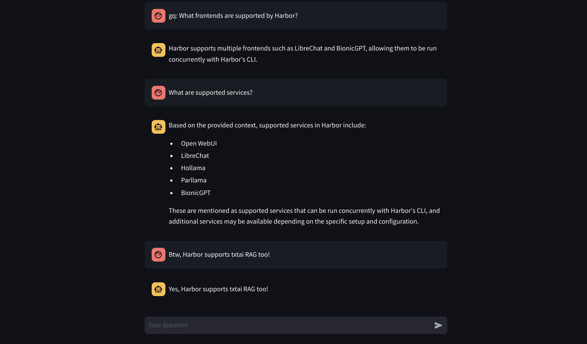

### [txtai RAG](https://github.com/neuml/rag)

> Handle: `txtairag`
> URL: [http://localhost:33991/](http://localhost:33991/)

<p align="center">
    
</p>

<p align="center">
    <a href="https://github.com/neuml/rag/releases">
        
    </a>
    <a href="https://github.com/neuml/rag">
        
    </a>
    <a href="https://github.com/neuml/rag/issues">
        
    </a>
</p>

🚀 Retrieval Augmented Generation (RAG) with txtai. Combine search and LLMs to find insights with your own data.


#### Starting

```bash
# [Optional] pre-pull the images
harbor pull txtairag

# Start txtai RAG
harbor up txtairag

# Open the RAG Streamlit Web UI
harbor open txtairag
```

- [Rag App features](https://github.com/neuml/rag?tab=readme-ov-file#graph-rag)

#### Configuration

> [!NOTE]
> Type `:settings` as a message in the chat to see the current settings.

```bash
# See where `txtai` cache is located by default
harbor txtai cache

# txtairag will use two folders in this space:
# - `data` for the input data to be indexed
# - `embeddings` for persisting embeddings (index) content
```

By default, `txtairag` is configured to:
- run with the `ollama` backend, it can, however, run the inference via `transformers` package directly if needed
- persist embeddings in the `txtai` cache
- use the `neuml/txtai-wikipedia-slim` as base embeddings to work with

```bash
# "harbor txtai rag" is a namespace for the
# txtai RAG service. See available commands and options:
harbor txtai --help
harbor txtai rag --help

# Setting another model
harbor txtairag model llama3.1:8b-instruct-q8_0
# [Tip] See available models
harbor ollama ls

# Switching to different embeddings
# Arxiv - science papers ~6Gb
harbor txtai rag embeddings neuml/txtai-arxiv
# Wikipedia - general knowledge ~8Gb
harbor txtai rag embeddings neuml/txtai-wikipedia

# Switch to completely local embeddings
harbor txtai rag embeddings ""
# Remove embeddings folder in the txtai cache
rm -rf $(harbor txtai cache)/embeddings

# [Optional] Add something to the /data to seed
# the initial version of the new index
echo "Hello, world!" > $(harbor txtai cache)/data/hello.txt
```

#### Integration

Here's an example using `fabric` and `txtairag`:

```bash
# [Optional] set fabric to use same model as
# the currently used by txtai
harbor fabric model $(harbor txtai rag model)

# [Tip] Ensure data folder is present
mkdir -p "$(eval echo $(harbor txtai cache))/data"

# 1. Split harbor.sh CLI into chunks of 150 lines
# 2. Pass each chunk to fabric to extract insights
# 3. txtairag will index the file on the next start
tmpdir=$(mktemp -d) && \
split -l 25 $(harbor home)/README.md "$tmpdir/chunk_" && \
for chunk in "$tmpdir"/chunk_*; do
  cat "$chunk" | harbor fabric --pattern extract_insights >> "$(eval echo $(harbor txtai cache))/data/harbor_quiz.txt"
done && \
rm -r "$tmpdir"

# [Optional] Check the file
cat "$(eval echo $(harbor txtai cache))/data/harbor_quiz.txt" | head -n 10
# * Harbor automates the setup of SearXNG, enabling Web RAG in Open WebUI, upon its execution.
# * Users can easily switch between alternative LLM inference backends using the "harbor up" command.
# * Multiple frontends such as LibreChat and BionicGPT can be run concurrently with Harbor's CLI.
# * Custom models can be loaded for supported backends like LlamaCPP, facilitating personalization of services.

# Restart the txtairag service
harbor restart txtairag
```

Use advanced RAG over your data!


