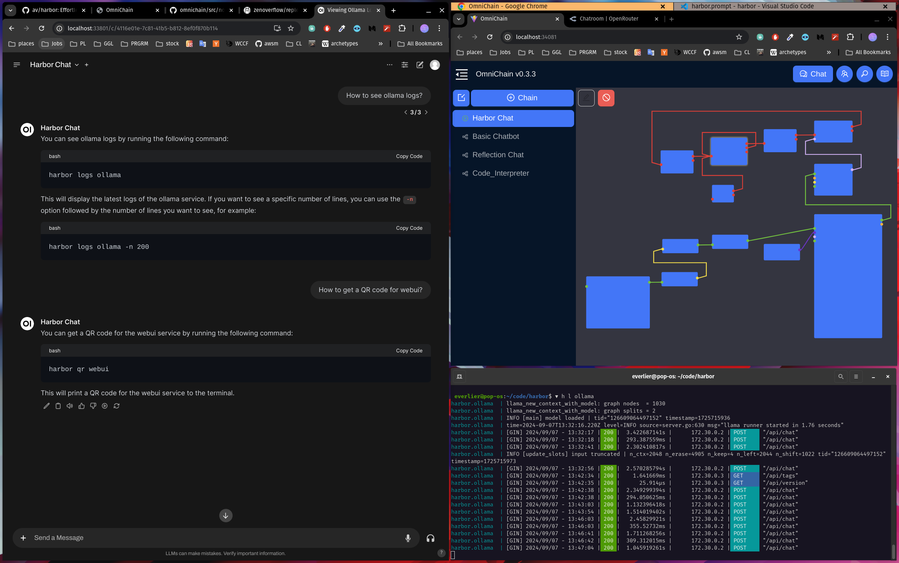
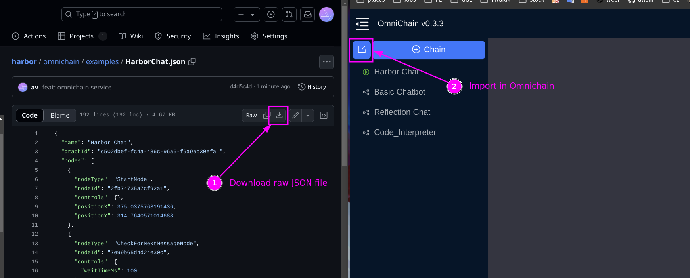

### [omnichain](https://github.com/zenoverflow/omnichain/tree/main)

> Handle: `omnichain`
> URL: [http://localhost:34081](http://localhost:34081)

Efficient visual programming for AI language models


- [Getting started](https://omnichain.zenoverflow.com)
- [Setup](https://omnichain.zenoverflow.com/docs/setup)
- [LLM Support](https://omnichain.zenoverflow.com/docs/llm-backends)
- [API](https://omnichain.zenoverflow.com/docs/chains-api)
- [Examples](https://omnichain.zenoverflow.com/examples/basic-chatbot)

#### Starting

```bash
# [Optional] pre-build the image
harbor build omnichain

# Start the service
harbor up omnichain

# [Optional] Open the UI
harbor open omnichain
```

#### Configuration

By default, Omnichain is not pre-configured with any external connections, as everything is specific for any given chain. It means that you'd connect specific chains to the LLM backends in Harbor upon creating them.

Harbor runs a custom version of the `omnichain` that was made compatible with `webui`. You'll see your chains as models in your Workplace there.

When running, Harbor will mount a workspace folder to the container. You can access it with:

```bash
# Open omnichain workspace in the file manager
harbor omnichain workspace

# See where the workspace is located,
# the folder is relative to $(harbor home)
harbor config get omnichain.workspace
```

In the workspace, following folders are used:
- `custom_nodes` - will provide files for the [Custom Nodes](https://omnichain.zenoverflow.com/docs/custom-nodes) functionality
- `data` - `omnichain` persistence: chains, avatars, etc.
- `files` - fill be available as `/app/omnichain/files` in your chains, that can be used with File nodes

Please refer to official documentation for more information:
- [Official Omnichain documentation](https://omnichain.zenoverflow.com/docs/setup)
- [Omnichain examples](https://omnichain.zenoverflow.com/examples/basic-chatbot)

#### Example

To make the testing easier, you can use a sample chain that was pre-configured to work with `ollama` in Harbor.

- [HarborChat.json](https://github.com/av/harbor/blob/main/omnichain/examples/HarborChat.json) - chat with Harbor CLI


