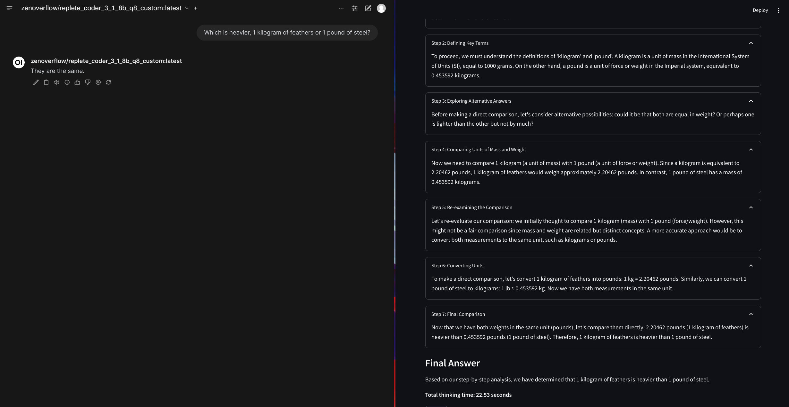

### [JupyterLab](https://github.com/jupyterlab/jupyterlab)

> Handle: `ol1`
> URL: [http://localhost:34111](http://localhost:34111)



> "But we have o1 at home!"

Based on the original work from:
- https://github.com/tcsenpai/ol1-p1
- https://github.com/bklieger-groq/g1

Lightweight Streamlit-based service with Ollama as a backend, that implements the o1-like reasoning chains.

#### Starting

```bash
# [Optional] pre-build the image
harbor build ol1

# Start the service
harbor up ol1

# Open ol1 in the browser
harbor open ol1
```

#### Configuration

`ol1` can be configured in the same way as the other Harbor services:
- via Harbor CLI (aliases, config, or profiles)
- via the `.env` file

Following configuration options are available:

```bash
# Get/set desired Ollama model for ol1
harbor ol1 model

# Manage dictionary of "options" to be
# sent to the Ollama
harbor ol1 args

# List all currently set args
harbor ol1 args
harbor ol1 args ls

# Get the value of a specific arg
harbor ol1 args get <arg_name>
harbor ol1 args get temperature

# Set the temperature
harbor ol1 args set <arg_name> <value>
harbor ol1 args set temperature 0.5
```

- [Official list of parameters](https://github.com/ollama/ollama/blob/main/docs/modelfile.md#parameter) for the `args`

Collections of settings can be saved in Harbor profiles for future reuse.

```bash
# Perform the configuration
harbor ol1 model codestral
harbor ol1 args set temperature 0.8
harbor ol1 args set num_ctx 1024

# Save profile
harbor profile save codestral-ol1

# Later, restore the profile
harbor profile use codestral-ol1
```