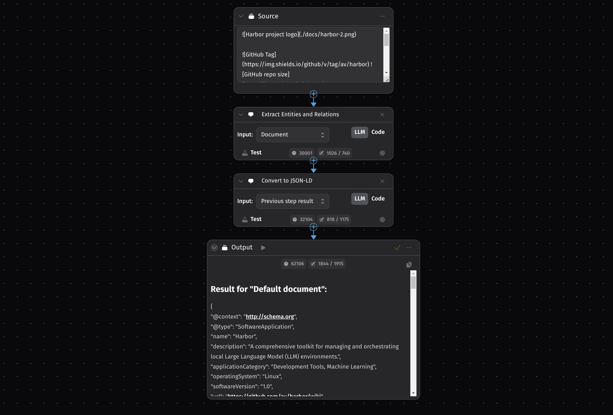
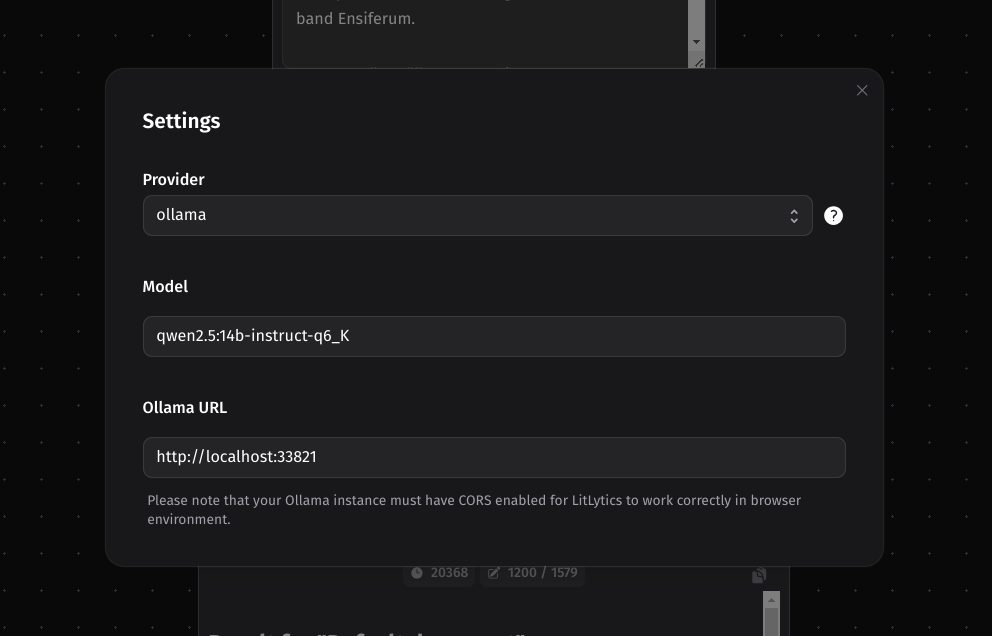

### [LitLytics](https://github.com/yamalight/litlytics)

> Handle: `litlytics`
> URL: [http://localhost:34161](http://localhost:34161)

LitLytics is an affordable, simple analytics platform that leverages LLMs to automate data analysis. It was designed to help teams without dedicated data scientists gain insights from their data.



Example of processing Harbor's README with LitLytics structured data pipeline.

<details>
<summary>Extracted data</summary>

  ```json
  ## Result for "Default document":

{
  "@context": "http://schema.org",
  "@type": "SoftwareApplication",
  "name": "Harbor",
  "description": "A comprehensive toolkit for managing and orchestrating local Large Language Model (LLM) environments.",
  "applicationCategory": "Development Tools, Machine Learning",
  "operatingSystem": "Linux",
  "softwareVersion": "1.0",
  "url": "https://github.com/av/harbor/wiki",
  "featureList": [
    {
      "@type": "Feature",
      "name": "Concise CLI",
      "description": "A shell command-line interface for managing various services related to LLMs."
    },
    {
      "@type": "Feature",
      "name": "Service Management",
      "description": "Tools for common tasks such as model management, configuration, and service debugging."
    },
    {
      "@type": "Feature",
      "name": "Pre-configured Services",
      "description": "Docker Compose files that ensure different services (e.g., Hugging Face, Ollama) work seamlessly together."
    },
    {
      "@type": "Feature",
      "name": "Shared Cache",
      "description": "A shared host cache to reduce redundancy in downloading models or data across multiple services."
    },
    {
      "@type": "Feature",
      "name": "Co-located Configurations",
      "description": "Centralized configuration profiles for different use cases."
    },
    {
      "@type": "Feature",
      "name": "LLM Benchmarking Service",
      "description": "Built-in functionality to benchmark LLMs."
    },
    {
      "@type": "Feature",
      "name": "Eject Functionality",
      "description": "The ability to run services independently of Harbor once configured."
    }
  ],
  "useCase": [
    {
      "@type": "UseCase",
      "name": "Experimentation",
      "description": "Ideal for experimenting with various LLMs and related services without the overhead of manual setup."
    },
    {
      "@type": "UseCase",
      "name": "Development Environment",
      "description": "Provides a consistent development environment for working on projects involving LLMs."
    },
    {
      "@type": "UseCase",
      "name": "Centralized Management",
      "description": "Simplifies management by centralizing configurations, caches, and service interactions."
    }
  ],
  "exampleWorkflow": [
    {
      "@type": "ExampleWorkflowStep",
      "stepName": "Install Harbor",
      "description": "Follow the installation guide to set up Harbor CLI and App.",
      "url": "https://github.com/av/harbor/wiki/1.0.-Installing-Harbor"
    },
    {
      "@type": "ExampleWorkflowStep",
      "stepName": "Launch Services",
      "description": "Use the Harbor App or CLI to launch a default stack with services like Ollama, Open WebUI, SearXNG, etc."
    },
    {
      "@type": "ExampleWorkflowStep",
      "stepName": "Configure Services",
      "description": "Adjust configurations as needed using the Harbor CLI or App interface."
    },
    {
      "@type": "ExampleWorkflowStep",
      "stepName": "Benchmarking and Optimization",
      "description": "Utilize built-in tools for benchmarking LLMs. Optimize outputs with features like `Harbor Boost`."
    },
    {
      "@type": "ExampleWorkflowStep",
      "stepName": "Eject from Harbor",
      "description": "Once configured, you can run services independently of Harbor using Docker Compose or other methods."
    }
  ],
  "exampleCommands": [
    {
      "@type": "ExampleCommand",
      "command": "harbor up",
      "description": "Launch Services"
    },
    {
      "@type": "ExampleCommand",
      "command": "harbor config set <service> <key>=<value>",
      "description": "Adjust Configurations"
    }
  ],
  "documentation": [
    {
      "@type": "DocumentationSection",
      "name": "Installing Harbor",
      "url": "https://github.com/av/harbor/wiki/1.0.-Installing-Harbor"
    },
    {
      "@type": "DocumentationSection",
      "name": "Harbor User Guide",
      "url": "https://github.com/av/harbor/wiki/1.-Harbor-User-Guide"
    },
    {
      "@type": "DocumentationSection",
      "name": "Harbor App",
      "url": "https://github.com/av/harbor/wiki/1.1-Harbor-App"
    },
    {
      "@type": "DocumentationSection",
      "name": "Services Catalog",
      "url": "https://github.com/av/harbor/wiki/2.-Services"
    },
    {
      "@type": "DocumentationSection",
      "name": "CLI Reference",
      "url": "https://github.com/av/harbor/wiki/3.-Harbor-CLI-Reference"
    }
  ],
  "whyUse": [
    {
      "@type": "WhyUsePoint",
      "pointName": "Convenience",
      "description": "Simplifies the setup and management of LLM environments."
    },
    {
      "@type": "WhyUsePoint",
      "pointName": "Centralization",
      "description": "Centralizes configurations, caches, and service interactions."
    }
  ]
}
  ```

</details>

#### Starting

```bash
# [Optional] Pre-pull the litlytics image
# otherwise will be pulled on start
harbor pull litlytics

# Start the service
harbor up litlytics

# [Optional] once started, open the UI
# in your default browser
harbor open litlytics
```

#### Configuration

Unfortunately there's no way to pre-configure LitLytics in any way otherwise than via the provided UI.

You can obtain needed configuration options via Harbor CLI, for example for `ollama`:

```bash
# Launch with Ollama and WebUI
harbor up litlytics

# Find and copy the Model ID
harbor ollama ls | grep qwen2.5

# Grab URL for LitLytics to connect to Ollama
harbor url ollama
```



