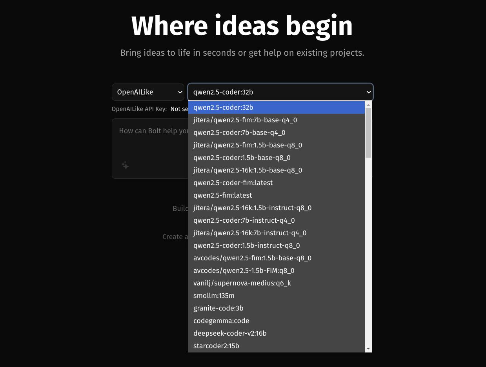
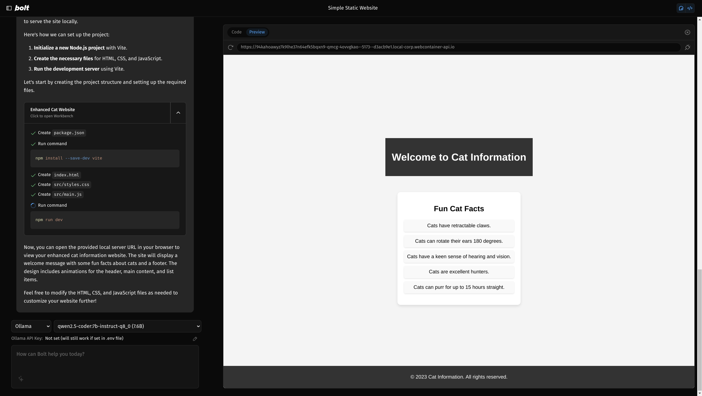

### [Bolt.diy](https://github.com/stackblitz-labs/bolt.diy)

> Handle: `bolt`
> URL: [http://localhost:34201](http://localhost:34201)

Bolt.new is an AI-powered web development agent that allows you to prompt, run, edit, and deploy full-stack applications directly from your browser.

> [!WARN]
> Due to how the service is designed and implemented - it can be very resource intensive, which might be especially noticeable on Mac OS due to the way Docker is implemented there.

#### Starting

```bash
# [Optional] Pre-pull the images
harbor pull bolt

# Start the service
harbor up bolt

# [Optional] Open the web interface
harbor open bolt
```

#### Configuration

Current version of `bolt` tries to query LLM APIs from both the Browser and the Server, it means that the identical URL should work for both network locations. In case of docker, it means that `localhost` would mean the container itself, not the host machine.

So, to make this service work - you'll need to figure out either:
- the IP address of your host on the LAN
- use the IP of the Docker Network Gateway (172.17.0.1 on Linux)

Unfortunately, the first option can't be known ahead of time, and the second one is only static on Linux, so Harbor can't pre-configure the connectivity for you and it'll need to be done manually.

For example, to connect `bolt` to Ollama, using the IP address on the LAN, you can use [`harbor url -a`](./3.-Harbor-CLI-Reference#harbor-url-service).

```bash
# For Ollama
harbor env bolt OLLAMA_API_BASE_URL $(harbor url -a ollama)

# For other backends (vllm in this case)
harbor env bolt OPENAI_LIKE_API_BASE_URL $(harbor url -a vllm)/v1
harbor env bolt OPENAI_LIKE_API_KEY <configured key>
```

After that, your `bolt` instance should have connectivity with the Ollama API.



When this is working, you'll then need to ensure that the models you run have their context extended to the maximum length your machine can handle, as Ollama's default 2048 is not enough out of the box to ensure that the function calling works as expected.

See [Custom Ollama Modelfiles](./2.2.1-Backend:-Ollama#custom-modelfiles) for more information on how to do this.


