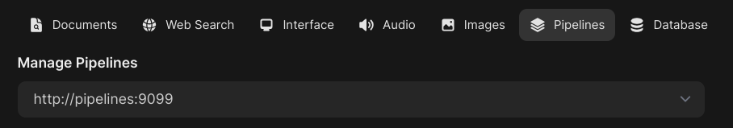

### [Open WebUI Pipelines](https://docs.openwebui.com/pipelines/)

> Handle: `pipelines`<br/>
> URL: [http://localhost:34211](http://localhost:34211)<br/>
> Integration author: [@ic4l4s9c](https://github.com/ic4l4s9c)

Pipelines bring modular, customizable workflows to any UI client supporting OpenAI API specs – and much more! Easily extend functionalities, integrate unique logic, and create dynamic workflows with just a few lines of code.

---

#### Starting

```bash
# [Optional] Pre-pull the images
harbor pull pipelines

# Start the service
harbor up pipelines
```

> [!NOTE]
> It makes most sense to run `pipelines` and `webui` together, as they are designed to work in tandem

#### Usage

Harbor connects `pipelines` to the `webui` service by default, when run together.



Apart from that, you can access the Pipelines API:

```bash
# URL for access from the host
harbor url pipelines

# URL for access in the same LAN
harbor url -a pipelines

# [Optional] create tunnel for access via
# public interned
# ⚠️ Never expose unprotected endpoints to the public internet
harbor tunnel pipelines
```

#### Configuration

Majority of configuration will happen via `webui`. Navigate to the pipelines settings (typically `Admin Settings` -> `Settings` -> `Pipelines`) and upload either a `.py` file with the pipeline code or point the service to a _raw_ GitHub URL (for example: https://raw.githubusercontent.com/open-webui/pipelines/refs/heads/main/examples/pipelines/integrations/wikipedia_pipeline.py)

After upload, the usage of the pipeline in the `webui` will depend on the type of the pipeline (e.g. Filter, Function, Scaffold, etc.).


Please refer to the [official documentation](https://docs.openwebui.com/pipelines/) for many more examples and detailed instructions.

#### Documentation

- [Official documentation](https://docs.openwebui.com/pipelines/)
- [Examples on GitHub](https://github.com/open-webui/pipelines/tree/main/examples)