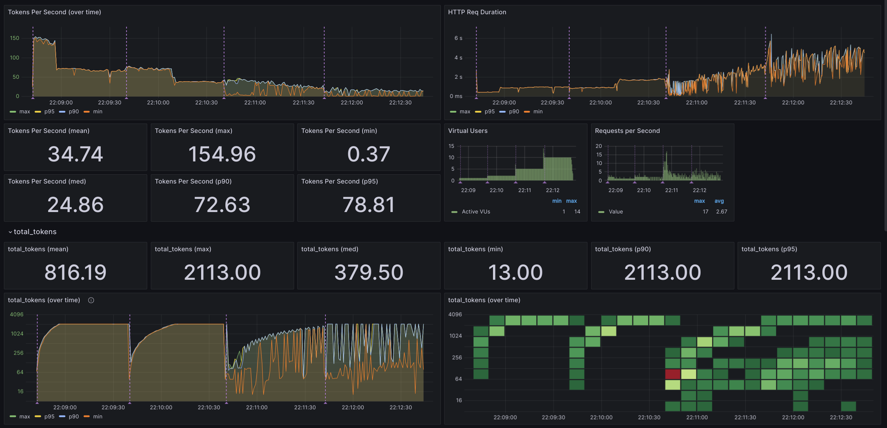

### [K6](https://github.com/grafana/k6)

> Handle: `k6`<br/>
> URL: [http://localhost:34233](http://localhost:34233)<br/>

`k6` is a modern load-testing tool. It's built to be powerful, extensible, and full-featured. The key design goal is to provide the best developer experience.

Harbor's `k6` comes with a few additional features that make it useful for LLM-related tasks out of the box:
- Pre-configured Influx and Grafana instances for metric collection and display
- Built-in Grafana dashboard for OpenAI-compatible API stats
- Built-in `k6` helpers for OpenAI-compatible API clients



#### Starting

```bash
# [Optional] Pre-pull the images
harbor pull k6

# Run K6 CLI (connected to "k6 run" by default)
harbor k6 --help
```

Harbor mounts a local workspace located in `$(harbor home)/k6` to the container. You can use it to store your scripts, configuration, and other data.

- `$(harbor home)/k6/scripts` - K6 scripts
- `$(harbor home)/k6/dashboards` - Grafana dashboards

#### Usage

In most instances, your workflow will be centered around editing and running performance testing scripts. You can find detailed guides on `k6` functionality in the [official documentation](https://grafana.com/docs/k6/latest/).

Here are a few helper commands to get you started:

```bash
# Open K6 scripts in VS Code
code $(harbor home)/k6/scripts

# Run a given script
# Note the forward slash - it's witihn a k6 container
# This will print Grafana URL to monitor the test
harbor k6 run /scripts/my-script.js

# Open Grafana dashboard
harbor open k6
```

The `k6` CLI will start Grafana/InfluxDB if needed - they'll continue to be running in the background until stopped explicitly (meaning you can collect results for more than one test).

The DB storage is not permanent and the contents will be erased after stopping the service.

Harbor comes with a few example scripts to get you started:
- [/scripts/example.js](https://github.com/av/harbor/blob/main/k6/scripts/example.js) - the "hello world" of K6
- [/scripts/ollama.js](https://github.com/av/harbor/blob/main/k6/scripts/ollama.js) - basic example of profiling Harbor's built-in Ollama instance
- [/scripts/openai-api-throughput.js](https://github.com/av/harbor/blob/main/k6/scripts/openai-api-throughput.js) - showcases all the features added by Harbor, used in the screenshot above

#### OpenAI-compatible API scripting

Harbor's `k6` has a built-in helper for OpenAI-compatible API clients. You can use it to easily create scripts that interact with the API.

```javascript
import * as oai from './helpers/openaiGeneric.js';

const client = oai.createClient({
  // URL of the API, note that
  // "/v1" is added by the helper
  url: 'http://ollama:11434',
  options: {
    // A set of options that'll be added to every
    // request sent by this client. In other words -
    // a subset of the body of the request for the given endpoint
    model: 'qwen2.5-coder:1.5b-base-q8_0',
  },
});

// /v1/completions endpoint
const response = client.complete({
  prompt: 'The meaning of life is',
  max_tokens: 10,
  // You can specify anything else supported by the
  // downstream service endpoint here, these
  // will override the "options" from the client as well.
});

// /v1/chat/completions endpoint
const response = client.chatComplete({
  messages: [
    { role: "user", content: "Answer in one word. Where is the moon?" },
  ],
  // You can specify anything else supported by the
  // downstream service endpoint here, these will
  // override the "options" from the client as well.
});
```

See the [helper source](https://github.com/av/harbor/blob/main/k6/scripts/helpers/openaiGeneric.js) for more details.

#### Standalone Setup

It's recommended to go with the Harbor setup, as it'll only use additional 6MB of disk space and will save you a lot of time. However, it's possible to use the setup standalone.

**Requirements:**

- Docker with standalone `compose` plugin
- Ability to run docker commands without `sudo`
- Free disk space for K6, Grafana, InfluxDB docker images

**Step 1:** Check out [the folder](https://github.com/av/harbor/tree/main/k6) with k6 scripts and grafana resources

Here's an example one-liner that'll put `https://github.com/av/harbor/k6` into `k6-oai-performance` folder at the current location:

```bash
git clone --depth 1 https://github.com/av/harbor /tmp/harbor-tmp && cp -r /tmp/harbor-tmp/k6 ./k6-oai-performance && rm -rf /tmp/harbor-tmp
```

**Step 2:** Run `k6` compose service with `docker compose`:

```bash
# Start InfluxDB, Grafana
docker compose up -d

# Run example script
docker compose run k6 run /scripts/example.js

# After you're done with testing
docker compose down
```

The configuration and usage are otherwise identical the main documentation above, except that you'll also need to manually spin up any other services you'll be testing.