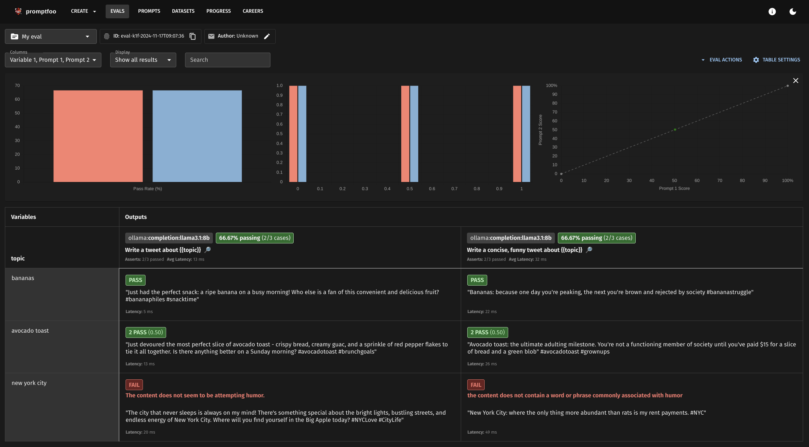
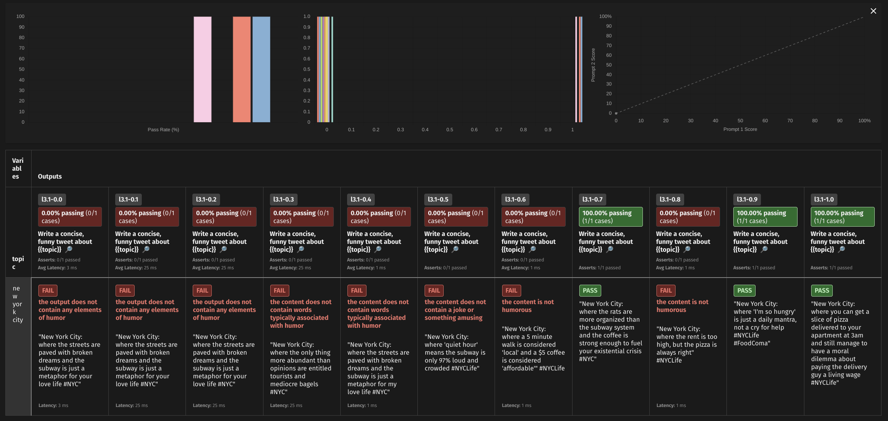

### [Promptfoo](https://github.com/promptfoo/promptfoo)

> Handle: `promptfoo`<br/>
> URL: [http://localhost:34233](http://localhost:34233)<br/>



[](https://npmjs.com/package/promptfoo)
[](https://npmjs.com/package/promptfoo)
[](https://github.com/promptfoo/promptfoo/actions/workflows/main.yml)

[](https://discord.gg/gHPS9jjfbs)

`promptfoo` is a tool for testing, evaluating, and red-teaming LLM apps.

With promptfoo, you can:

- **Build reliable prompts, models, and RAGs** with benchmarks specific to your use-case
- **Secure your apps** with automated [red teaming](https://www.promptfoo.dev/docs/red-team/) and pentesting
- **Speed up evaluations** with caching, concurrency, and live reloading
- **Score outputs automatically** by defining [metrics](https://www.promptfoo.dev/docs/configuration/expected-outputs)
- Use as a [CLI](https://www.promptfoo.dev/docs/usage/command-line), [library](https://www.promptfoo.dev/docs/usage/node-package), or in [CI/CD](https://www.promptfoo.dev/docs/integrations/github-action)
- Use OpenAI, Anthropic, Azure, Google, HuggingFace, open-source models like Llama, or integrate custom API providers for [any LLM API](https://www.promptfoo.dev/docs/providers)

#### Starting

```bash
# [Optional] Pre-pull the image
harbor pull promptfoo
```

You'll be running Promptfoo CLI most of the time, it's available as:
```bash
# Full name
harbor promptfoo --help

# Alias
harbor pf --help
```

Whenever the CLI is called, it'll also automatically start local Promptfoo backend.

```bash
# Run a CLI command
harbor pf --help

# Promptfoo backend started
harbor ps # harbor.promptfoo
```

Promptfoo backend serves all recorded results in the web UI:

```bash
# Open the web UI
harbor open promptfoo
harbor promptfoo view
harbor pf o
```

#### Usage

Most of the time, your workflow will be centered around creating prompts, assets, writing an eval config, running it and then viewing the results.

Harbor will run `pf` CLI from where you call Harbor CLI, so you can use it from any folder on your machine.

```bash
# Ensure a dedicated folder for the eval
cd /path/to/your/eval

# Init the eval (here)
harbor pf init

# Edit the configuration, prompts as needed
# Run the eval
harbor pf eval

# View the results
harbor pf view
```

> [!NOTE]
> If you're seeing any kind of file system permission errors you'll need to ensure that files written from within a container are [accessible to your user](./1.-Harbor-User-Guide#file-system-permissions).

#### Configuration

Harbor pre-configures `promptfoo` to run against `ollama` out of the box (must be started before `pf eval`). Any other providers can be configured via:
- env vars (see [`harbor env`](./3.-Harbor-CLI-Reference#harbor-env))
- directly in promptfooconfig files (see [Providers reference](https://www.promptfoo.dev/docs/providers/) in the official documentation)

```bash
# For example, use vLLM API
harbor env promptfoo OPENAI_BASE_URL $(harbor url -i vllm)
```

Promptfoo is a very rich and extensive tool, we recommend reading through excellent [official documentation](https://www.promptfoo.dev/docs/intro) to get the most out of it.

Harbor comes with two (basic) built-in examples.

##### Promptfoo hello-world

```bash
# Navigate to eval folder
cd $(harbor home)/promptfoo/examples/hello-promptfoo

# Start ollama and pull the target model
harbor up ollama
harbor ollama pull llama3.1:8b

# Run the eval
harbor pf eval

# View the results
harbor pf view
```

##### Promptfoo temp-test



Evaluate a model across a range of temperatures to see if there's a sweet spot for a given prompt.

```bash
# Navigate to eval folder
cd $(harbor home)/promptfoo/examples/temp-test

# Start ollama and pull the target model
harbor up ollama
harbor ollama pull llama3.1:8b

# Run the eval
harbor pf eval

# View the results
harbor pf view
```