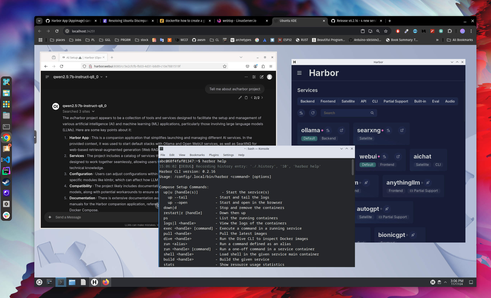

### [Webtop (from Linuxserver.io)](https://github.com/linuxserver/docker-webtop)

> Handle: `webtop`<br/>
> URL: [http://localhost:34251](http://localhost:34251)<br/>

[](https://scarf.sh)
[](https://github.com/linuxserver/docker-webtop)
[](https://github.com/linuxserver/docker-webtop/releases)
[](https://github.com/linuxserver/docker-webtop/packages)
[](https://gitlab.com/linuxserver.io/docker-webtop/container_registry)
[](https://quay.io/repository/linuxserver.io/webtop)
[](https://hub.docker.com/r/linuxserver/webtop)
[](https://hub.docker.com/r/linuxserver/webtop)
[](https://ci.linuxserver.io/job/Docker-Pipeline-Builders/job/docker-webtop/job/master/)
[](https://ci-tests.linuxserver.io/linuxserver/webtop/latest/index.html)

[Webtop](https://github.com/linuxserver/docker-webtop) - Alpine, Ubuntu, Fedora, and Arch based containers containing full desktop environments in officially supported flavors accessible via any modern web browser.

[](https://github.com/linuxserver/docker-webtop)



Harbor's `webtop` instance is pre-configured with a few extra things:
- Additional dependencies
- Harbor App pre-installed
  - Harbor CLI mounted from your host

The main goals of the service are:
1. Provide a full desktop environment accessible via a web browser, usable by LLM agents
2. Run/configure Harbor GUI/CLI remotely (by accessing webtop via Browser).

#### Starting

```bash
# [Optional] Pre-build the image
harbor build webtop

# Run Webtop and open in browser
harbor up webtop --open

# [Optional] open when already running
harbor open webtop

# [Optional] Get the URL to access from the same LAN
harbor url -a webtop

# [Optional] Get the QR code to access from the same LAN
harbor qr -a webtop

# [Optional] Start the tunnel to access from the internet
# ⚠️ Never expose unprotected services to the internet
harbor tunnel webtop
```

#### Configuration

Harbor will mount the `webtop` home directory from your host. You can configure the location to your preference:
```bash
harbor config set webtop.workspace /path/to/your/workspace
```

Paired with [`harbor profiles`](./3.-Harbor-CLI-Reference#harbor-profile), you can use that to "switch" between different home directories for different projects.

You can also change the distro of the container by switching to [one of the tags](https://docs.linuxserver.io/images/docker-webtop/#version-tags) supported by the Linuxserver.io team.

```bash
harbor config set webtop.version ubuntu-xfce
```

In addition to that, all of the baseline configuration options from original service are supported. One quick way to adjust the environment is via [`harbor env`](./3.-Harbor-CLI-Reference#harbor-env):

```bash
# See current env overrides
harbor env webtop

# Set a new env override
harbor env set webtop TITLE "AI Webtop"
```

#### Usage

When working within the webtop container, all harbor services are available by their internal URLs. So, for example, you'll find the `webui` not on `http://localhost:33801`, but on `http://harbor.webui:8080`.

```bash
# will return the "host" URL
harbor url webui

# will return the internal URL suitable for webtop
harbor url -i webui
```

See more info in [`harbor url` reference](./3.-Harbor-CLI-Reference#harbor-url).

