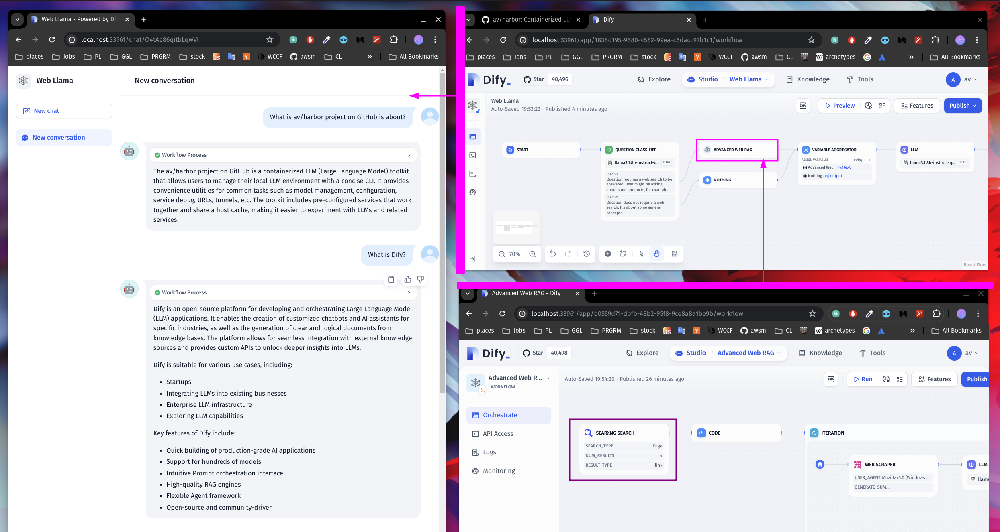
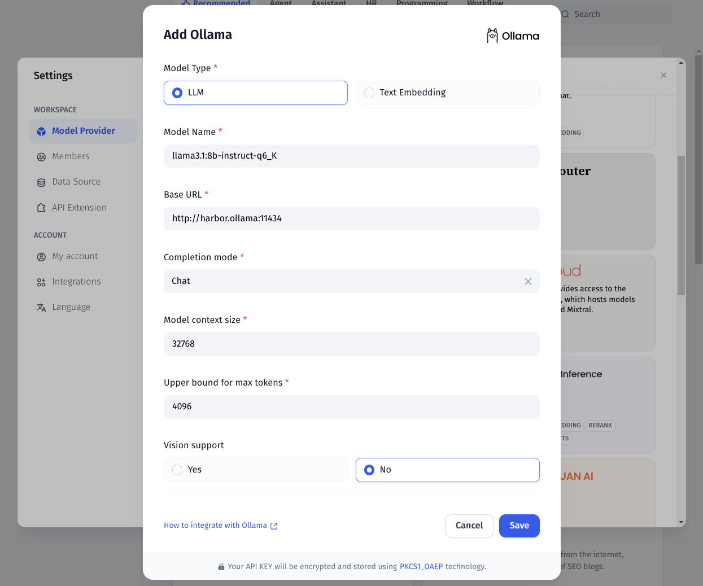
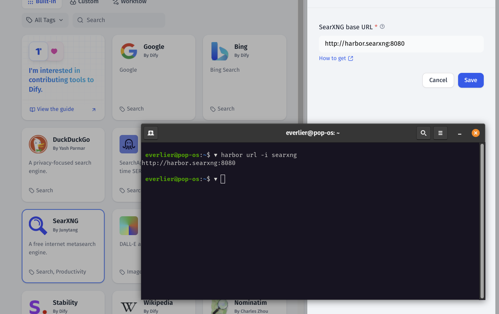
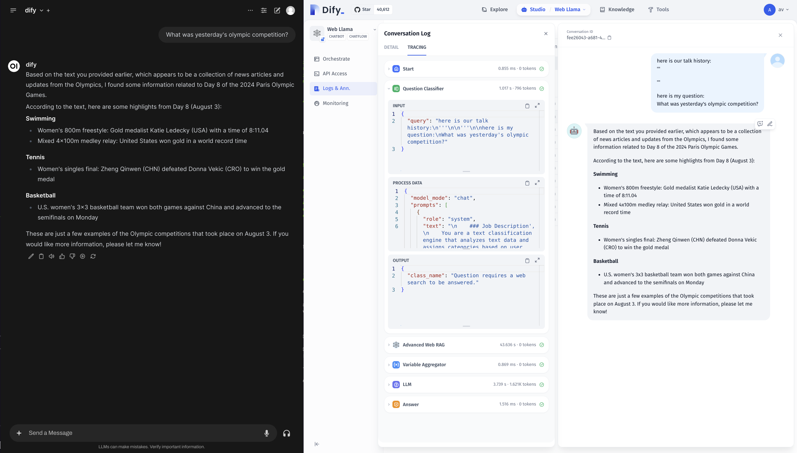

### [Dify](https://docs.dify.ai/)

> Handle: `dify`
> URL: [http://localhost:33961/](http://localhost:33961/)


<p align="center">
  <a href="https://cloud.dify.ai">Dify Cloud</a> ·
  <a href="https://docs.dify.ai/getting-started/install-self-hosted">Self-hosting</a> ·
  <a href="https://docs.dify.ai">Documentation</a> ·
  <a href="https://cal.com/guchenhe/60-min-meeting">Enterprise inquiry</a>
</p>

<p align="center">
    <a href="https://dify.ai" target="_blank">
        </a>
    <a href="https://dify.ai/pricing" target="_blank">
        </a>
    <a href="https://discord.gg/FngNHpbcY7" target="_blank">
        </a>
    <a href="https://twitter.com/intent/follow?screen_name=dify_ai" target="_blank">
        </a>
    <a href="https://hub.docker.com/u/langgenius" target="_blank">
        </a>
    <a href="https://github.com/langgenius/dify/graphs/commit-activity" target="_blank">
        </a>
    <a href="https://github.com/langgenius/dify/" target="_blank">
        </a>
    <a href="https://github.com/langgenius/dify/discussions/" target="_blank">
        </a>
</p>

Dify is an open-source LLM app development platform. Dify's intuitive interface combines AI workflow, RAG pipeline, agent capabilities, model management, observability features and more, letting you quickly go from prototype to production.

#### Starting

```bash
# [Optional] Pull the dify images
# ahead of starting the service
harbor pull dify

# Start the service
harbor up dify

harbor open dify
```

When started for the first time - you'll be asked to create an admin account.

Dify enables implementing some quite advanced workflows with high degree of specialization. For example:



On this screenshot, we have two Dify workflows:
- Web Llama . [download](./dify-sample-webllama.yml)
- Advanced Web RAG . [download](./dify-sample-webrag.yml)

Web Llama classifies User input to detect if a Web Search is needed, or if the input can be answered directly. If a search is needed, it launches the "Advanced Web RAG" workflow.

Advanced Web RAG workflow transforms the User input into a query for SearXNG, then uses code to scrape the links from the search results. The links are then passed to the Web Scraper and a summarization model to generate a response.

Then, Web Llama generates a final response based on the Web RAG.

Neat!

#### Configuration

Unfortunately, there's no direct way to configure Dify via Harbor CLI. So, all the configuration should be done via Dify UI.

However, Dify provides good integration guides for relevant services.

Use the command below to list all Harbor configuration options specific to Dify:

```bash
user@os:~$ ▼ h config list | grep DIFY
DIFY_HOST_PORT                 33961
DIFY_DB_HOST_PORT              33962
DIFY_D2O_HOST_PORT             33963
DIFY_VERSION                   0.6.16
DIFY_SANDBOX_VERSION           0.2.1
DIFY_WEAVIATE_VERSION          1.19.0
DIFY_VOLUMES                   ./dify/volumes
DIFY_BOT_TYPE                  Chat
DIFY_OPENAI_WORKFLOW
```

##### Updating Dify

Due to the way Dify is setup, its versions are pinned in Harbor. You can use `dify.version` config option to set the desired version.

```bash
# Set the version to a different one
harbor config set dify.version 0.6.16

# Re-pull the images
harbor pull dify

# Restart the service
harbor restart dify
```

##### Ollama

[Dify + Ollama](https://docs.dify.ai/guides/model-configuration/ollama)

```bash
# Get your ollama URL for dify
# Note the "-i" flag - the URL is internal to Docker
harbor url -i ollama

# See which models are available
harbor ollama list
```



Ensure to also setup the Embedding model to be better equipped for Dify's RAG pipeline.

##### SearXNG

Dify can use SearXNG in a similar way to what Open WebUI does, however you can be much more specific with what LLM will search for when conifugring the workflow.

[Dify + SearXNG](https://docs.dify.ai/guides/tools)


```bash
# SearXNG should be running to be
# available for Dify
harbor up searxng

# Get the URL for the SearXNG
harbor url -i searxng

# Open the Dify UI
harbor open dify
```



#### Integration

Once you've configured one or more interesting workflows - they can be integrated back with the rest of the Harbor via an OpenAI-compatible (-ish) API.

Harbor runs an custom `dify-openai` proxy that can translate requests from OpenAI API to Dify API.

In order to use it, for example:
- Configure the Workflow/Agent/Chatbot in Dify
- Create the API key for your workflow, copy it
- Point Dify OpenAI proxy to the workflow

```bash
harbor config set dify.openai.workflow <workflow-key>

# Remember to restart the stack
harbor restart dify webui
```

Done!

Here's a cool example based on the sample workflows from above:



- WebUI uses Dify "Web Llama" workflow as a chat backend
- Dify runs the whole workflow as outlined in the "Starting" section of this guide
