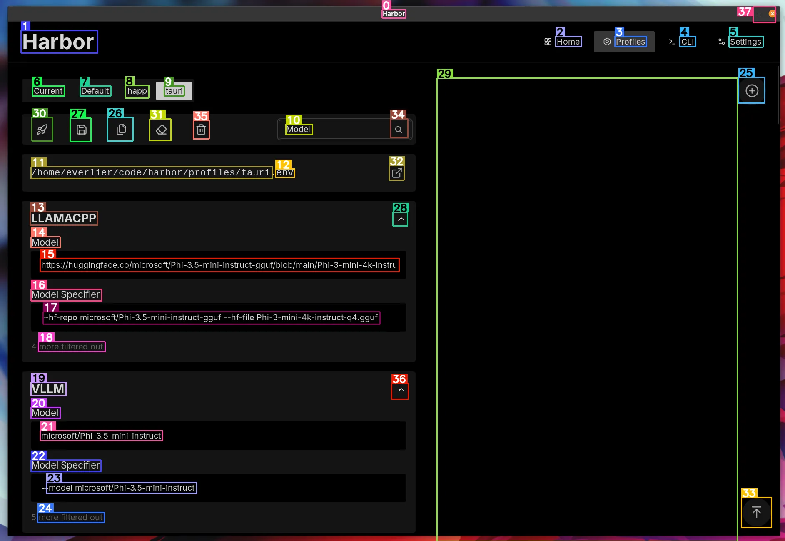

### [OmniParser](https://github.com/microsoft/OmniParser)

> Handle: `omniparser`<br/>
> URL: [http://localhost:34271](http://localhost:34271)<br/>

<p align="center">
  
</p>

[](https://arxiv.org/abs/2408.00203)
[](https://opensource.org/licenses/MIT)

📢 [[Project Page](https://microsoft.github.io/OmniParser/)] [[Blog Post](https://www.microsoft.com/en-us/research/articles/omniparser-for-pure-vision-based-gui-agent/)] [[Models](https://huggingface.co/microsoft/OmniParser)] [[Huggingface demo](https://huggingface.co/spaces/microsoft/OmniParser)]



**OmniParser** is a comprehensive method for parsing user interface screenshots into structured and easy-to-understand elements, which significantly enhances the ability of GPT-4V to generate actions that can be accurately grounded in the corresponding regions of the interface.

#### Starting

> [!WARN]
> OmniParser currently requires CUDA and Nvidia GPU to run.

```bash
# [Optional] Pre-build the image
# Will take a while, as depends on CUDA
harbor build omniparser

# Start the service
harbor up omniparser

# [Optional] first run will take a while to download the models
# monitor the progress:
harbor logs omniparser

# [Optional] open in browser
harbor open omniparser
```

#### Usage

You can use either an original Gradio App or its API (via [Gradio Client](https://www.gradio.app/guides/getting-started-with-the-python-client)).

Either way, the service will produce an image with annotations as well as textual output, ensure to use both together for the best results.


