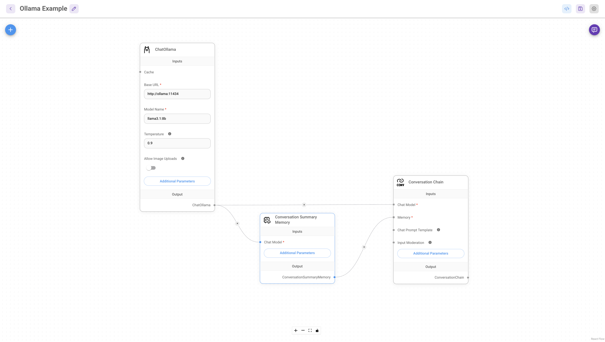

### [Flowise](https://github.com/FlowiseAI/Flowise)

> Handle: `flowise`<br/>
> URL: [http://localhost:34231](http://localhost:34231)

</a>

[](https://github.com/FlowiseAI/Flowise/releases)
[](https://discord.gg/jbaHfsRVBW)
[](https://twitter.com/FlowiseAI)
[](https://star-history.com/#FlowiseAI/Flowise)
[](https://github.com/FlowiseAI/Flowise/fork)

Open source low-code tool for developers to build customized LLM orchestration flow & AI agents.

#### Starting

```bash
# [Optional] Pre-pull the image
harbor pull flowise

# Start the service [--open is optional, to auto open in browser]
harbor up flowise --open
```

#### Usage

Flowise connections are mostly configured specifically for a given workflow right within the nodes.

When running alongside other services in Harbor - use their internal URLs. For example:

```bash
# Ollama URL for the Flowise
harbor url -i ollama
```

Here's the most basic chat workflow:



Other than that, Flowise is an extremely feature-rich tool with a lot of capabilities, please see the [official documentation](https://docs.flowiseai.com/integrations) and [tutorials](https://docs.flowiseai.com/using-flowise/agentflows/sequential-agents/video-tutorials) to get started.

#### Configuration

[Official environment variables reference](https://github.com/FlowiseAI/Flowise/blob/main/CONTRIBUTING.md#-env-variables). To set them, see Harbor's [environment configuration guide](./1.-Harbor-User-Guide#environment-variables).

Apart from that, you can configure the following via [`harbor config`](./3.-Harbor-CLI-Reference#harbor-config) with the following options supported:

```bash
# The port on the host machine to access
# the Flowise service API and UI
FLOWISE_HOST_PORT              34281

# The Docker image to use
FLOWISE_IMAGE                  flowiseai/flowise
# The tag of the Docker image to use
FLOWISE_VERSION                latest

# Location of the workspace directory on the host machine
# relative to $(harbor home), but can be global as well
FLOWISE_WORKSPACE              ./flowise/data
```
