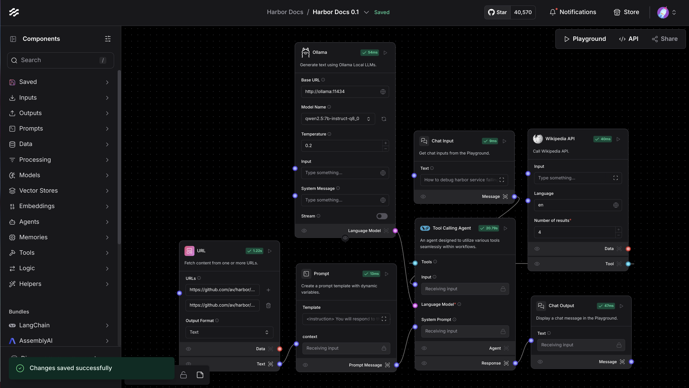

### [Langflow](https://github.com/langflow-ai/langflow)

> Handle: `langflow`<br/>
> URL: [http://localhost:34291](http://localhost:34291)<br/>
> Integration author: [@ZacharyKehlGEAppliances](https://github.com/ZacharyKehlGEAppliances)


<p align="center" style="font-size: 12px;">
    Langflow is a low-code app builder for RAG and multi-agent AI applications. It’s Python-based and agnostic to any model, API, or database.
</p>

<p align="center" style="font-size: 12px;">
    <a href="https://docs.langflow.org" style="text-decoration: underline;">Docs</a> -
    <a href="https://astra.datastax.com/signup?type=langflow" style="text-decoration: underline;">Free Cloud Service</a> -
    <a href="https://docs.langflow.org/get-started-installation" style="text-decoration: underline;">Self Managed</a>
</p>

LangFlow is a powerful visual workflow builder, similar to [Dify](./2.3.3-Satellite:-Dify.md), [Flowise](./2.3.31-Satellite:-Flowise.md), and [omnichain](./2.3.16-Satellite:-omnichain.md). It’s Python-based and agnostic to any model, API, or database.

#### Starting

```bash
# [Optional] Pre-pull the image
harbor pull langflow

# Start the service [--open is optional, to auto open in browser]
harbor up langflow --open
```

If everything is expected, you should see LangFlow UI open in your browser. See [troubleshooting](./1.-Harbor-User-Guide#troubleshooting) if you encounter any issues.

#### Usage

Most of the configuration/connections are done in the LangFlow own UI, including the connections to other services included in Harbor.

When running alongside other services in Harbor - use their internal URLs. For example:

```bash
# Ollama URL for the LangFlow
# Default is http://ollama:11434
harbor url -i ollama
```

Here's an example of a simple workflow that does QA over Harbor's CLI reference:



Other than that, LangFlow is an extremely feature-rich tool with a lot of capabilities, please see the [official documentation](https://docs.langflow.org) to get started.

#### Configuration

[Official environment variables reference](https://docs.langflow.org/environment-variables#supported-variables). To set them, see Harbor's [environment configuration guide](./1.-Harbor-User-Guide#environment-variables).

```bash
# Example: see DO_NOT_TRACK env variable value
harbor env langflow DO_NOT_TRACK

# Example: set LANGFLOW_SUPERUSER_PASSWORD env variable
harbor env langflow LANGFLOW_SUPERUSER_PASSWORD spi-4523l-kn-LK99
```

Apart from that, you can configure the following via [`harbor config`](./3.-Harbor-CLI-Reference#harbor-config) with the following options supported:

```bash
# The port on the host machine to access
# the LangFlow service when it is running
LANGFLOW_HOST_PORT

# The Docker image to use for LangFlow service
LANGFLOW_IMAGE

# The tag of the Docker image to use for LangFlow service
LANGFLOW_VERSION

# Location of the workspace directory on the host machine,
# relative to $(harbor home), but can be global as well
LANGFLOW_WORKSPACE
```

