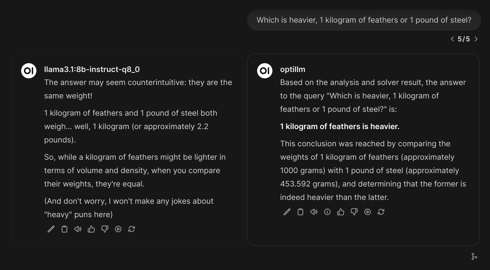

### [optillm](https://github.com/codelion/optillm)

> Handle: `optillm`<br/>
> URL: [http://localhost:34301](http://localhost:34301)



`optillm` is an OpenAI API compatible optimizing inference proxy which implements several state-of-the-art techniques that can improve the accuracy and performance of LLMs.

### Starting

```bash
# [Optional] Pre-build the image
harbor build optillm

# Start the service [--tail is optional, to show logs]
harbor up optillm --tail
```

See [troubleshooting guide](./1.-Harbor-User-Guide#troubleshooting) if you encounter any issues.

#### Usage

`optillm` serves underlying models without any modifications, so it's not possible for the upstream services (for example `webui`) to distinguish them from the original models when connected to both `optillm` and the original inference backend. Additionally, its streaming implementation is not compatible with all the frontends. See [compatibility section](./4.-Compatibility#optillm).

### Configuration

`optillm` is pre-configured (but not tested) to connect to the following services: `airllm`, `aphrodite`, `boost` (yes you can chain the optimising proxies), `dify`, `ktransformers`, `litellm`, `llamacpp`, `mistralrs`, `nexa`, `ollama`, `omnichain`, `pipelines`, `sglang`, `tabbyapi`, `vllm`.

See the [official parameters reference](https://github.com/codelion/optillm/tree/main?tab=readme-ov-file#available-parameters). To set them, see Harbor's [environment configuration guide](./1.-Harbor-User-Guide#environment-variables).

```bash
# Example: see OPTILLM_APPROACH env variable value
harbor env optillm OPTILLM_APPROACH

# Example: set OPTILLM_APPROACH env variable
harbor env optillm OPTILLM_APPROACH mcts
```

Additionally, following options can be set via [`harbor config`](./3.-Harbor-CLI-Reference#harbor-config):

```bash
# The port on the host where OptiLLM endpoint will be available
OPTILLM_HOST_PORT              34301

# The path to the workspace directory on the host machine
# (relative to $(harbor home), but can be global as well)
OPTILLM_WORKSPACE              ./optillm/data
```
