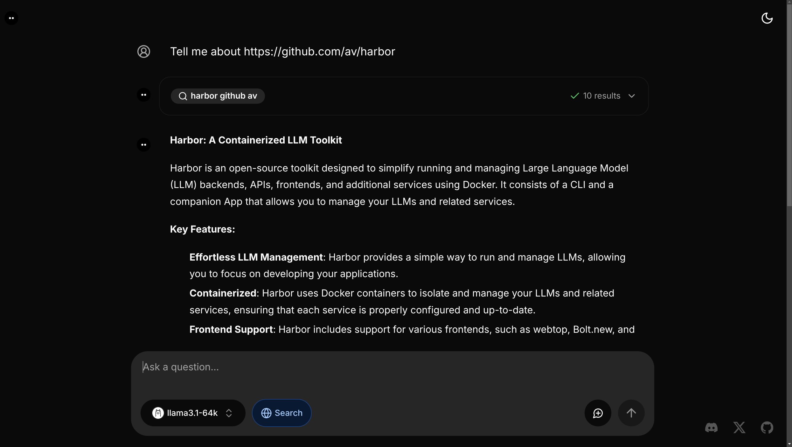

### [Morphic](https://github.com/miurla/morphic)

> Handle: `morphic`<br/>
> URL: [http://localhost:34341](http://localhost:34341)

An AI-powered search engine with a generative UI.



### Starting

```bash
# [Optional] Pre-build the image
harbor build morphic

# Download Ollama models Harbor sets by default
# (or change to your own preference)
# 1. Ensure Ollama is running
harbor up ollama
# 2. Download the models
harbor ollama pull $(harbor morphic model)
harbor ollama pull $(harbor morphic tool_model)

# Start the service [--open is optional, to open in browser]
harbor up morphic --open
```

> [!NOTE]
> `morphic` official container runs in "dev" mode, so first application load will include a compilation step. This can take a few minutes.

See [troubleshooting guide](./1.-Harbor-User-Guide#troubleshooting) if you encounter any issues.

#### Usage

- Harbor will automatically start `searxng` alongside `morphic`
- `morphic` will automatically connect to Harbor's `ollama` if it's running
- Harbor disables chat history feature in Morphic as it breaks the main search functionality
- Upon the first start - ensure to select "Ollama" model in the model dropdown
- Models:
  - Morphic has specific requirements for tool use capability that won't play well with all models (do not expect all models to work)
  - Morphic will not work with default 2k context in Ollama - you'll need to ensure that the model runs with at least 16k context

#### Configuration

Harbor CLI allows configuring Ollama models for `morphic`:

```bash
# Get/set the Ollama model to use
harbor morphic model <model>
# Get/set the Ollama tool model to use
harbor morphic tool_model <model>
```

Following options can be set via [`harbor config`](./3.-Harbor-CLI-Reference#harbor-config):

```bash
# The port on the host where morphic endpoint will be available
MORPHIC_HOST_PORT              34341
```

Additionally, all [environment variables](https://github.com/miurla/morphic/blob/main/.env.local.example) from the official example can be set according to Harbor's [environment configuration guide](./1.-Harbor-User-Guide#environment-variables).

```bash
# Example: set DEEPSEEK_API_KEY env variable value
harbor env morphic DEEPSEEK_API_KEY <value>

# Example: see GROQ_API_KEY env variable value
harbor env morphic GROQ_API_KEY
```