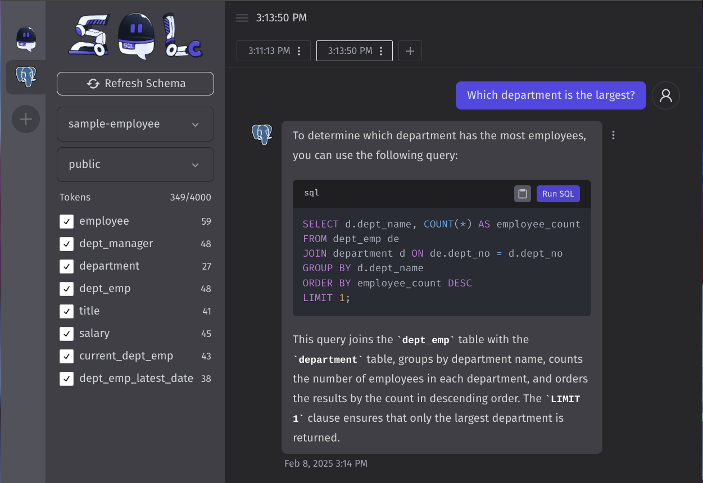

### [SQL Chat](https://github.com/sqlchat/sqlchat)

> Handle: `sqlchat`<br/>
> URL: [http://localhost:34351](http://localhost:34351)



SQL Chat is a chat-based SQL client, which uses natural language to communicate with the database to implement operations such as query, modification, addition, and deletion of the database.

### Starting

```bash
# [Optional] Pre-pull the image
harbor pull sqlchat

# SQL Chat relies on OpenAI-compatible model IDs
# So to use with Ollama, model needs to be named accordingly
harbor ollama cp llama3.1:8b gpt-3.5-turbo
# Start the service [--open is optional, to open in browser]
harbor up sqlchat --open

# [Optional] Open the URL in your browser
harbor open sqlchat
# [Optional] See service logs
harbor logs sqlchat
```

See [troubleshooting guide](./1.-Harbor-User-Guide#troubleshooting) if you encounter any issues.

### Usage

- Harbor will pre-configure `sqlchat` to use Ollama as OpenAI-compatible backend when started together
- Connection settings for SQL Chat are stored in the browser, so you won't be able to pre-configure them via Harbor
- When configuring a connection - `sqlchat` runs within docker, so `localhost` will refer to the docker container, not your host machine
  - On MacOS/Windows - use `host.docker.internal`
  - On Linux - use `172.17.0.1`
- SQL Chat relies on OpenAI-compatible model IDs, so ensure to use the correct model name when configuring the service
  - For Ollama, you can "copy" the model definition to be available with the new ID: `harbor ollama cp llama3.1:8b gpt-3.5-turbo`

### Configuration

Following options can be set via [`harbor config`](./3.-Harbor-CLI-Reference#harbor-config):

```bash
# The port on the host where SQL Chat endpoint will be available
SQLCHAT_HOST_PORT              34351

# The version (docker image tag) of SQL Chat to use
SQLCHAT_VERSION                latest

# The docker image to use for SQL Chat
SQLCHAT_IMAGE                  sqlchat/sqlchat

# Next Auth Secret for SQL Chat
SQLCHAT_AUTH_SECRET            sk-harbor
```

Additionally, you can set arbitrary environment variables for SQL Chat according to Harbor's [environment configuration guide](./1.-Harbor-User-Guide#environment-variables).

```bash
# Example: Set the OpenAI API key
harbor config set OPENAI_API_KEY <your-key>

# Example: Set the OpenAI API endpoint
harbor config set OPENAI_API_ENDPOINT <your-endpoint>
```