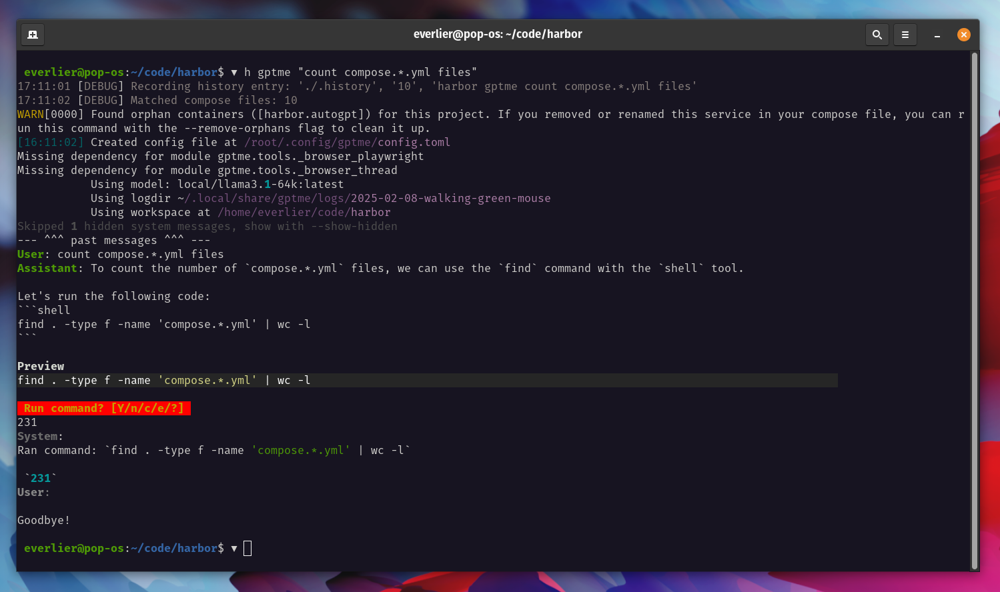

### [gptme](https://github.com/ErikBjare/gptme)

> Handle: `gptme`<br/>
> URL: -



📜 Personal AI assistant in your terminal, with tools so it can:
Use the terminal, run code, edit files, browse the web, use vision, and much more;
Assists in all kinds of knowledge-work, especially programming, from a simple but powerful CLI.

An unconstrained local alternative to ChatGPT's "Code Interpreter".
Not limited by lack of software, internet access, timeouts, or privacy concerns (if using local models).

### Starting

```bash
# [Optional] Pre-build the image
harbor build gptme

# 1. Ensure that you have the model locally
harbor ollama pull $(harbor gptme model)
# 2. Run as a CLI in any folder on your machine
harbor gptme "Summarize" README.md
```

### Usage

- `gptme` is a CLI tool that can be run in any folder on your machine
- Harbor will mount the current directory as a working directory for `gptme`
  - It means that `gptme` will only see the current folder and its subfolders, but not the rest of your filesystem
- `gptme` runs in a container, so the functionality related to interactions with the host OS will not work (opening a browser, etc.)
- Harbor will pre-configure `gptme` to use Ollama as OpenAI-compatible backend when started together
- `gptme` requires a fairly large context window, Ollama's default 2k is almost never enough for the tools to work properly

### Configuration

Harbor CLI allows configuring local models for `gptme`:

```bash
# Get/set the local model to use
harbor gptme model <model>
```

This will result in the "local" model configuration for `gptme`: `local/<model>`.

Following options can be set via [`harbor config`](./3.-Harbor-CLI-Reference#harbor-config):

```bash
# The same model as configured by "harbor gptme model"
GPTME_MODEL                    llama3.1:8b
```

Additionally, you can set arbitrary environment variables for `gptme` according to Harbor's [environment configuration guide](./1.-Harbor-User-Guide#environment-variables), for example:

```bash
# Set the GPTME_COSTS environment variable to true
harbor env gptme GPTME_COSTS true

# Get the GPTME_COSTS environment variable
harbor env gptme GPTME_COSTS
```

Finally, there's a "global" [config file](https://gptme.org/docs/config.html) (empty by default) in the `gptme` workspace.

```bash
open $(harbor home)/gptme/config.toml
```