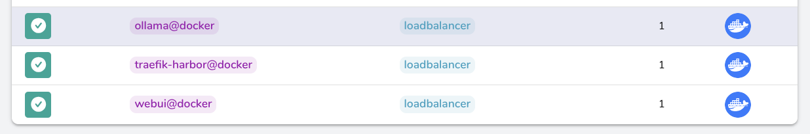

### [traefik](https://github.com/traefik/traefik)

> Handle: `traefik`<br/>
> URL: [http://localhost:34373](http://localhost:34373)



Traefik (pronounced traffic) is a modern HTTP reverse proxy and load balancer that makes deploying microservices easy.

### Starting

```bash
harbor up traefik
```

- Harbor creates relevant traefik service files [via a seed script](../.scripts/seed-traefik.ts).

### Configuration

If Harbor's [default traefik config](../traefik/traefik.yml) doesn't suit your needs the expected way to configure traefik is to provide a custom configuration file.

```bash
# Path should either be global or relative to $(harbor home)
harbor config set traefik.config /path/to/your/traefik.yml
```

Apart from that, the following options can be set via [`harbor config`](./3.-Harbor-CLI-Reference#harbor-config):

```bash
TRAEFIK_HOST_PORT              34371
TRAEFIK_METRICS_HOST_PORT      34372
TRAEFIK_DASHBOARD_HOST_PORT    34373

# Traefik version to use (docker image tag)
TRAEFIK_VERSION                v2.10
# Docker image to use for traefik
# the default one is from traefik's official docker hub
TRAEFIK_IMAGE                  traefik

TRAEFIK_CERT_EMAIL             harbor@harbor.sh

# Default Harbor setup will pre-configure services
# on the <service-handle>.${TRAEFIK_DOMAIN} domain
# example: ollama -> ollama.local
TRAEFIK_DOMAIN                 local

# Path should either be global or relative to $(harbor home)
TRAEFIK_CONFIG                 ./traefik/traefik.yml

# URL that'll open when you call "harbor open traefik"
TRAEFIK_OPEN_URL               http://localhost:34373
```

